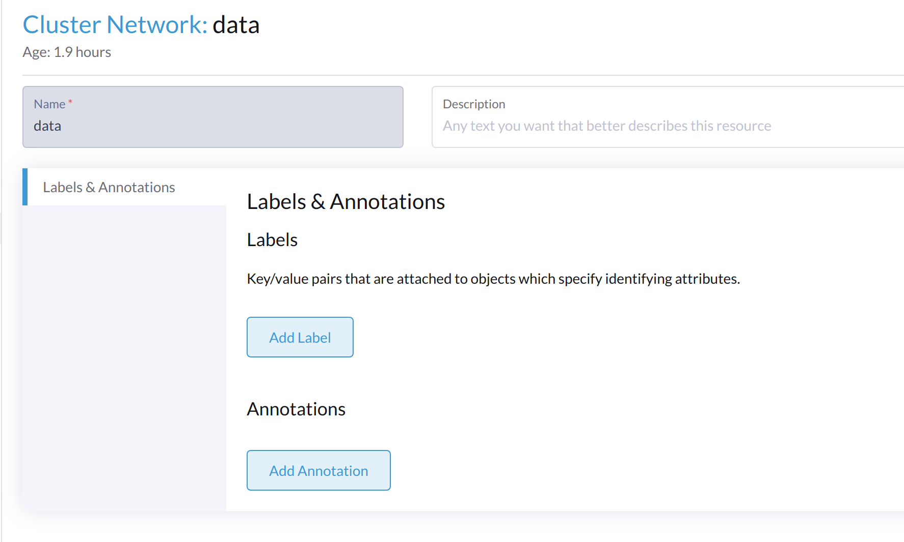

# Config Additional VLAN Interface on VM Network on Harvester

## Scenario

The cluster has a unified network topology:

1. Each Node has 2 NICs: NIC1 and NIC2
1. NIC1 is used for management network with VLAN ID 420
1. NIC2 is used for VM network with VLAN ID 423

User plans to add an additional VLAN 739 for a third-party storage, which has a private sub-net and is not route-able with other sub-nets.


## Work with Existing Solution

### Create a Harvester Cluster Network

e.g. Cluster Network: data



### Create Networks

Create one or a few networks to cover the planned nodes with the Uplinks.


### Create Virtual Machine Network

Create 2 VM networks with VLAN ID 423, 739


### Check Existing Configures

#### IP Links

In this example, the link `ens8` is the Uplink of cluster network `data`.

Two additional links `data-bo` and `data-br` are created by the Harvester controller.

```

2: ens3: <BROADCAST,MULTICAST,SLAVE,UP,LOWER_UP> mtu 1500 qdisc pfifo_fast master mgmt-bo state UP mode DEFAULT group default qlen 1000
    link/ether 52:54:00:03:3a:e4 brd ff:ff:ff:ff:ff:ff
    altname enp0s3

3: ens8: <BROADCAST,MULTICAST,UP,LOWER_UP> mtu 1500 qdisc pfifo_fast state UP mode DEFAULT group default qlen 1000
    link/ether 52:54:00:9c:83:1d brd ff:ff:ff:ff:ff:ff
    altname enp0s8

    
82: data-bo: <NO-CARRIER,BROADCAST,MULTICAST,MASTER,UP> mtu 1500 qdisc noqueue master data-br state DOWN mode DEFAULT group default qlen 1000
    link/ether 1e:56:c2:2b:7f:c2 brd ff:ff:ff:ff:ff:ff
    
83: data-br: <BROADCAST,MULTICAST,PROMISC,UP,LOWER_UP> mtu 1500 qdisc noqueue state UP mode DEFAULT group default 
    link/ether 76:b1:4e:08:48:6d brd ff:ff:ff:ff:ff:ff
```

The internal Linux bridge is configured with different VLANs, the `data-bo` (Uplink bond link) has `VID 1, 423, 739`, `data-br` itself has only `VID 1`.

```
$ bridge vlan show dev data-br
port              vlan-id  
data-br           1 PVID Egress Untagged


$ bridge vlan show dev data-bo
port              vlan-id  
data-bo           1 PVID Egress Untagged
                  423
                  739
```

### Create VMs

Create VMs on network `default/vlan423`, they work well.

## Hack Solution

Harvester VM Network is designed for VM usage, the Host OS program like CSI back-end process can't use it directly.

The following steps will create a special VLAN sub-inteface for Host OS.

### Add Vlan Sub-interface and IP manually

```
example:

node1:

$ bridge vlan add vid 739 dev data-br self
$ ip link add link data-br data-br.739 up type vlan id 739
$ ip addr add 192.168.100.141/24 dev data-br.739


node2:

$ bridge vlan add vid 739 dev data-br self
$ ip link add link data-br data-br.739 up type vlan id 739
$ ip addr add 192.168.100.120/24 dev data-br.739
```

When ping each other from harvester host, it works:

```
node2 $ ping 192.168.100.141 -I 192.168.100.120

PING 192.168.100.141 (192.168.100.141) from 192.168.100.120 : 56(84) bytes of data.
64 bytes from 192.168.100.141: icmp_seq=1 ttl=64 time=0.423 ms
```

Changes on the VLAN bridge `data-b*`:

```
$ bridge vlan show dev data-br
port              vlan-id  
data-br           1 PVID Egress Untagged
                  739

$ bridge vlan show dev data-bo
port              vlan-id  
data-bo           1 PVID Egress Untagged
                  423
                  739
```

The VLAN sub-interface.

```
78: data-br.739@data-br: <BROADCAST,MULTICAST,UP,LOWER_UP> mtu 1500 qdisc noqueue state UP mode DEFAULT group default qlen 1000
    link/ether 7e:e4:40:af:36:df brd ff:ff:ff:ff:ff:ff
```

### Configure Third-party CSI on the Vlan Sub-interface

After above configuration, on each Harvester Node, there is a VLAN sub-interface link `data-br.739` with VLAN ID 739 and related IP like `192.168.100.*/24`


```
$ ip addr show dev data-br.739

78: data-br.739@data-br: <BROADCAST,MULTICAST,UP,LOWER_UP> mtu 1500 qdisc noqueue state UP group default qlen 1000
    link/ether 7e:e4:40:af:36:df brd ff:ff:ff:ff:ff:ff
    inet 192.168.100.141/24 scope global data-br.739
       valid_lft forever preferred_lft forever
```

The third-party CSI driver can work on this Vlan&IP.

:::note

The manual configuration is not persistant and will be lost after node is rebooted, need another solution.

:::

### Troubleshooting

If above configuration causes the VM to be not working as expected, run the reverse options below on a specific node or all nodes:

```
$ bridge vlan del vid 739 dev data-br self

$ ip link del link data-br.739
```

The last solution is to reboot the node to recover the VM network.
