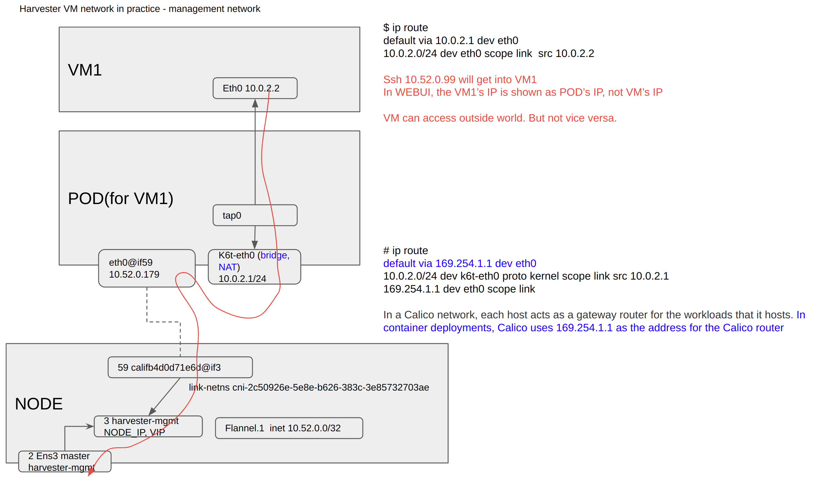

# connect to Harvester provisiond VM from management network

## Related Issues

https://github.com/harvester/harvester/issues/2291


## Harvester VM management network in practice

Generally, it's OK to connect to ouside world from the VM. 

But not vice versa. As the VM is under kind of NAT.

Harvester is built ontop of k8s and kubevirt, the VM's network is a bit different with traditional IaaS.

Following diagram shows info from a practice deployment.



Sometimes, user may want to connect to VM actively. It is not easy, but sitll possible.

## utilize the NAT rules in HOST NODE to connec to VM from outside world

In Harvester, each VM is carried by a k8s POD. POD IP, NODE IP are all available.

```
$ kubectl get pod virt-launcher-test-vm-2-szffs -o JSON 

{
...
        "hostIP": "192.168.122.195",
        "phase": "Running",
        "podIP": "10.52.0.110",
        "podIPs": [
            {
                "ip": "10.52.0.110"
            }
        ],
        "qosClass": "Burstable",
        "startTime": "2022-06-22T10:25:06Z"
    }
}
```

Undoubtly, the VM's IP is not pingable from outside the cluster.

```
PING 10.52.0.110 (10.52.0.110) 56(84) bytes of data.

--- 10.52.0.110 ping statistics ---
3 packets transmitted, 0 received, 100% packet loss, time 2050ms
```

Without NAT rules for port fowarding, ssh to HOST IP is also not working.

```
pc:~$ ssh cirros@192.168.122.195 -p 50023
ssh: connect to host 192.168.122.195 port 50023: Connection refused

```

Add one NAT rules to `Harvester HOST NODE`. Map a specific `HOST PORT` to the destination IP and PORT.

```
harv1:~ # iptables -t nat -I PREROUTING -p tcp --dport 50023 -j DNAT --to 10.52.0.110:22
```

It's possible to connect to the VM from outside world actively.

```
$ ssh cirros@192.168.122.195 -p 50023
The authenticity of host '[192.168.122.195]:50023 ([192.168.122.195]:50023)' can't be established.
ECDSA key fingerprint is SHA256:zgkaPBHp1d4L463EEWlyblFe304hVEHoZFJPnHkrp3Y.
Are you sure you want to continue connecting (yes/no/[fingerprint])? yes
Warning: Permanently added '[192.168.122.195]:50023' (ECDSA) to the list of known hosts.
cirros@192.168.122.195's password: 
$ 
$ uname -a
Linux test-vm-2 5.3.0-26-generic #28~18.04.1-Ubuntu SMP Wed Dec 18 16:40:14 UTC 2019 x86_64 GNU/Linux
$ who
cirros          pts/0           00:00   Jun 22 11:28:47  192.168.122.1
$
```

## limitations

1. In Harvester, the guest VM is on top of K8S POD, it borrows POD's IP.

2. When POD is (deleted&)started or replaced, POD's IP will change. POD may be in any HOST NODE.

3. To access VM, specific NAT rules should be added carefully. It needs to be updated when 2 happens.

To now, we know it is only fit for study and test.

## Best practice

It's essential to give VM a dedicated network, please refer:

https://docs.harvesterhci.io/v1.0/networking/harvester-network/#vlan-network

