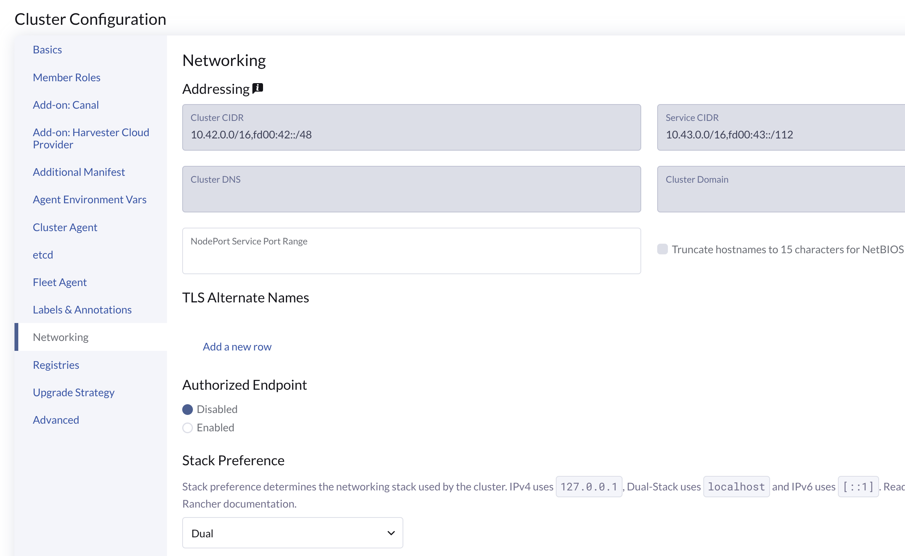
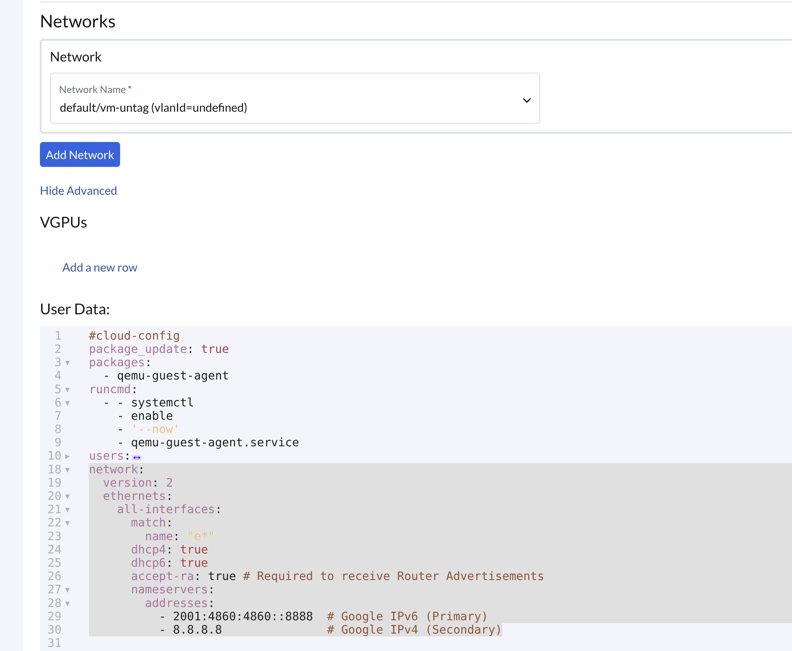

# Provision Dual Stack Guest Cluster

## Motivations

Set up the dual-stack guest cluster provision on Rancher UI.

---

## Optional: Setup KVM if your env is based on it

Enable ipv6 dhcp and nat

virsh net-dumpxml --network default

```
<network connections='2'>
  <name>default</name>
  <uuid>8d734fe4-e445-4bd7-99c6-4bd47adab81e</uuid>
  <forward mode='nat'>
    <nat>
      <port start='1024' end='65535'/>
    </nat>
  </forward>
  <bridge name='virbr0' stp='on' delay='0'/>
  <mac address='52:54:00:2b:06:ba'/>
  <ip address='192.168.122.1' netmask='255.255.255.0'>
    <dhcp>
      <range start='192.168.122.2' end='192.168.122.254'/>
...
    </dhcp>
  </ip>
  <ip family='ipv6' address='2001:db8:cafe::1' prefix='64'>
    <dhcp>
      <range start='2001:db8:cafe::100' end='2001:db8:cafe::1ff'/>
    </dhcp>
  </ip>
</network>

```

## Rancher UI params

CNI: Select `Canal`, set option `felixIpv6Support: true`

RKE2-Networking: select `Dual` on `Stack Preference`, input dual cidr to `cluster-cidr` and `service-cidr`.


```
      Stack Preference: Dual

      cluster-cidr: 10.42.0.0/16,fd00:42::/48
      service-cidr: 10.43.0.0/16,fd00:43::/112
```




User Data: intput to enable v4, v6 dhcp; or set static IPv4, IPv6 addresses.

```
network:
  version: 2
  ethernets:
    all-interfaces:
      match:
        name: "e*"
      dhcp4: true
      dhcp6: true
      accept-ra: true # Required to receive Router Advertisements
      nameservers:
        addresses:
          - 2001:4860:4860::8888  # Google IPv6 (Primary)
          - 8.8.8.8               # Google IPv4 (Secondary)
```




Check the the generated `Cluster` object, confirm the lines with `// ensure` are there.


```
apiVersion: provisioning.cattle.io/v1
kind: Cluster
metadata:
...
  name: gc6
  namespace: fleet-default
...
spec:
  cloudCredentialSecretName: cattle-global-data:cc-xf9nm
  clusterAgentDeploymentCustomization: {}
  fleetAgentDeploymentCustomization: {}
  kubernetesVersion: v1.35.3+rke2r3
  localClusterAuthEndpoint: {}
  rkeConfig:
    chartValues:
      harvester-cloud-provider:
        cloudConfigPath: /var/lib/rancher/rke2/etc/config-files/cloud-provider-config
        global:
          cattle:
            clusterName: gc6
        image:
          pullPolicy: IfNotPresent
          repository: ttl.sh/hcp                                // note: this is the test HCP iamge, if you cloud-provider-harvester chart version is >=0.2.12, then it has the dual-stack feature
          tag: 2h
      rke2-canal:
        calico:
          felixIpv6Support: true                                // ensure
      rke2-ingress-nginx: {}
      rke2-traefik: {}
    dataDirectories: {}
    etcd:
      snapshotRetention: 5
      snapshotScheduleCron: 0 */5 * * *
    machineGlobalConfig:
      cluster-cidr: 10.42.0.0/16,fd00:42::/48                   // ensure
      cni: canal
      disable-kube-proxy: false
      etcd-expose-metrics: false
      ingress-controller: traefik
      service-cidr: 10.43.0.0/16,fd00:43::/112                  // ensure
    machinePoolDefaults: {}
    machinePools:
      - controlPlaneRole: true
        drainBeforeDelete: true
        dynamicSchemaSpec: >-
...
        etcdRole: true
        machineConfigRef:
          kind: HarvesterConfig
          name: nc-gc6-pool1-nc6vn
        name: pool1
        quantity: 1
        unhealthyNodeTimeout: 0s
        workerRole: true
    machineSelectorConfig:
      - config:
          cloud-provider-config: secret://fleet-default:harvesterconfigrmttw
          cloud-provider-name: harvester
          protect-kernel-defaults: false
    networking:
      stackPreference: dual                                       // ensure
    registries: {}
    upgradeStrategy:
...
```

## Ensure the HCP version is `0.2.12` or higher

From harvester-cloud-provider chart version `v0.2.12` or higher, the dual-stack IP reporting is supported.

In RKE2, the chart version is: `harvester-cloud-provider-0.2.1200` or higher

In Rancher, the chart version is: `harvester-cloud-provider` `109.0.0+up0.2.12. v2.13 108.0.1+up0.2.12 v2.12 107.0.3+up0.2.12`, ensure the `up` part is `0.2.12` or higher.

## Test steps and reports

Refer https://github.com/harvester/cloud-provider-harvester/pull/74#issue-4336585274


:::note

In dual-stack (default IPv4 first) mode, the remote Rancher Manager can still work on IPv4 only mode, it contacts that guest cluster via the IPv4 address.

:::

