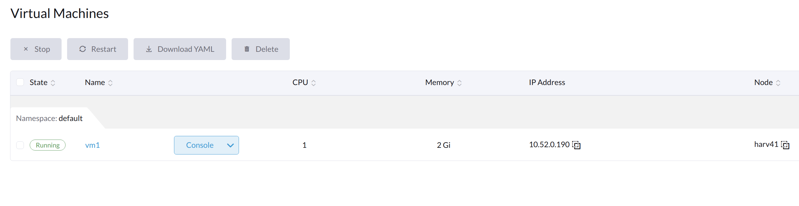

# Dive into Harvester VLAN network in netsted virtualization

Is it possible to study/test/... Harvester VLAN network in one single PC without dedicated hardware SWITCH?

The answer is sure. In this article, we will demostrate:

```
Add VLAN aware bridge.
Set indepedent DHCP server.
Add second NIC to Harvester NODE.
Add Harvester VLAN network.
Create Harveter guest VM with management and VLAN network.
Use DHCP to get VLAN network IP in guest VM.
Guest VM-VM, VM-host communication via VLAN network.
```

## 1. Basic environment setting

One PC is running Ubuntu 20.04 or any other Linux distros.

A couple of KVM VMs are created to run Harvester ISO, they compose a Harvester cluster. Sure, single NODE cluster is also OK, we demostrate it.

From Harvester WebUI, we can create VM with images like below.

```
Ubuntu: https://cloud-images.ubuntu.com/focal/current/focal-server-cloudimg-amd64.img

Opensuse: http://download.opensuse.org/repositories/Cloud:/Images:/Leap_15.3/images/openSUSE-Leap-15.3.x86_64-NoCloud.qcow2
[with one know issue: dhclient on second NIC failed]

```
The Guest VM will share Harvester management network, to access peer VMs and outside world.

## 2. Add the second network in `Virtual Machine Manager` and set it

Harvester supports VLAN network, which is used as the second network / the single network for the guest VM.

With nested virtualization, the setting in single PC could be as following.


### 2.1 Add new network virbr1 in KVM

From `Virtual Machine Manager`, click `Edit`, select `Connection Details`.

Then click `Virtual Networks`, select click `+` icon in left corner.

In the popup window, select mode `NAT`, `un-select` `Enable DHCPv4`.


### 2.2 Set network virbr1 filter VLAN

By default, the new bridge created by `Virtual Machine Manager`, is not VLAN aware.

Set vlan filter and add vlan 100.

```
with sudo or sudo -i

$ ip link set virbr1 type bridge vlan_filtering 1

$ bridge vlan add dev virbr1 vid 100 self

```

Check bridge vlan.

```
$ bridge vlan show

virbr1	 1 PVID Egress Untagged
	 100

virbr1-nic	 1 PVID Egress Untagged
```

Check KVM network.

```
$ sudo -i virsh net-list --all

 Name      State    Autostart   Persistent
--------------------------------------------
 default   active   yes         yes
 virbr1    active   yes         yes
```

The `default` network.

```
$ sudo -i virsh net-dumpxml --network default 

<network connections='1'>
  <name>default</name>
  <uuid>8d734fe4-e445-4bd7-99c6-4bd47adab81e</uuid>
  <forward mode='nat'>
    <nat>
      <port start='1024' end='65535'/>
    </nat>
  </forward>
  <bridge name='virbr0' stp='on' delay='0'/>
  <mac address='52:54:00:2b:06:ba'/>
  <ip address='192.168.122.1' netmask='255.255.255.0'>
    <dhcp>
      <range start='192.168.122.2' end='192.168.122.254'/>
      <host mac='52:54:00:03:3a:e4' name='harv41' ip='192.168.122.141'/>  // NOTE: here is added manually, for static IP binding
    </dhcp>
  </ip>
</network>
```

NOTE: the difference in second network, no `<dhcp> <dhcp/>`.

```
# sudo -i virsh net-dumpxml --network virbr1

<network connections='1'>
  <name>virbr1</name>
  <uuid>29e87ad2-e60e-4891-9c72-9dd0f20ce242</uuid>
  <forward mode='nat'>
    <nat>
      <port start='1024' end='65535'/>
    </nat>
  </forward>
  <bridge name='virbr1' stp='on' delay='0'/>
  <mac address='52:54:00:2f:f6:5b'/>
  <domain name='virbr1'/>
  <ip address='192.168.100.1' netmask='255.255.255.0'>
  </ip>
</network>
```

### 2.3 Add VLAN sub-interface in virbr1

The vlan sub-interface will automatically add/remove VLAN tag when the packet in/out the bridge `virbr1` via `virbr1.100`.

```
# add an VLAN sub-interface

$ ip link add link virbr1 virbr1.100 type vlan id 100

$ ip link set virbr1.100 up

# config IP to this vlan sub-interface

$ ip addr add dev virbr1.100 192.168.100.88/24
```

Check sub-interface `virbr1.100`, it should be up and have an IP. It will be used by DHCP server, and also used by ping/ssh/... from PC.

```
$ ip addr

39: virbr1.100@virbr1: <BROADCAST,MULTICAST,UP,LOWER_UP> mtu 1500 qdisc noqueue state UP group default qlen 1000
    link/ether 52:54:00:2f:f6:5b brd ff:ff:ff:ff:ff:ff
    inet 192.168.100.88/24 scope global virbr1.100
       valid_lft forever preferred_lft forever
    inet6 fe80::5054:ff:fe2f:f65b/64 scope link 
       valid_lft forever preferred_lft forever
```


### 2.4 Set DHCP server

We use isc-dhcp-server.

Configure the DHCP server options in `/etc/dhcp/dhcpd.conf`, add below block.

```
# 2022.06.24 for test VLAN network
# VLAN 100
subnet 192.168.100.0 netmask 255.255.255.0 {
        option routers 192.168.100.1;
        option broadcast-address 192.168.100.255;
        pool {
                range 192.168.100.100 192.168.100.200;
        }
}
```

Configure the DHCP server to serve `virbr1.100` in `/etc/default/isc-dhcp-server`

```
# Defaults for isc-dhcp-server (sourced by /etc/init.d/isc-dhcp-server)

INTERFACESv4="virbr1.100"
INTERFACESv6="virbr1.100"
```

Stop and start the DHCP server service

```
$ systemctl stop isc-dhcp-server.service

$ systemctl start isc-dhcp-server.service

```

Check isc-dhcp-server status.

```
$ systemctl status isc-dhcp-server.service 

● isc-dhcp-server.service - ISC DHCP IPv4 server
     Loaded: loaded (/lib/systemd/system/isc-dhcp-server.service; enabled; vendor preset: enabled)
     Active: active (running) since Tue 2022-06-28 10:36:03 CEST; 3h 14min ago
       Docs: man:dhcpd(8)
   Main PID: 27985 (dhcpd)
      Tasks: 4 (limit: 76973)
     Memory: 4.7M
     CGroup: /system.slice/isc-dhcp-server.service
             └─27985 dhcpd -user dhcpd -group dhcpd -f -4 -pf /run/dhcp-server/dhcpd.pid -cf /etc/dhcp/dhcpd.conf virbr1.100
```

To now, the DHCP server is serving a subnet, which is on top of an VLAN.


### Trouble shooting - DHCP server service failed.

When link `virbr1.100` is not in PC ( not in `ip link`), or not `UP`, or not having IP address, then the isc-dhcp-server is not working.

```
$ systemctl status isc-dhcp-server.service 

● isc-dhcp-server.service - ISC DHCP IPv4 server
     Loaded: loaded (/lib/systemd/system/isc-dhcp-server.service; enabled; vendor preset: enabled)
     Active: failed (Result: exit-code) since Wed 2022-06-29 09:47:01 CEST; 1h 46min ago
       Docs: man:dhcpd(8)
   Main PID: 1547 (code=exited, status=1/FAILURE)

Jun 29 09:47:01 jianwang-pc dhcpd[1547]: Not configured to listen on any interfaces!
Jun 29 09:47:01 jianwang-pc systemd[1]: isc-dhcp-server.service: Failed with result 'exit-code'.

```

## 3. Add the second NIC to Harvester NODE VM

### Add the second NIC to VM and attache it to virbr1

From `Virtual Machine Manager`, add a second NIC to Harvester NODE VM, and select the network `virbr1`.


### Start the VM

In PC, a new link like `vnet1` will be added to `virbr1` automatically by `Virtual Machine Manager`, when `run` VM from `Virtual Machine Manager`.

In our example:

When Harvester NODE harv41 starts, two NICs are created in PC and attached to virbr0, virbr1.

```
$ ip link

23: vnet0: <BROADCAST,MULTICAST,UP,LOWER_UP> mtu 1500 qdisc fq_codel master virbr0 state UNKNOWN mode DEFAULT group default qlen 1000
    link/ether fe:54:00:03:3a:e4 brd ff:ff:ff:ff:ff:ff
24: vnet1: <BROADCAST,MULTICAST,UP,LOWER_UP> mtu 1500 qdisc fq_codel master virbr1 state UNKNOWN mode DEFAULT group default qlen 1000
    link/ether fe:54:00:c2:55:bd brd ff:ff:ff:ff:ff:ff
```

When Harvester NODE harv42 starts, another two NICs are created in PC and attached to virbr0, virbr1.

```
$ ip link

25: vnet2: <BROADCAST,MULTICAST,UP,LOWER_UP> mtu 1500 qdisc fq_codel master virbr0 state UNKNOWN mode DEFAULT group default qlen 1000
    link/ether fe:54:00:30:98:6b brd ff:ff:ff:ff:ff:ff
26: vnet3: <BROADCAST,MULTICAST,UP,LOWER_UP> mtu 1500 qdisc fq_codel master virbr1 state UNKNOWN mode DEFAULT group default qlen 1000
    link/ether fe:54:00:80:b8:1b brd ff:ff:ff:ff:ff:ff
```

The `virbr1` related NICs.

```
$ ip link | grep virbr1

3: virbr1: <BROADCAST,MULTICAST,UP,LOWER_UP> mtu 1500 qdisc noqueue state UP mode DEFAULT group default qlen 1000
4: virbr1-nic: <BROADCAST,MULTICAST> mtu 1500 qdisc fq_codel master virbr1 state DOWN mode DEFAULT group default qlen 1000

// Added by `Virtual Machine Manager` when VM starts, deleted when VM is stopped/deleted
24: vnet1: <BROADCAST,MULTICAST,UP,LOWER_UP> mtu 1500 qdisc fq_codel master virbr1 state UNKNOWN mode DEFAULT group default qlen 1000
26: vnet3: <BROADCAST,MULTICAST,UP,LOWER_UP> mtu 1500 qdisc fq_codel master virbr1 state UNKNOWN mode DEFAULT group default qlen 1000

// Added manually
27: virbr1.100@virbr1: <BROADCAST,MULTICAST,UP,LOWER_UP> mtu 1500 qdisc noqueue state UP mode DEFAULT group default qlen 1000
```


NOTE: When the VM is stopped or deleted, `Virtual Machine Manager` will delete the related NICs from PC.

### Set VLAN for the new link

After `Virtual Machine Manager` adds the `vnet*` for each starting VM, we add VLAN on it manually.

```
$ bridge vlan add dev vnet1 vid 100

$ bridge vlan add dev vnet3 vid 100
```

Check bridge VLAN again, `vnet1` is also added into VLAN 100.

```
$ bridge vlan show

virbr1	 1 PVID Egress Untagged
	 100

virbr1-nic	 1 PVID Egress Untagged

vnet1	 1 Egress Untagged
	 100

vnet3	 1 PVID Egress Untagged
	 100
```


## 4. Enable Harvester VLAN network


In Harvester NODE, from `ip link`, we get the newly added second NIC's name `ens8`.

```
harv41:~ # ip link

2: ens3: <BROADCAST,MULTICAST,SLAVE,UP,LOWER_UP> mtu 1500 qdisc pfifo_fast master harvester-mgmt state UP mode DEFAULT group default qlen 1000
    link/ether 52:54:00:03:3a:e4 brd ff:ff:ff:ff:ff:ff
    altname enp0s3
3: ens8: <BROADCAST,MULTICAST,UP,LOWER_UP> mtu 1500 qdisc pfifo_fast master harvester-br0 state UP mode DEFAULT group default qlen 1000
    link/ether 52:54:00:c2:55:bd brd ff:ff:ff:ff:ff:ff
    altname enp0s8
```

Per https://docs.harvesterhci.io/v1.0/networking/harvester-network/#enabling-default-vlan-network, we enable VLAN network with `ens8` as the default network interface.


## 5. Create VLAN network and test DHCP


Next step, crete a new VLAN network in Harvester `Advanced` --> `Networks` --> `Create`, when DHCP is prefered, we can leave `Route` page un-changed.


Internally, the Harvester will try a DHCP REQUEST operation to check whether the DHCP server is working.

When it works, the network is shown as `active`.


### Trouble shooting - Harvester VLAN network DHCP is active.

Following debug helps understanding the internal DHCP process.

Bridge `virbr1` has DHCP DISCOVER/OFFER log in the PC.

```
$ tcpdump -e -i virbr1 port 67 or port 68

23:47:05.184428 d6:4f:26:c4:9f:30 (oui Unknown) > Broadcast, ethertype 802.1Q (0x8100), length 346: vlan 100, p 0, ethertype IPv4, 0.0.0.0.bootpc > 255.255.255.255.bootps: BOOTP/DHCP, Request from d6:4f:26:c4:9f:30 (oui Unknown), length 300

23:47:06.184769 52:54:00:2f:f6:5b (oui Unknown) > d6:4f:26:c4:9f:30 (oui Unknown), ethertype 802.1Q (0x8100), length 346: vlan 100, p 0, ethertype IPv4, jianwang-pc.bootps > 192.168.100.113.bootpc: BOOTP/DHCP, Reply, length 300
```

Bridge interface/port `vnet1` has DHCP DISCOVER/OFFER log.
```
$ tcpdump -e -i vnet1 port 67 or port 68

23:47:05.184428 d6:4f:26:c4:9f:30 (oui Unknown) > Broadcast, ethertype 802.1Q (0x8100), length 346: vlan 100, p 0, ethertype IPv4, 0.0.0.0.bootpc > 255.255.255.255.bootps: BOOTP/DHCP, Request from d6:4f:26:c4:9f:30 (oui Unknown), length 300

23:47:06.184780 52:54:00:2f:f6:5b (oui Unknown) > d6:4f:26:c4:9f:30 (oui Unknown), ethertype 802.1Q (0x8100), length 346: vlan 100, p 0, ethertype IPv4, jianwang-pc.bootps > 192.168.100.113.bootpc: BOOTP/DHCP, Reply, length 300
```

The DHCP server has logs like below, it offered IP.

```
$ systemctl status isc-dhcp-server.service 

● isc-dhcp-server.service - ISC DHCP IPv4 server
     Loaded: loaded (/lib/systemd/system/isc-dhcp-server.service; enabled; vendor preset: enabled)
     Active: active (running) since Tue 2022-06-28 10:36:03 CEST; 1h 35min ago
       Docs: man:dhcpd(8)
   Main PID: 27985 (dhcpd)
      Tasks: 4 (limit: 76973)
     Memory: 4.7M
     CGroup: /system.slice/isc-dhcp-server.service
             └─27985 dhcpd -user dhcpd -group dhcpd -f -4 -pf /run/dhcp-server/dhcpd.pid -cf /etc/dhcp/dhcpd.conf virbr1.100

...
Jun 28 10:36:25 jianwang-pc dhcpd[27985]: DHCPDISCOVER from ba:19:28:0d:72:de via virbr1.100
Jun 28 10:36:26 jianwang-pc dhcpd[27985]: DHCPOFFER on 192.168.100.100 to ba:19:28:0d:72:de via virbr1.100
```

To now, the Harvester VLAN network (vlan 100) is ready, DHCP server can also work.

### Trouble shooting - Harvester VLAN network DHCP failed

When DHCP failed, then network will show error state `Dhcp failed`:


We tcpdump through the communication path.

The DHCP Server, has 3 times of DHCP DISCOVER/OFFER, for the v100 network.

```
$ systemctl status isc-dhcp-server.service 

● isc-dhcp-server.service - ISC DHCP IPv4 server
     Loaded: loaded (/lib/systemd/system/isc-dhcp-server.service; enabled; vendor preset: enabled)
     Active: active (running) since Wed 2022-06-29 11:57:52 CEST; 2min 54s ago
       Docs: man:dhcpd(8)
   Main PID: 37622 (dhcpd)
      Tasks: 4 (limit: 76973)
     Memory: 4.7M
     CGroup: /system.slice/isc-dhcp-server.service
             └─37622 dhcpd -user dhcpd -group dhcpd -f -4 -pf /run/dhcp-server/dhcpd.pid -cf /etc/dhcp/dhcpd.conf virbr1.100

Jun 29 11:57:52 jianwang-pc sh[37622]: Sending on   Socket/fallback/fallback-net
Jun 29 11:57:52 jianwang-pc dhcpd[37622]: Sending on   LPF/virbr1.100/52:54:00:2f:f6:5b/192.168.100.0/24
Jun 29 11:57:52 jianwang-pc dhcpd[37622]: Sending on   Socket/fallback/fallback-net
Jun 29 11:57:52 jianwang-pc dhcpd[37622]: Server starting service.
Jun 29 11:58:10 jianwang-pc dhcpd[37622]: DHCPDISCOVER from 32:82:ba:e0:66:c1 via virbr1.100
Jun 29 11:58:11 jianwang-pc dhcpd[37622]: DHCPOFFER on 192.168.100.103 to 32:82:ba:e0:66:c1 via virbr1.100
Jun 29 11:58:15 jianwang-pc dhcpd[37622]: DHCPDISCOVER from 32:82:ba:e0:66:c1 via virbr1.100
Jun 29 11:58:15 jianwang-pc dhcpd[37622]: DHCPOFFER on 192.168.100.103 to 32:82:ba:e0:66:c1 via virbr1.100
Jun 29 11:58:25 jianwang-pc dhcpd[37622]: DHCPDISCOVER from 32:82:ba:e0:66:c1 via virbr1.100
Jun 29 11:58:25 jianwang-pc dhcpd[37622]: DHCPOFFER on 192.168.100.103 to 32:82:ba:e0:66:c1 via virbr1.100
root@jianwang-pc:~# 

```

VLAN sub-interface virbr1.100 has DHCP DISCOVER/OFFER log. Note, it is un-tagged.

```
$ sudo -i tcpdump -e -i virbr1.100 port 67 or port 68

tcpdump: verbose output suppressed, use -v or -vv for full protocol decode
listening on virbr1.100, link-type EN10MB (Ethernet), capture size 262144 bytes
11:58:10.344378 32:82:ba:e0:66:c1 (oui Unknown) > Broadcast, ethertype IPv4 (0x0800), length 342: 0.0.0.0.bootpc > 255.255.255.255.bootps: BOOTP/DHCP, Request from 32:82:ba:e0:66:c1 (oui Unknown), length 300
11:58:11.622572 52:54:00:2f:f6:5b (oui Unknown) > 32:82:ba:e0:66:c1 (oui Unknown), ethertype IPv4 (0x0800), length 342: jianwang-pc.bootps > 192.168.100.103.bootpc: BOOTP/DHCP, Reply, length 300
11:58:15.344801 32:82:ba:e0:66:c1 (oui Unknown) > Broadcast, ethertype IPv4 (0x0800), length 342: 0.0.0.0.bootpc > 255.255.255.255.bootps: BOOTP/DHCP, Request from 32:82:ba:e0:66:c1 (oui Unknown), length 300
11:58:15.344955 52:54:00:2f:f6:5b (oui Unknown) > 32:82:ba:e0:66:c1 (oui Unknown), ethertype IPv4 (0x0800), length 342: jianwang-pc.bootps > 192.168.100.103.bootpc: BOOTP/DHCP, Reply, length 300
11:58:25.345984 32:82:ba:e0:66:c1 (oui Unknown) > Broadcast, ethertype IPv4 (0x0800), length 342: 0.0.0.0.bootpc > 255.255.255.255.bootps: BOOTP/DHCP, Request from 32:82:ba:e0:66:c1 (oui Unknown), length 300
11:58:25.346155 52:54:00:2f:f6:5b (oui Unknown) > 32:82:ba:e0:66:c1 (oui Unknown), ethertype IPv4 (0x0800), length 342: jianwang-pc.bootps > 192.168.100.103.bootpc: BOOTP/DHCP, Reply, length 300

```

Bridge `virbr1` has DHCP DISCOVER/OFFER log. Note, it is tagged, VLAN id is 100.

```
$ tcpdump -e -i virbr1 port 67 or port 68

tcpdump: verbose output suppressed, use -v or -vv for full protocol decode
listening on virbr1, link-type EN10MB (Ethernet), capture size 262144 bytes
11:58:10.344378 32:82:ba:e0:66:c1 (oui Unknown) > Broadcast, ethertype 802.1Q (0x8100), length 346: vlan 100, p 0, ethertype IPv4, 0.0.0.0.bootpc > 255.255.255.255.bootps: BOOTP/DHCP, Request from 32:82:ba:e0:66:c1 (oui Unknown), length 300
11:58:11.622580 52:54:00:2f:f6:5b (oui Unknown) > 32:82:ba:e0:66:c1 (oui Unknown), ethertype 802.1Q (0x8100), length 346: vlan 100, p 0, ethertype IPv4, jianwang-pc.bootps > 192.168.100.103.bootpc: BOOTP/DHCP, Reply, length 300
11:58:15.344801 32:82:ba:e0:66:c1 (oui Unknown) > Broadcast, ethertype 802.1Q (0x8100), length 346: vlan 100, p 0, ethertype IPv4, 0.0.0.0.bootpc > 255.255.255.255.bootps: BOOTP/DHCP, Request from 32:82:ba:e0:66:c1 (oui Unknown), length 300
11:58:15.344960 52:54:00:2f:f6:5b (oui Unknown) > 32:82:ba:e0:66:c1 (oui Unknown), ethertype 802.1Q (0x8100), length 346: vlan 100, p 0, ethertype IPv4, jianwang-pc.bootps > 192.168.100.103.bootpc: BOOTP/DHCP, Reply, length 300
11:58:25.345984 32:82:ba:e0:66:c1 (oui Unknown) > Broadcast, ethertype 802.1Q (0x8100), length 346: vlan 100, p 0, ethertype IPv4, 0.0.0.0.bootpc > 255.255.255.255.bootps: BOOTP/DHCP, Request from 32:82:ba:e0:66:c1 (oui Unknown), length 300
11:58:25.346163 52:54:00:2f:f6:5b (oui Unknown) > 32:82:ba:e0:66:c1 (oui Unknown), ethertype 802.1Q (0x8100), length 346: vlan 100, p 0, ethertype IPv4, jianwang-pc.bootps > 192.168.100.103.bootpc: BOOTP/DHCP, Reply, length 300


```

Bridge interface/port `vnet1` has only packet in log. It means, the DHCP OFFER is not sent back to Harvester NODE VM. Note, it is tagged, VLAN id is 100.

The Harvester will try 3 times of DHCP REQUEST before failure.

```
$ tcpdump -e -i vnet1 port 67 or port 68

tcpdump: verbose output suppressed, use -v or -vv for full protocol decode
listening on vnet1, link-type EN10MB (Ethernet), capture size 262144 bytes
11:58:10.344384 32:82:ba:e0:66:c1 (oui Unknown) > Broadcast, ethertype 802.1Q (0x8100), length 346: vlan 100, p 0, ethertype IPv4, 0.0.0.0.bootpc > 255.255.255.255.bootps: BOOTP/DHCP, Request from 32:82:ba:e0:66:c1 (oui Unknown), length 300
11:58:15.344809 32:82:ba:e0:66:c1 (oui Unknown) > Broadcast, ethertype 802.1Q (0x8100), length 346: vlan 100, p 0, ethertype IPv4, 0.0.0.0.bootpc > 255.255.255.255.bootps: BOOTP/DHCP, Request from 32:82:ba:e0:66:c1 (oui Unknown), length 300
11:58:25.345991 32:82:ba:e0:66:c1 (oui Unknown) > Broadcast, ethertype 802.1Q (0x8100), length 346: vlan 100, p 0, ethertype IPv4, 0.0.0.0.bootpc > 255.255.255.255.bootps: BOOTP/DHCP, Request from 32:82:ba:e0:66:c1 (oui Unknown), length 300

```

This example show that the DHCP request is sent to `virbr1` and `virbr1.100` via `vnet1`, but the DHCP reply is not sent back to `vnet1`.

Solution: add vlan 100 to bridge `virbr1` itself. It will forward DHCP reply from `virbr1.100` to `vnet1`.

```
$ bridge vlan add dev virbr1 vid 100 self
```

NOTE: It's better to have such a DHCP server there, thus the networking could be checked in PC and Harvester NODE VM, without mixing with Harvester guest VM.

## 6. Create Harvester guest VM with VLAN network

### Create Harvester guest VM with 2 NICs

In Create VM page, add second network in `Networks` tab.


Add additional information to `cloud-config` in `Advanced Options` tab.

```
#cloud-config
package_update: true
packages:
  - qemu-guest-agent
runcmd:
  - - systemctl
    - enable
    - --now
    - qemu-guest-agent.service
password: 123456
chpasswd: { expire: False }
ssh_pwauth: True
network:
  version: 2
  ethernets:
    enp1s0:
      dhcp4: true
    enp2s0:
      dhcp4: true
```

Add a password to `cloud-config`, to enable the password login for easy usage. (default login name: ubuntu)

And enable dhcp4 in both NICs.


### Login into vm1

The VM's shown IP is indeed the Harvester POD's IP. Login in Harvester NODE first, then login into VM.



```
ssh rancher@192.168.122.144   // Harvester NODE's IP/VIP
Have a lot of fun...
rancher@harv41:~> 
rancher@harv41:~> 
rancher@harv41:~> ssh ubuntu@10.52.0.190  // VM's IP
```

```
ubuntu@vm1:~$ ip addr
1: lo: <LOOPBACK,UP,LOWER_UP> mtu 65536 qdisc noqueue state UNKNOWN group default qlen 1000
    link/loopback 00:00:00:00:00:00 brd 00:00:00:00:00:00
    inet 127.0.0.1/8 scope host lo
       valid_lft forever preferred_lft forever
    inet6 ::1/128 scope host 
       valid_lft forever preferred_lft forever
2: enp1s0: <BROADCAST,MULTICAST,UP,LOWER_UP> mtu 1450 qdisc fq_codel state UP group default qlen 1000
    link/ether 52:54:00:91:2e:14 brd ff:ff:ff:ff:ff:ff
    inet 10.0.2.2/24 brd 10.0.2.255 scope global dynamic enp1s0
       valid_lft 86313408sec preferred_lft 86313408sec
    inet6 fe80::5054:ff:fe91:2e14/64 scope link 
       valid_lft forever preferred_lft forever
3: enp2s0: <BROADCAST,MULTICAST> mtu 1500 qdisc noop state DOWN group default qlen 1000
    link/ether 22:0e:72:d5:f5:a6 brd ff:ff:ff:ff:ff:ff
ubuntu@vm1:~$ ip route
default via 10.0.2.1 dev enp1s0 proto dhcp src 10.0.2.2 metric 100 
10.0.2.0/24 dev enp1s0 proto kernel scope link src 10.0.2.2 
10.0.2.1 dev enp1s0 proto dhcp scope link src 10.0.2.2 metric 100 
ubuntu@vm1:~$ 
```

We notice that the second NIC `enp2s0` is DOWN, without IP address. The related `cloud-config` is not executed.

The reason is: there should be only 1 default route. When using DHCP in multi NICs, there could be multi default route, which may cause problem.

Details: https://harvesterhci.io/kb/multiple-nics-vm-connectivity

### DHCP on VM's second NIC manually

Suppose we are in vm3, and create below shell script:

```
cat <<EOF > get-ip.sh 
#!/usr/bin/bash
ip addr
ip route
ip link set enp2s0 up
dhclient enp2s0
ip route delete default via 192.168.100.1
ip addr
ip route
EOF

chmod +x get-ip.sh
```

Execute the script to get IP from DHCP server, and delete the newly added default route, without this step, the connection to vm will be lost.

NOTE: use backgroud task to execute.


```
ubuntu@vm3:~$ sudo -i /home/ubuntu/get-ip.sh &
[1] 2089

ubuntu@vm3:~$ 1: lo: <LOOPBACK,UP,LOWER_UP> mtu 65536 qdisc noqueue state UNKNOWN group default qlen 1000
    link/loopback 00:00:00:00:00:00 brd 00:00:00:00:00:00
    inet 127.0.0.1/8 scope host lo
       valid_lft forever preferred_lft forever
    inet6 ::1/128 scope host 
       valid_lft forever preferred_lft forever
2: enp1s0: <BROADCAST,MULTICAST,UP,LOWER_UP> mtu 1450 qdisc fq_codel state UP group default qlen 1000
    link/ether 52:54:00:e9:1d:ca brd ff:ff:ff:ff:ff:ff
    inet 10.0.2.2/24 brd 10.0.2.255 scope global dynamic enp1s0
       valid_lft 86313389sec preferred_lft 86313389sec
    inet6 fe80::5054:ff:fee9:1dca/64 scope link 
       valid_lft forever preferred_lft forever
3: enp2s0: <BROADCAST,MULTICAST> mtu 1500 qdisc noop state DOWN group default qlen 1000
    link/ether b2:b6:74:6e:00:d6 brd ff:ff:ff:ff:ff:ff
 
default via 10.0.2.1 dev enp1s0 proto dhcp src 10.0.2.2 metric 100 
10.0.2.0/24 dev enp1s0 proto kernel scope link src 10.0.2.2 
10.0.2.1 dev enp1s0 proto dhcp scope link src 10.0.2.2 metric 100

1: lo: <LOOPBACK,UP,LOWER_UP> mtu 65536 qdisc noqueue state UNKNOWN group default qlen 1000
    link/loopback 00:00:00:00:00:00 brd 00:00:00:00:00:00
    inet 127.0.0.1/8 scope host lo
       valid_lft forever preferred_lft forever
    inet6 ::1/128 scope host 
       valid_lft forever preferred_lft forever
2: enp1s0: <BROADCAST,MULTICAST,UP,LOWER_UP> mtu 1450 qdisc fq_codel state UP group default qlen 1000
    link/ether 52:54:00:e9:1d:ca brd ff:ff:ff:ff:ff:ff
    inet 10.0.2.2/24 brd 10.0.2.255 scope global dynamic enp1s0
       valid_lft 86313388sec preferred_lft 86313388sec
    inet6 fe80::5054:ff:fee9:1dca/64 scope link 
       valid_lft forever preferred_lft forever
3: enp2s0: <BROADCAST,MULTICAST,UP,LOWER_UP> mtu 1500 qdisc fq_codel state UP group default qlen 1000
    link/ether b2:b6:74:6e:00:d6 brd ff:ff:ff:ff:ff:ff
    inet 192.168.100.107/24 brd 192.168.100.255 scope global dynamic enp2s0
       valid_lft 600sec preferred_lft 600sec
    inet6 fe80::b0b6:74ff:fe6e:d6/64 scope link tentative 
       valid_lft forever preferred_lft forever

default via 10.0.2.1 dev enp1s0 proto dhcp src 10.0.2.2 metric 100 
10.0.2.0/24 dev enp1s0 proto kernel scope link src 10.0.2.2 
10.0.2.1 dev enp1s0 proto dhcp scope link src 10.0.2.2 metric 100 
192.168.100.0/24 dev enp2s0 proto kernel scope link src 192.168.100.107 

[1]+  Done                    sudo -i /home/ubuntu/get-ip.sh
ubuntu@vm3:~$ 

```

Repeat in all VMs.

NOTE: VM with opensuse no cloud image, failed with `dhclient enp2s0` .

http://download.opensuse.org/repositories/Cloud:/Images:/Leap_15.3/images/openSUSE-Leap-15.3.x86_64-NoCloud.qcow2


### All 3 VMs are ready

Now we get 3 VMs, and each has management network and VLAN network.


### Test VM to VM

From vm2 ping vm1.
```
ubuntu@vm2:~$ ping 192.168.100.105
PING 192.168.100.105 (192.168.100.105) 56(84) bytes of data.
64 bytes from 192.168.100.105: icmp_seq=1 ttl=64 time=0.444 ms
64 bytes from 192.168.100.105: icmp_seq=2 ttl=64 time=0.334 ms
^C
--- 192.168.100.105 ping statistics ---
2 packets transmitted, 2 received, 0% packet loss, time 1031ms
rtt min/avg/max/mdev = 0.334/0.389/0.444/0.055 ms
```

From vm3 ping vm1

```
ubuntu@vm3:~$ ping 192.168.100.105
PING 192.168.100.105 (192.168.100.105) 56(84) bytes of data.
64 bytes from 192.168.100.105: icmp_seq=1 ttl=64 time=0.783 ms
^C
--- 192.168.100.105 ping statistics ---
1 packets transmitted, 1 received, 0% packet loss, time 0ms
rtt min/avg/max/mdev = 0.783/0.783/0.783/0.000 ms
```

From vm3 ping vm2

```
ubuntu@vm3:~$ ping 192.168.100.106
PING 192.168.100.106 (192.168.100.106) 56(84) bytes of data.
64 bytes from 192.168.100.106: icmp_seq=1 ttl=64 time=0.887 ms
^C
--- 192.168.100.106 ping statistics ---
1 packets transmitted, 1 received, 0% packet loss, time 0ms
rtt min/avg/max/mdev = 0.887/0.887/0.887/0.000 ms
ubuntu@vm3:~$ 
```

### Test PC to VM

In PC, add a specific route to vm3 via virbr1.100 (192.168.100.88).

```
$ sudo -i ip route add 192.168.100.107/32 via 192.168.100.88

or

$ sudo -i ip route add 192.168.100.0/24 via 192.168.100.88
```

Ping vm3 from PC.

```
$ ping 192.168.100.107 
PING 192.168.100.107 (192.168.100.107) 56(84) bytes of data.
64 bytes from 192.168.100.107: icmp_seq=1 ttl=64 time=0.328 ms
64 bytes from 192.168.100.107: icmp_seq=2 ttl=64 time=0.293 ms
```

SSH into vm3 from PC.

```
$ ssh ubuntu@192.168.100.107

...

Last login: Wed Jun 29 12:39:30 2022 from 10.52.0.0

ubuntu@vm3:~$ who
ubuntu   pts/0        2022-06-29 12:47 (192.168.100.88)
```

Start a simple HTTP server in vm3.

```
ubuntu@vm3:~/http$ python3 -m http.server
Serving HTTP on 0.0.0.0 port 8000 (http://0.0.0.0:8000/) ...
192.168.100.88 - - [29/Jun/2022 12:56:01] "GET / HTTP/1.1" 200 -
```

Curl vm3 from PC

```
PC $ curl http://192.168.100.107:8000


<!DOCTYPE HTML PUBLIC "-//W3C//DTD HTML 4.01//EN" "http://www.w3.org/TR/html4/strict.dtd">
<html>
<head>
<meta http-equiv="Content-Type" content="text/html; charset=utf-8">
<title>Directory listing for /</title>
</head>
<body>
<h1>Directory listing for /</h1>
<hr>
<ul>
<li><a href="hello.txt">hello.txt</a></li>
</ul>
<hr>
</body>
</html>
```


### Known limitations

When the PC is rebooted, then:

1. virbr1 loses VLAN filter, VLAN ID.
2. vnet1, vnet3 are gone.
3. virbr1.100 is gone.
4. specific route to vm* is gone.

We need to manually execute those commands.

And, as we manually DHCP IP from second nic, it's not renewed. Either set a long lease time in DHCP server, or renew it manually.

## Official documents

Harvester VLAN Network:

https://docs.harvesterhci.io/v1.0/networking/harvester-network/#vlan-network


