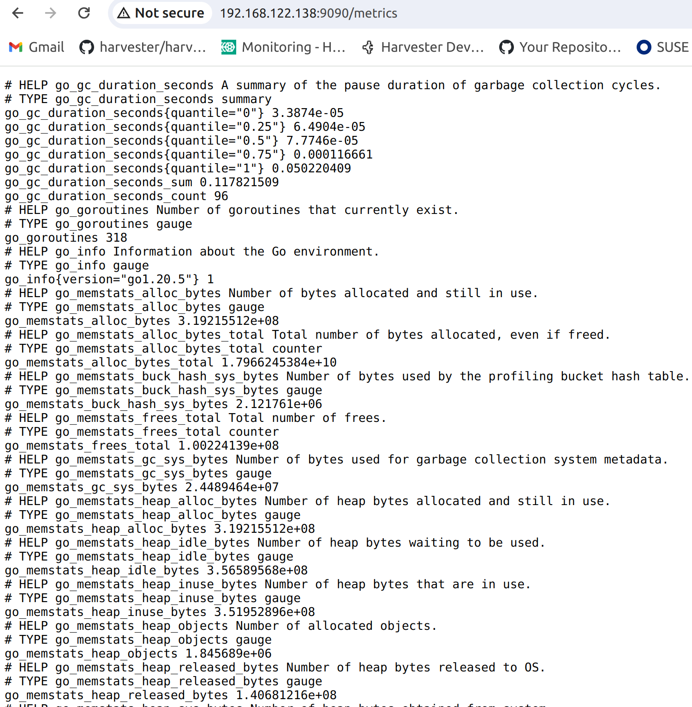

# Expose Harvester Prometheus Http Datasource

You plan to expose the Harvester prometheus datasource from the embedded [rancher-monitoring stack](https://docs.harvesterhci.io/v1.3/monitoring/harvester-monitoring).

:::note

Sugguest to use a new IP (not Harvester VIP, not any NODE IP) for exposing the prometheus data source, to avoid affection other services.

The current solution exposes only via http endpoint.

Enable the [rancher-monitoring addon](https://docs.harvesterhci.io/v1.3/advanced/addons) on Harvester.

:::

## Prepare a new Serivce

Prepare a new Loadbalancer type k8s service to expose the Prometheus.

When the LB is getting IP from DHCP server:

```
cat > prometheus.yaml << 'EOF'
apiVersion: v1
kind: Service
metadata:
  name: prometheus-expose
  namespace: cattle-monitoring-system
spec:
  ipFamilies:
  - IPv4
  ipFamilyPolicy: SingleStack
  loadBalancerIP: 0.0.0.0
  ports:
  - name: promethues-http
    port: 9090
    protocol: TCP
    targetPort: 9090
  selector:
    app.kubernetes.io/name: prometheus
  sessionAffinity: None
  type: LoadBalancer
EOF

kubectl apply -f prometheus.yaml

```

If you are using fixed IP for this LB, change the field `loadBalancerIP`.


```
Change

spec:
  loadBalancerIP: 0.0.0.0
  
to

spec:
  loadBalancerIP: your IP  
```

## Verify the service

A successful run will get:

```
$ kubectl get service -n cattle-monitoring-system prometheus-expose
NAME                TYPE           CLUSTER-IP     EXTERNAL-IP       PORT(S)          AGE
prometheus-expose   LoadBalancer   10.53.162.14   192.168.122.138   9090:30517/TCP   3m47s


$ kubectl get endpointslice -n cattle-monitoring-system  -l "kubernetes.io/service-name"=prometheus-expose
NAME                      ADDRESSTYPE   PORTS   ENDPOINTS     AGE
prometheus-expose-mm7bd   IPv4          9090    10.52.0.144   4m54s

```

### Verify the datasource

Access the metrics from http endpoint.

```
http://192.168.122.138:9090/metrics

```



