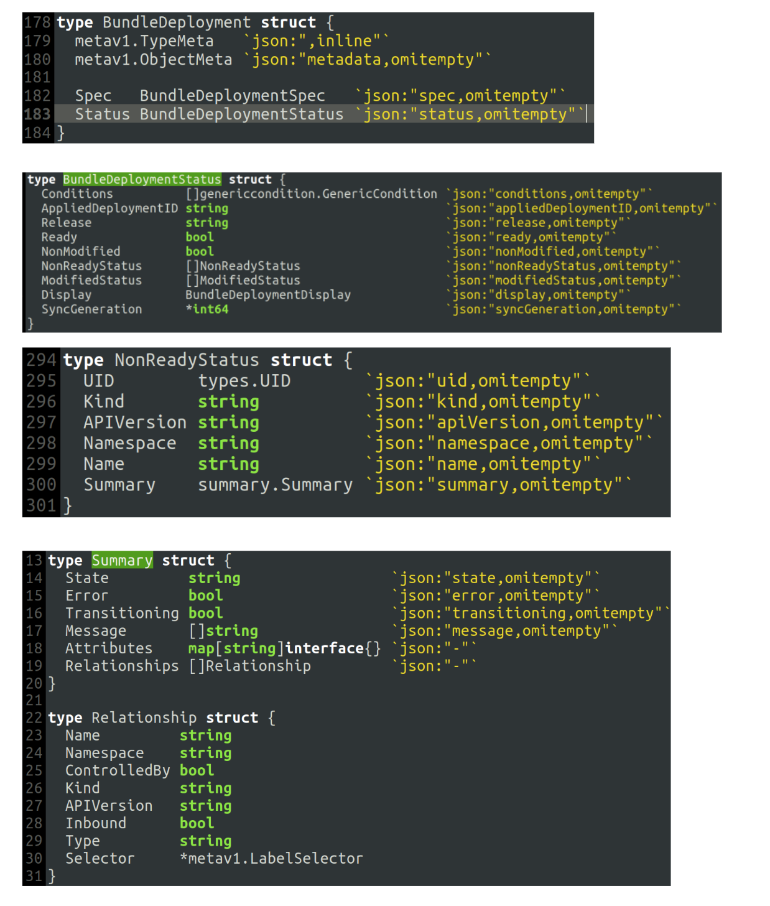
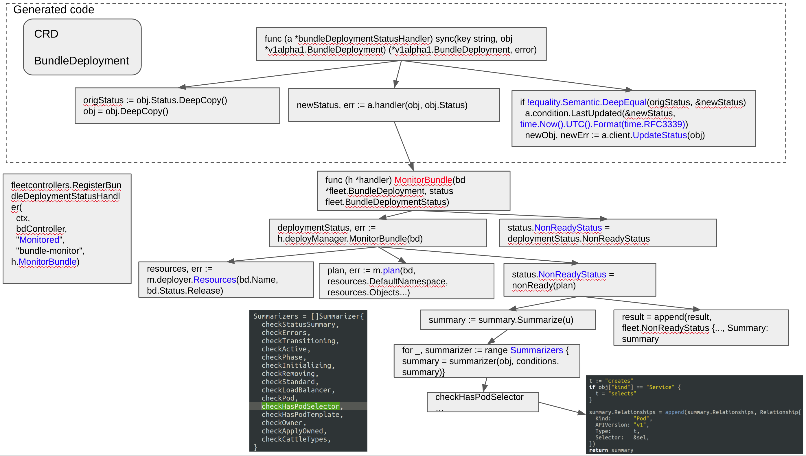

# trouble shooting of `fleet-agent` using high amount of CPU in Harvester in some scenarios

## Related Issues

https://github.com/harvester/harvester/issues/1893

https://github.com/harvester/harvester/issues/2245

https://github.com/rancher/fleet/issues/760

## Reproduce steps

After investation, a stable reproducing operations are as following (there could be more):

1. Install a new cluster with 2 nodes

2. Power off the KVM VM which runs the compute node

## Debug information

1. kubectl shows a couple of PODs are in Terminating


```
cattle-system               rancher-598f5dbc8-htf4m                                  1/1     Terminating   1          32m
harvester-system            harvester-697fb5d565-5822h                               1/1     Terminating   1          32m
harvester-system            harvester-network-controller-manager-99677f8fd-l456c     1/1     Terminating   1          32m
harvester-system            harvester-webhook-584f99698c-kj8sc                       1/1     Terminating   1          32m
kube-system                 rke2-coredns-rke2-coredns-687554ff58-kj6ld               1/1     Terminating   1          32m
longhorn-system             instance-manager-e-b624ea55                              1/1     Terminating   0          12m
longhorn-system             instance-manager-r-0d880b77                              1/1     Terminating   0          12m
```


2. Fleet bundle also shows related information


```
$ kubectl get bundle -A 

NAMESPACE     NAME                                          BUNDLEDEPLOYMENTS-READY   STATUS
fleet-local   fleet-agent-local                             1/1                       
fleet-local   local-managed-system-agent                    1/1                       
fleet-local   mcc-harvester                                 0/1                       NotReady(1) [Cluster fleet-local/local]; configmap.v1 longhorn-system/longhorn-storageclass missing; deployment.apps harvester-system/harvester [progressing] Available: 1/2; deployment.apps harvester-system/harvester-network-controller-manager [progressing] Deployment does not have minimum availability., Available: 1/2; deployment.apps harvester-system/harvester-webhook [progressing] Deployment does not have minimum availability., Available: 1/2; kubevirt.kubevirt.io harvester-system/kubevirt [progressing] Deploying version 0.49.0-2 with registry registry.suse.com/harvester-beta, Resource is current
fleet-local   mcc-harvester-crd                             1/1                       
fleet-local   mcc-local-managed-system-upgrade-controller   1/1                       
fleet-local   mcc-rancher-monitoring                        0/1                       NotReady(1) [Cluster fleet-local/local]; daemonset.apps cattle-monitoring-system/rancher-monitoring-prometheus-node-exporter [progressing] Available: 1/2
fleet-local   mcc-rancher-monitoring-crd                    1/1                       
```

3. Fleet-agent uses a big amount of CPU usage

```
top - 14:20:28 up 29 min,  1 user,  load average: 3.66, 3.83, 4.20
Tasks: 438 total,   2 running, 436 sleeping,   0 stopped,   0 zombie
%Cpu(s): 39.4 us,  3.6 sy,  0.0 ni, 55.1 id,  0.5 wa,  0.0 hi,  1.3 si,  0.0 st
MiB Mem : 16002.85+total, 1030.832 free, 9919.383 used, 5052.641 buff/cache
MiB Swap:    0.000 total,    0.000 free,    0.000 used. 5837.199 avail Mem 

  PID USER      PR  NI    VIRT    RES    SHR S  %CPU  %MEM     TIME+ COMMAND                                                                                                   
16764 root      20   0 1401796 484804  47208 S 111.0 2.958  24:01.66 fleetagent                       ------                                                                         
13321 10001     20   0 1030080 246492  34904 S 97.67 1.504   2:54.50 adapter                                                                                                   
 2489 root      20   0 3094452 1.817g  77424 S 90.03 11.63  20:50.75 kube-apiserver                                                                                            
 2476 root      20   0 1610048 819860 118996 R 17.94 5.003   4:13.23 etcd                                                                                                      
 1955 root      20   0  901140 175480  68036 S 5.980 1.071   1:33.35 kubelet                                                                                                   
25422 1000      20   0 1670748 740248  50640 S 4.319 4.517   1:17.00 prometheus                                                                                                
12168 root      20   0  755196  62992  31752 S 3.322 0.384   0:00.10 kubectl                                                                                                   
 2381 root      20   0  958848 215396  68420 S 2.658 1.314   0:32.32 kube-controller                                                                                           
11762 1000      20   0  842580 163572  46668 S 2.326 0.998   0:39.65 fleetcontroller
```


4. Fleet-agent log shows continuous similar information

```
time="2022-05-06T14:13:53Z" level=info msg="getting history for release harvester"
time="2022-05-06T14:13:53Z" level=error msg="bundle mcc-rancher-monitoring: daemonset.apps cattle-monitoring-system/rancher-monitoring-prometheus-node-exporter [progressing] Available: 1/2"
time="2022-05-06T14:13:53Z" level=info msg="getting history for release rancher-monitoring"
W0506 14:13:54.077803       1 warnings.go:70] policy/v1beta1 PodSecurityPolicy is deprecated in v1.21+, unavailable in v1.25+
W0506 14:13:54.180218       1 warnings.go:70] policy/v1beta1 PodSecurityPolicy is deprecated in v1.21+, unavailable in v1.25+
time="2022-05-06T14:13:54Z" level=error msg="bundle mcc-harvester: kubevirt.kubevirt.io harvester-system/kubevirt [progressing] Deploying version 0.49.0-2 with registry registry.suse.com/harvester-beta, Resource is current"
time="2022-05-06T14:13:54Z" level=info msg="getting history for release harvester"
time="2022-05-06T14:13:54Z" level=info msg="getting history for release rancher-monitoring"
time="2022-05-06T14:13:55Z" level=info msg="getting history for release rancher-monitoring"
W0506 14:13:55.077193       1 warnings.go:70] policy/v1beta1 PodSecurityPolicy is deprecated in v1.21+, unavailable in v1.25+
time="2022-05-06T14:13:55Z" level=info msg="getting history for release harvester"
time="2022-05-06T14:13:55Z" level=info msg="getting history for release harvester"
W0506 14:13:55.665340       1 warnings.go:70] policy/v1beta1 PodSecurityPolicy is deprecated in v1.21+, unavailable in v1.25+
time="2022-05-06T14:13:55Z" level=error msg="bundle mcc-rancher-monitoring: daemonset.apps cattle-monitoring-system/rancher-monitoring-prometheus-node-exporter [progressing] Available: 1/2"
time="2022-05-06T14:13:56Z" level=info msg="getting history for release rancher-monitoring"
W0506 14:13:56.079681       1 warnings.go:70] policy/v1beta1 PodSecurityPolicy is deprecated in v1.21+, unavailable in v1.25+
time="2022-05-06T14:13:56Z" level=error msg="bundle mcc-harvester: kubevirt.kubevirt.io harvester-system/kubevirt [progressing] Deploying version 0.49.0-2 with registry registry.suse.com/harvester-beta, Resource is current"
time="2022-05-06T14:13:56Z" level=info msg="getting history for release harvester"
W0506 14:13:56.602775       1 warnings.go:70] policy/v1beta1 PodSecurityPolicy is deprecated in v1.21+, unavailable in v1.25+
time="2022-05-06T14:13:56Z" level=info msg="getting history for release rancher-monitoring"
W0506 14:13:57.078222       1 warnings.go:70] policy/v1beta1 PodSecurityPolicy is deprecated in v1.21+, unavailable in v1.25+
time="2022-05-06T14:13:57Z" level=info msg="getting history for release harvester"
time="2022-05-06T14:13:57Z" level=info msg="getting history for release harvester"
time="2022-05-06T14:13:57Z" level=info msg="getting history for release rancher-monitoring"
W0506 14:13:58.026595       1 warnings.go:70] policy/v1beta1 PodSecurityPolicy is deprecated in v1.21+, unavailable in v1.25+
W0506 14:13:58.079424       1 warnings.go:70] policy/v1beta1 PodSecurityPolicy is deprecated in v1.21+, unavailable in v1.25+
time="2022-05-06T14:13:58Z" level=error msg="bundle mcc-harvester: kubevirt.kubevirt.io harvester-system/kubevirt [progressing] Deploying version 0.49.0-2 with registry registry.suse.com/harvester-beta, Resource is current"
time="2022-05-06T14:13:58Z" level=info msg="getting history for release harvester"
time="2022-05-06T14:13:58Z" level=error msg="bundle mcc-rancher-monitoring: daemonset.apps cattle-monitoring-system/rancher-monitoring-prometheus-node-exporter [progressing] Available: 1/2"
time="2022-05-06T14:13:58Z" level=info msg="getting history for release rancher-monitoring"
```

5. The related CRD's status is keeping updated, but only the "lastUpdateTime" in type "Monitored" is changed, other items are not changed.

```
$ kubectl get bundledeployment -n cluster-fleet-local-local-1a3d67d0a899 mcc-rancher-monitoring -o JSON 

{
    "apiVersion": "fleet.cattle.io/v1alpha1",
    "kind": "BundleDeployment",
    "metadata": {
..
        "name": "mcc-rancher-monitoring",
        "namespace": "cluster-fleet-local-local-1a3d67d0a899",
..
    },
    "spec": {
..
    },
    "status": {
        "appliedDeploymentID": "s-3037063ddd777fc28a3f1c7cba6f6d98748123942a7f6da3c4c921dbca782:4a7acbe7fd26f1c6cd1e177070694caba568e8bec6b4e47a76bc328fea24631c",
        "conditions": [
            {
                "lastUpdateTime": "2022-06-15T14:14:51Z",
                "status": "True",
                "type": "Deployed"
            },
            {
                "lastUpdateTime": "2022-06-15T21:35:25Z",  // ---------------------- only this field is keeping updated
                "status": "True",
                "type": "Monitored"
            },
            {
                "lastUpdateTime": "2022-06-15T14:09:38Z",
                "message": "daemonset.apps cattle-monitoring-system/rancher-monitoring-prometheus-node-exporter [progressing] Available: 1/2",
                "reason": "Error",
                "status": "False",
                "type": "Ready"
            }
        ],
        "display": {
            "deployed": "True",
            "monitored": "True",
            "state": "NotReady"
        },
        "nonModified": true,
        "nonReadyStatus": [
            {
                "apiVersion": "apps/v1",
                "kind": "DaemonSet",
                "name": "rancher-monitoring-prometheus-node-exporter",
                "namespace": "cattle-monitoring-system",
                "summary": {
                    "message": [
                        "Available: 1/2"
                    ],
                    "state": "in-progress",
                    "transitioning": true
                },
                "uid": "2ad5b74e-8886-4e7c-a6fa-f238374c16e7"
            }
        ],
        "release": "cattle-monitoring-system/rancher-monitoring:12",
        "syncGeneration": 0
    }
}
```

## Code analysis

The related data structures.




The running process.



Why `status` is keeping updated in the specific field?

Next, why `equality.Semantic.DeepEqual` return false ?

## Debugging

### Why `equality.Semantic.DeepEqual` return false

As `equality.Semantic.DeepEqual` is a bit diffcult to debug, we tried to expand the `BundleDeploymentStatus` step by step, to check which field causes the `false`.

```

func (h *handler) MonitorBundle(bd *fleet.BundleDeployment, status fleet.BundleDeploymentStatus) (fleet.BundleDeploymentStatus, error) {

  st1 := status.DeepCopy()

	deploymentStatus, err := h.deployManager.MonitorBundle(bd)
..

	status.NonReadyStatus = deploymentStatus.NonReadyStatus
	status.ModifiedStatus = deploymentStatus.ModifiedStatus
	status.Ready = deploymentStatus.Ready
	status.NonModified = deploymentStatus.NonModified

	if !equality.Semantic.DeepEqual(st1, &status) {
		testStatus(st1, &status) ---------------
	}

	return status, nil
}


func testStatus(s1 *fleet.BundleDeploymentStatus, s2 *fleet.BundleDeploymentStatus) {

	v1 := equality.Semantic.DeepEqual(s1.Conditions, s2.Conditions)
	v2 := equality.Semantic.DeepEqual(s1.AppliedDeploymentID, s2.AppliedDeploymentID)

	v3 := equality.Semantic.DeepEqual(s1.Release, s2.Release)
	v4 := equality.Semantic.DeepEqual(s1.Ready, s2.Ready)

	v5 := equality.Semantic.DeepEqual(s1.NonModified, s2.NonModified)
	v6 := equality.Semantic.DeepEqual(s1.NonReadyStatus, s2.NonReadyStatus)

	if !v6 {
		testNoneReadyStatusSlice(s1.NonReadyStatus, s2.NonReadyStatus)
	}

	v7 := equality.Semantic.DeepEqual(s1.ModifiedStatus, s2.ModifiedStatus)

	v8 := equality.Semantic.DeepEqual(s1.Display, s2.Display)

	v9 := equality.Semantic.DeepEqual(s1.SyncGeneration, s2.SyncGeneration)

	logrus.Warnf("testStatus: v1=%v, v2=%v, v3=%v, v4=%v, v5=%v, v6=%v, v7=%v, v8=%v, v9=%v", v1, v2, v3, v4, v5, v6, v7, v8, v9)
}

/*
type BundleDeploymentStatus struct {
	Conditions          []genericcondition.GenericCondition `json:"conditions,omitempty"`
	AppliedDeploymentID string                              `json:"appliedDeploymentID,omitempty"`

	Release             string                              `json:"release,omitempty"`
	Ready               bool                                `json:"ready,omitempty"`

	NonModified         bool                                `json:"nonModified,omitempty"`
	NonReadyStatus      []NonReadyStatus                    `json:"nonReadyStatus,omitempty"`
	ModifiedStatus      []ModifiedStatus                    `json:"modifiedStatus,omitempty"`

	Display             BundleDeploymentDisplay             `json:"display,omitempty"`
	SyncGeneration      *int64                              `json:"syncGeneration,omitempty"`

*/

```

Finally, it shows the false is caused by: `Summary.Relationships`

```
type Summary struct {
	State         string                 `json:"state,omitempty"`
	Error         bool                   `json:"error,omitempty"`
	Transitioning bool                   `json:"transitioning,omitempty"`
	Message       []string               `json:"message,omitempty"`
	Attributes    map[string]interface{} `json:"-"`
	Relationships []Relationship         `json:"-"`
}

type Relationship struct {
	Name         string
	Namespace    string
	ControlledBy bool
	Kind         string
	APIVersion   string
	Inbound      bool
	Type         string
	Selector     *metav1.LabelSelector
}
```

The debug: 1 is from the local saved copy of `status` (st1) at beginning of `MonitorBundle`, 2 is the to be returned `status`.

```
1=[], 
2=[{  false Pod v1 false creates &LabelSelector{MatchLabels:map[string]string{app: prometheus-node-exporter,release: rancher-monitoring,},MatchExpressions:[]LabelSelectorRequirement{},}} {rancher-monitoring-prometheus-node-exporter  false ServiceAccount v1 false uses nil}
```

It's clear, after main process of `MonitorBundle`, `status.NonReadyStatus[*].Summary.Relationships[*]` is filled with some value.

### Why status is continuously updated

Again, let's check `Summary`, the `Relationships` field is tagged as `json:"-"`.

```
type Summary struct {
	State         string                 `json:"state,omitempty"`
	Error         bool                   `json:"error,omitempty"`
	Transitioning bool                   `json:"transitioning,omitempty"`
	Message       []string               `json:"message,omitempty"`
	Attributes    map[string]interface{} `json:"-"`
	Relationships []Relationship         `json:"-"`
}
```

As said in https://www.digitalocean.com/community/tutorials/how-to-use-struct-tags-in-go

```
Ignoring Private Fields
Some fields must be exported from structs so that other packages can correctly interact with the type. However, the nature of these fields may be sensitive, so in these circumstances, we would like the JSON encoder to ignore the field entirely—even when it is set. This is done using the special value - as the value argument to a json: struct tag.
```

It means, `status.NonReadyStatus[*].Summary.Relationships[*]` will not be updated to API Server side.

Further, let's check below auto generated code, it gives the answer.

(a) `status.NonReadyStatus[*].Summary.Relationships[*]` causes `equality.Semantic.DeepEqual(origStatus, &newStatus)` return `false`

(b) `a.condition.LastUpdated(&newStatus, time.Now().UTC().Format(time.RFC3339))` updates the `lastUpdatedTime` field.

(c) `a.client.UpdateStatus(obj)` updates the `status` to API Server, with the only changed filed `lastUpdatedTime` of `Monitored` in Condition

`status` is updated to API Server, it will trigger a new round of (a) (b) (c). 

It is a dead/long loop before something changed.

```
func (a *bundleDeploymentStatusHandler) sync(key string, obj *v1alpha1.BundleDeployment) (*v1alpha1.BundleDeployment, error) {
	if obj == nil {
		return obj, nil
	}

	origStatus := obj.Status.DeepCopy()
	obj = obj.DeepCopy()
	newStatus, err := a.handler(obj, obj.Status)
	if err != nil {
		// Revert to old status on error
		newStatus = *origStatus.DeepCopy()
	}

	if a.condition != "" {
		if errors.IsConflict(err) {
			a.condition.SetError(&newStatus, "", nil)
		} else {
			a.condition.SetError(&newStatus, "", err)
		}
	}
	if !equality.Semantic.DeepEqual(origStatus, &newStatus) {  // NOTE
		if a.condition != "" {
			// Since status has changed, update the lastUpdatedTime
			a.condition.LastUpdated(&newStatus, time.Now().UTC().Format(time.RFC3339))  // NOTE
		}

		var newErr error
		obj.Status = newStatus
		newObj, newErr := a.client.UpdateStatus(obj)
		if err == nil {
			err = newErr
		}
		if newErr == nil {
			obj = newObj
		}
	}
	return obj, err
}
```

### Why so frequent ?

Fleet-agent aims to make sure the deployment meets expectation. When the `deployment` is ongoing, or some `NODEs` are down and caused the related `POD` are in `Terminating` state, current code will assume the `bundledeployment` is in `NonReadyStatus`.

The summary.Summarize will call all following checks, as long as they generate the `Relationship`, then this `BUG` is triggered.

If the `deployment` becomes ready quickly, the `BUG` may not cause attention.

Other cases, it is noticed.

```
	Summarizers = []Summarizer{
		checkStatusSummary,
		checkErrors,
		checkTransitioning,
		checkActive,
		checkPhase,
		checkInitializing,
		checkRemoving,
		checkStandard,
		checkLoadBalancer,
		checkPod,
		checkHasPodSelector,
		checkHasPodTemplate,
		checkOwner,
		checkApplyOwned,
		checkCattleTypes,
	}
```


## Workaround

Tried as such, fleet-agent breaks the dead loop.

```
func removeStatusPrivateField(s1 *fleet.BundleDeploymentStatus) {
	for id, _ := range s1.NonReadyStatus {
			s1.NonReadyStatus[id].Summary.Relationships = nil
	}
}


func (h *handler) MonitorBundle(bd *fleet.BundleDeployment, status fleet.BundleDeploymentStatus) (fleet.BundleDeploymentStatus, error) {

  st1 := status.DeepCopy()

	deploymentStatus, err := h.deployManager.MonitorBundle(bd)
..

	status.NonReadyStatus = deploymentStatus.NonReadyStatus
..

  removeStatusPrivateField(&status) // remove the private field

	return status, nil
}
```

## Open questions

How to solve this `BUG`? Replace `summary`, remove `private field`, or use customized `equality.Semantic.DeepEqual`, or ...?

