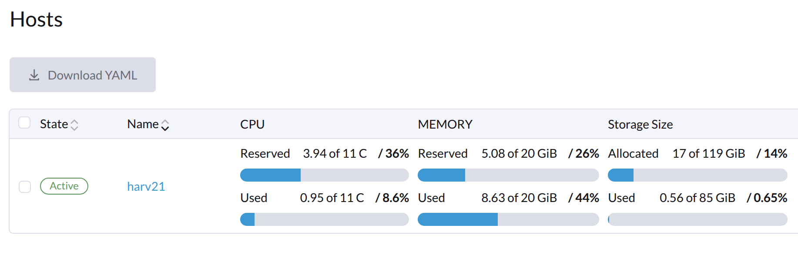
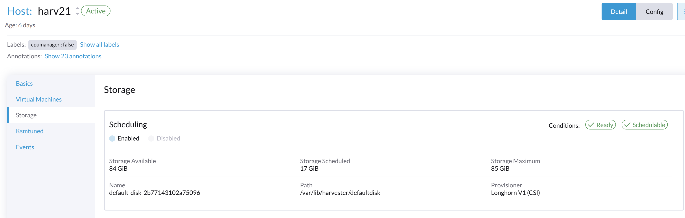

# Harvester Storage Allocated Used Statistics

## Harvester Hosts Page View






How are `Allocated` and `Used` computed? We use the data from a single-node cluster to explain the details.

## Details

The default `CSI driver` in `Harvester` is `Longhorn`, which manages all `disks` and provisions `PVs` to all workloads.

:::note

If third-party CSI driver is used, the related disks and PVs mamanged by it are not included in the statistics.

:::

#### Longhorn Nodes

Longhorn generates a `nodes.longhorn.io` object for each node on Harvester cluster.

```
$ kubectl get nodes.longhorn.io -A
NAMESPACE         NAME     READY   ALLOWSCHEDULING   SCHEDULABLE   AGE
longhorn-system   harv21   True    true              True          6d20h

apiVersion: v1
items:
- apiVersion: longhorn.io/v1beta2
  kind: Node
  metadata:
    creationTimestamp: "2025-02-18T15:25:00Z"
...
    name: harv21
    namespace: longhorn-system
...
  spec:
    allowScheduling: true
    disks:
      default-disk-2b77143102a75096:
        allowScheduling: true
        diskDriver: ""
        diskType: filesystem
        evictionRequested: false
        path: /var/lib/harvester/defaultdisk
        storageReserved: 27389509632                                      //
        tags: []
    evictionRequested: false
    instanceManagerCPURequest: 0
    name: harv21
    tags: []
  status:
    autoEvicting: false
...
    diskStatus:
      default-disk-2b77143102a75096:
        conditions:
...
        diskDriver: ""
        diskName: default-disk-2b77143102a75096
        diskPath: /var/lib/harvester/defaultdisk
        diskType: filesystem
        diskUUID: bcd71663-b714-4f90-b09d-008606820299
        filesystemType: ext2/ext3
        instanceManagerName: instance-manager-6f041fd336331e0713ddf314a69b54b5
        scheduledBackingImage: {}
        scheduledReplica:
          pvc-2d5e1691-9ab0-4656-b7dd-10f669069813-r-558f8913: 2147483648
          pvc-685b9455-ac41-41ea-afc8-ac9f287f2487-r-1d5e3614: 5368709120
          pvc-37679b7b-c560-481e-b22a-fa48f67e029f-r-a4a39caf: 10737418240
        storageAvailable: 90701824000                                     //
        storageMaximum: 91298365440                                       //
        storageScheduled: 18253611008                                     //
    region: ""
    snapshotCheckStatus: {}
    zone: ""
kind: List
metadata:
  resourceVersion: ""

```

### Allocated (17 of 119 GiB)

This shows the storage usage and capacity from the view of Longhorn, it is an abstrct & virtualized layer on top of real disk.

#### 119 GiB (LH PV capacity)

This is computed via the following formula:

`(Sum of (disk.storageMaximum - disk.storageReserved)) * (storage-over-provisioning-percentage / 100)`

The default `storage-over-provisioning-percentage` on Harvester is `200`.
```
settings.longhorn.io

longhorn-system   storage-over-provisioning-percentage                              200                                           true      6d18h
```

In above example, the computed value is:

`(91298365440 - 27389509632) * (200 / 100) =127817711616,  127817711616 >> 30 = 119GiB`

This means:

A disk with size `91298365440 (85 GiB)` is managed by Longhorn, Longhorn reserves `27389509632 (25 GiB, around 30% of 85 GiB)` for internal usage like swap, and with a ` storage-over-provisioning-percentage` ratio of `200`, Longhorn can provision `119 GiB` of PV on Harvester cluster.

#### 17 GiB (the current K8s PVCs)

It is computed via the `volume` object's `.spec.size`, and those volumes are owned by the current node.

```
$ kubectl get volume -A -oyaml |  grep size -w
    size: "2147483648"
    size: "10737418240"
    size: "5368709120"

(2147483648+10737418240+5368709120) >> 30   = 17 GiB


$ kubectl get volume -A -oyaml

apiVersion: v1
items:
- apiVersion: longhorn.io/v1beta2
  kind: Volume
  metadata:
...
    name: pvc-2d5e1691-9ab0-4656-b7dd-10f669069813
    namespace: longhorn-system
...
  spec:
    Standby: false
    accessMode: rwo
    backendStoreDriver: ""
    backingImage: ""
    backupCompressionMethod: lz4
    backupTargetName: default
    dataEngine: v1
    dataLocality: disabled
    dataSource: ""
    disableFrontend: false
    diskSelector: []
    encrypted: false
    engineImage: ""
    freezeFilesystemForSnapshot: ignored
    fromBackup: ""
    frontend: blockdev
    image: longhornio/longhorn-engine:v1.8.0
    lastAttachedBy: ""
    migratable: false
    migrationNodeID: ""
    nodeID: ""
    nodeSelector: []
    numberOfReplicas: 3
    replicaAutoBalance: ignored
    replicaDiskSoftAntiAffinity: ignored
    replicaSoftAntiAffinity: ignored
    replicaZoneSoftAntiAffinity: ignored
    restoreVolumeRecurringJob: ignored
    revisionCounterDisabled: true
    size: "2147483648"                                                    // claimed size
    snapshotDataIntegrity: ignored
    snapshotMaxCount: 250
    snapshotMaxSize: "0"
    staleReplicaTimeout: 30
    unmapMarkSnapChainRemoved: ignored
...
  status:
    actualSize: 114352128                                                 // actual size
...
    currentImage: longhornio/longhorn-engine:v1.8.0
    currentMigrationNodeID: ""
    currentNodeID: ""
...
    lastBackup: ""
    lastBackupAt: ""
    lastDegradedAt: ""
    ownerID: harv21                                                       // owner node
    pendingNodeID: ""
...
    state: detached


$ kubectl get volume -A
NAMESPACE         NAME                                       DATA ENGINE   STATE      ROBUSTNESS   SCHEDULED   SIZE          NODE   AGE
longhorn-system   pvc-2d5e1691-9ab0-4656-b7dd-10f669069813   v1            detached   unknown                  2147483648           6d19h
longhorn-system   pvc-37679b7b-c560-481e-b22a-fa48f67e029f   v1            detached   unknown                  10737418240          6d19h
longhorn-system   pvc-685b9455-ac41-41ea-afc8-ac9f287f2487   v1            detached   unknown                  5368709120           6d19h
```

### Used (0.56 of 85 GiB)

This shows the real usage of disk.

#### 85 GiB (total disk capacities)

This value is take from object `node.longhorn.io`, the summary of `.status.diskStatus[].storageMaximum`.

In this example, it is `storageMaximum: 91298365440`

`91298365440 >> 30 = 85 GiB`

#### 0.56 Gi (actual used disk spaces)

It is computed via the `volume` object's `.status.actualSize`, and those volumes are owned by the current node.

```
$ kubectl get volume -A -oyaml | grep actual -i
    actualSize: 114352128
    actualSize: 274726912
    actualSize: 153821184

(114352128+274726912+153821184) >> 20 ~= 0.52 Gi                          // slightly different with the UI results

```
