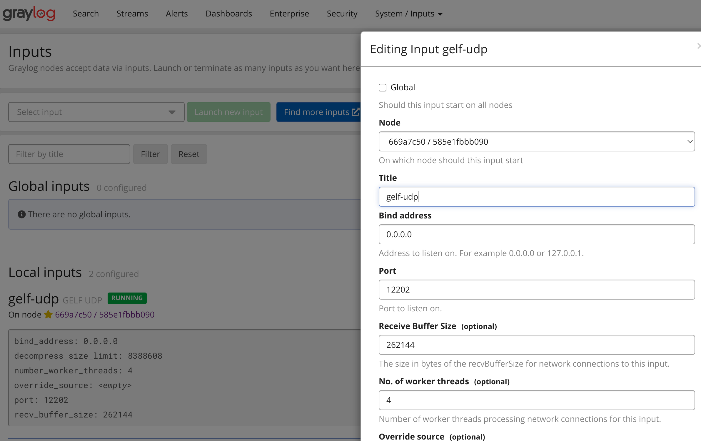
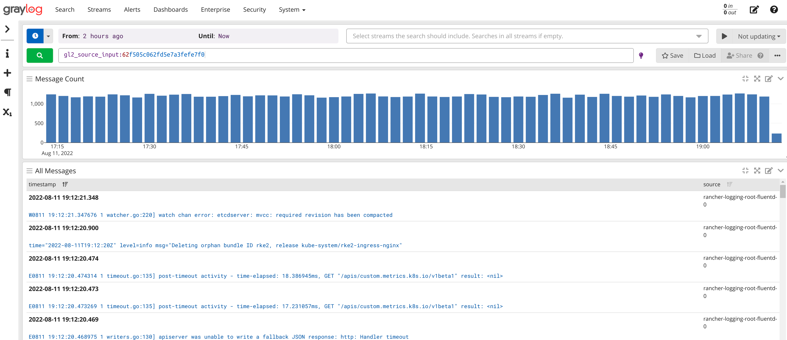

# Integrate Harvester log with various log systems

## integrate Harvester logging with graylog

### deploy graylog in docker container

Graylog needs mongodb and elasticsearch.

#### reference

https://docs.graylog.org/docs/docker

REQUIREMENTS
You will need a recent version of Docker. In addition, use the following Docker images in this chapter:

Graylog: graylog/graylog
MongoDB: mongo
Elasticsearch: https://www.docker.elastic.co/r/elasticsearch
If you prefer to run the containers together you could configure all the containers above in a yaml file. To do this, install Docker Compose. Refer to Settings for Compose examples.


#### prepare docker image

We select the latest images:

```
docker pull graylog/graylog:4.3.5

docker pull mongo:4.2.22-rc0

docker pull docker pull docker.elastic.co/elasticsearch/elasticsearch:6.8.23
```

[note, we first tried latest docker.elastic.co/elasticsearch/elasticsearch:8.3.3-amd64, but finally find that graylog can only support elasticsearch 6.* ~ 7.*

docker pull docker.elastic.co/elasticsearch/elasticsearch:8.3.3-amd64 (not working)

the related log:

```
2022-08-10 19:05:05,834 INFO : org.graylog2.bootstrap.preflight.MongoDBPreflightCheck - Connected to MongoDB version 4.2.22

2022-08-10 19:05:05,919 ERROR: org.graylog2.bootstrap.preflight.PreflightCheckService - Preflight check failed with error: Unsupported (Elastic/Open)Search version <Elasticsearch:8.3.3>. Supported versions: <[SearchVersionRange{distribution=OpenSearch, expression=^1.0.0}, SearchVersionRange{distribution=Elasticsearch, expression=^6.0.0}, SearchVersionRange{distribution=Elasticsearch, expression=^7.0.0}]>
```


#### run docker containers


##### mongo db

```
docker run --name mongo -d mongo:4.2.22-rc0
```


##### elasticsearch

make sure `max_map_count >= 262144`

cat /proc/sys/vm/max_map_count

if not: (you may need to set each time after system rebooting)

sudo sysctl -w vm.max_map_count=262144

related error message:
`bootstrap check failure [1] of [1]: max virtual memory areas vm.max_map_count [65530] is too low, increase to at least [262144]`

```
docker run --name elasticsearch -p 9200:9200 -p 9300:9300 -e xpack.security.enabled=false  -e node.name=es01 -it docker.elastic.co/elasticsearch/elasticsearch:6.8.23
```

To simplify, the xpack.security.enabled is set to false.

test `elasticsearch`

```
$ curl localhost:9200
{
  "name" : "es01",
  "cluster_name" : "docker-cluster",
  "cluster_uuid" : "GGvo_EmPTlC0x2qEpQjF0A",
  "version" : {
    "number" : "6.8.23",
    "build_flavor" : "default",
    "build_type" : "docker",
    "build_hash" : "4f67856",
    "build_date" : "2022-01-06T21:30:50.087716Z",
    "build_snapshot" : false,
    "lucene_version" : "7.7.3",
    "minimum_wire_compatibility_version" : "5.6.0",
    "minimum_index_compatibility_version" : "5.0.0"
  },
  "tagline" : "You Know, for Search"
}
```

#### graylog

prepare the `admin` user password for login into graylog dashboard

$ echo -n ROOT_PASSWORDa1 | sha256sum
899e9793de44cbb14f48b4fce810de122093d03705c0971752a5c15b0fa1ae03  -

[note] It's important to add required `udp port` into parameters when lunching `graylog` container. `Docker` defaults to allow `container->internet` access, but not vice versa. The `port mapping` will allow `internet->container` access, `fluentd` output requires it. Following example, the `udp 12202 port` is mapped.

```
docker run --name graylog --link mongo --link elasticsearch -p 9000:9000 -p 12201:12201 -p 1514:1514 -p 5555:5555 -p 12202:12202 -p 12202:12202/udp -e GRAYLOG_PASSWORD_SECRET="Graypass3WordMor!e" -e GRAYLOG_ROOT_PASSWORD_SHA2=899e9793de44cbb14f48b4fce810de122093d03705c0971752a5c15b0fa1ae03   -e GRAYLOG_HTTP_EXTERNAL_URI="http://127.0.0.1:9000/"  -d graylog/graylog:4.3.5
```

Normally, you can access: `http://<your server ip>:9000`  with username `admin`, password `ROOT_PASSWORDa1` now.


When you need to add more `port` mapping, the quick way is to stop&delete current docker container, and deploy a new one.


[If you faile to stop graylog container](#stop-docker-container-fail)

##### add inputs

For each type of inputs, setup the related params.



##### view logs




### set harvester logging


#### check graylog syslog plugin

The `fluentd` needs related plugin to send log to log server.

For `graylog` syslog input, it needs `gelf-hs` plugin.

It can be checked via login into the POD.

```
kubectl exec -i -t -n cattle-logging-system rancher-logging-root-fluentd-0 -c fluentd -- /bin/sh
```

Both `gem list` and `ls /usr/lib/ruby/gems/2.7.0/gems` work.


`fluent-plugin-gelf-hs-1.0.8` is in the list, we don't need to install the plugin manually.


```

/ $ gem list
...

/ $ ls /usr/lib/ruby/gems/2.7.0/gems

activemodel-7.0.2                               fluent-plugin-gcs-0.4.0                         msgpack-1.4.4
activesupport-7.0.2                             fluent-plugin-gelf-hs-1.0.8                     multi_json-1.15.0
addressable-2.8.0                               fluent-plugin-geoip-1.3.2                       multipart-post-2.1.1
aes_key_wrap-1.1.0                              fluent-plugin-grafana-loki-1.2.18               mutex_m-0.1.0
aliyun-sdk-0.8.0                                fluent-plugin-kafka-0.17.4                      net-http-persistent-3.1.0
async-1.30.1                                    fluent-plugin-kinesis-3.4.2                     net-http-persistent-4.0.1
async-http-0.56.3                               fluent-plugin-kube-events-timestamp-0.1.3       net-pop-0.1.0
async-io-1.32.2                                 fluent-plugin-kubernetes-metadata-filter-2.5.3  net-smtp-0.1.0
async-pool-0.3.9                                fluent-plugin-kubernetes-sumologic-2.0.0        netrc-0.11.0
attr_required-1.0.1                             fluent-plugin-label-router-0.2.10               nio4r-2.5.8
aws-eventstream-1.2.0                           fluent-plugin-logdna-0.4.0                      nokogiri-1.13.1
aws-partitions-1.553.0                          fluent-plugin-logzio-0.0.21                     observer-0.1.0
aws-sdk-cloudwatchlogs-1.51.0                   fluent-plugin-multi-format-parser-1.0.0         oj-3.11.6
aws-sdk-core-3.126.0                            fluent-plugin-newrelic-1.2.1                    open3-0.1.0
aws-sdk-firehose-1.47.0                         fluent-plugin-oss-0.0.2                         openid_connect-1.1.8
aws-sdk-kinesis-1.40.0                          fluent-plugin-parser-logfmt-0.0.0               openssl-2.1.3
aws-sdk-kms-1.54.0                              fluent-plugin-prometheus-2.0.2                  os-1.1.4
aws-sdk-s3-1.112.0                              fluent-plugin-record-modifier-2.1.0             ostruct-0.2.0
aws-sdk-sqs-1.50.0                              fluent-plugin-redis-0.3.5                       prime-0.1.1
aws-sigv4-1.4.0                                 fluent-plugin-remote-syslog-1.1                 prometheus-client-2.1.0
azure-storage-blob-2.0.3                        fluent-plugin-rewrite-tag-filter-2.4.0          protocol-hpack-1.4.2
azure-storage-common-2.0.4                      fluent-plugin-s3-1.6.1                          protocol-http-0.22.5
benchmark-0.1.0                                 fluent-plugin-splunk-hec-1.2.10                 protocol-http1-0.14.2
bigdecimal-1.4.4                                fluent-plugin-sqs-3.0.0                         protocol-http2-0.14.2
bindata-2.4.10                                  fluent-plugin-sumologic_output-1.7.3            pstore-0.1.0
bundler-2.3.6                                   fluent-plugin-syslog_rfc5424-0.9.0.rc.8         psych-3.1.0
cgi-0.1.0.1                                     fluent-plugin-tag-normaliser-0.1.1              public_suffix-4.0.6
concurrent-ruby-1.1.9                           fluent-plugin-throttle-0.0.5                    racc-1.4.16
connection_pool-2.2.5                           fluent-plugin-webhdfs-1.5.0                     rack-2.2.3
console-1.14.0                                  fluentd-1.14.4                                  rack-oauth2-1.19.0
cool.io-1.7.1                                   forwardable-1.3.1                               rake-13.0.6
csv-3.1.2                                       gelf-3.0.0                                      readline-0.0.2
date-3.0.3                                      geoip-c-0.9.1                                   readline-ext-0.1.0
dbm-1.1.0                                       geoip2_c-0.3.3                                  recursive-open-struct-1.1.3
declarative-0.0.20                              getoptlong-0.1.0                                redis-3.3.5
delegate-0.1.0                                  google-apis-core-0.4.2                          reline-0.1.5
did_you_mean-1.4.0                              google-apis-iamcredentials_v1-0.10.0            representable-3.1.1
dig_rb-1.0.1                                    google-apis-storage_v1-0.11.0                   resolv-0.2.1
digest-crc-0.6.4                                google-cloud-core-1.6.0                         rest-client-2.1.0
domain_name-0.5.20190701                        google-cloud-env-1.5.0                          retriable-3.1.2
elasticsearch-7.13.3                            google-cloud-errors-1.2.0                       rexml-3.2.3.1
elasticsearch-api-7.13.3                        google-cloud-storage-1.36.0                     rss-0.2.8
elasticsearch-transport-7.13.3                  google-protobuf-3.19.4                          ruby-kafka-1.4.0
elasticsearch-xpack-7.13.3                      googleauth-1.1.0                                ruby2_keywords-0.0.5
etc-1.1.0                                       http-2.2.2                                      serverengine-2.2.5
excon-0.91.0                                    http-4.4.1                                      sigdump-0.2.4
ext_monitor-0.1.2                               http-accept-1.7.0                               signet-0.16.0
faraday-1.9.3                                   http-cookie-1.0.4                               singleton-0.1.0
faraday-em_http-1.0.0                           http-form_data-1.0.3                            specific_install-0.3.7
faraday-em_synchrony-1.0.0                      http-form_data-2.3.0                            stringio-0.1.0
faraday-excon-1.1.0                             http-parser-1.2.3                               strptime-0.2.5
faraday-httpclient-1.0.1                        http_parser.rb-0.5.3                            strscan-1.0.3
faraday-multipart-1.0.3                         http_parser.rb-0.6.0                            swd-1.3.0
faraday-net_http-1.0.1                          httpclient-2.8.3                                syslog_protocol-0.9.2
faraday-net_http_persistent-1.2.0               i18n-1.9.1                                      thread_safe-0.3.6
faraday-patron-1.0.0                            io-console-0.5.6                                timeout-0.1.0
faraday-rack-1.0.0                              ipaddr-1.2.2                                    timers-4.3.3
faraday-retry-1.0.3                             irb-1.2.6                                       tracer-0.1.0
faraday_middleware-1.2.0                        jmespath-1.5.0                                  trailblazer-option-0.1.2
faraday_middleware-aws-sigv4-0.3.0              json-2.5.1                                      tzinfo-1.2.7
fcntl-1.0.0                                     json-jwt-1.13.0                                 tzinfo-2.0.4
ffi-1.15.5                                      jsonpath-1.1.0                                  tzinfo-data-1.2021.5
ffi-compiler-1.0.1                              jwt-2.3.0                                       uber-0.1.0
fiber-local-1.0.0                               kubeclient-4.9.1                                unf-0.1.4
fileutils-1.4.1                                 logfmt-0.0.9                                    unf_ext-0.0.8
fluent-config-regexp-type-1.0.0                 logger-1.4.2                                    uri-0.10.0
fluent-mixin-config-placeholders-0.4.0          lru_redux-1.1.0                                 uuidtools-2.2.0
fluent-plugin-aws-elasticsearch-service-2.4.1   ltsv-0.1.2                                      validate_email-0.1.6
fluent-plugin-azure-storage-append-blob-0.2.1   mail-2.7.1                                      validate_url-1.0.13
fluent-plugin-cloudwatch-logs-0.14.2            matrix-0.2.0                                    webfinger-1.2.0
fluent-plugin-concat-2.5.0                      memoist-0.16.2                                  webhdfs-0.10.2
fluent-plugin-datadog-0.14.1                    mime-types-3.4.1                                webrick-1.7.0
fluent-plugin-dedot_filter-1.0.0                mime-types-data-3.2022.0105                     yajl-ruby-1.4.1
fluent-plugin-detect-exceptions-0.0.14          mini_mime-1.1.2                                 yaml-0.1.0
fluent-plugin-elasticsearch-5.1.5               mini_portile2-2.7.1                             zlib-1.1.0
fluent-plugin-enhance-k8s-metadata-2.0.0        minitest-5.15.0
/ $ 


```

Further verify

The `fluentd`'s log can not be picked via `kubectl logs`, it is in following file in the POD.

The `'fluent-plugin-gelf-hs' version '1.0.8'` is installed when POD startup.

```
/ $ cat /fluentd/log/out


# Logfile created on 2022-08-11 13:04:37 +0000 by logger.rb/v1.4.2
2022-08-11 13:04:37 +0000 [info]: parsing config file is succeeded path="/fluentd/etc/fluent.conf"
...
2022-08-11 13:04:38 +0000 [info]: gem 'fluent-plugin-gcs' version '0.4.0'
2022-08-11 13:04:38 +0000 [info]: gem 'fluent-plugin-gelf-hs' version '1.0.8'
...
```


#### add clusterrule and clusteroutput

Below `ClusterFlow` and `ClusterOutput` will guide `fluentd` send all logs to `graylog` server via `udp port` 12202 .

```
cat << EOF > cf3.YAML
apiVersion: logging.banzaicloud.io/v1beta1
kind: ClusterFlow
metadata:
  name: "all-logs-gelf-hs"
  namespace: "cattle-logging-system"
spec:
  globalOutputRefs:
    - "example-gelf-hs"
EOF


cat << EOF > co3.YAML
apiVersion: logging.banzaicloud.io/v1beta1
kind: ClusterOutput
metadata:
  name: "example-gelf-hs"
  namespace: "cattle-logging-system"
spec:
  gelf:
    host: "192.168.122.159"
    port: 12202
    protocol: "udp"
EOF

kubectl apply -f cf3.YAML
kubectl apply -f co3.YAML
```

#### known limitions of fluentbit and fluentd


https://github.com/fluent/fluent-operator

https://github.com/fluent/fluent-operator/blob/master/charts/fluent-operator/crds/fluentbit.fluent.io_clusterfluentbitconfigs.yaml

But in the `rancher-logging`, the `logging-operator` does not know `ClusterFluentBitConfig`.


It does not watch `ClusterFluentBitConfig`

```
{"level":"info","ts":1660338486.9123373,"logger":"controller.logging","msg":"Starting EventSource","reconciler group":"logging.banzaicloud.io","reconciler kind":"Logging","source":"kind source: *v1.ClusterRole"}
{"level":"info","ts":1660338486.9123454,"logger":"controller.logging","msg":"Starting EventSource","reconciler group":"logging.banzaicloud.io","reconciler kind":"Logging","source":"kind source: *v1.ClusterRoleBinding"}
{"level":"info","ts":1660338486.9123504,"logger":"controller.logging","msg":"Starting EventSource","reconciler group":"logging.banzaicloud.io","reconciler kind":"Logging","source":"kind source: *v1.ServiceAccount"}
{"level":"info","ts":1660338486.9123535,"logger":"controller.logging","msg":"Starting EventSource","reconciler group":"logging.banzaicloud.io","reconciler kind":"Logging","source":"kind source: *v1beta1.ClusterOutput"}
{"level":"info","ts":1660338486.9123561,"logger":"controller.logging","msg":"Starting EventSource","reconciler group":"logging.banzaicloud.io","reconciler kind":"Logging","source":"kind source: *v1beta1.ClusterFlow"}
{"level":"info","ts":1660338486.9123595,"logger":"controller.logging","msg":"Starting EventSource","reconciler group":"logging.banzaicloud.io","reconciler kind":"Logging","source":"kind source: *v1beta1.Output"}

harv1:~ # kk logs -n cattle-logging-system rancher-logging-7b54b444c8-2djf4 | grep "reconciler group"  | grep "fluent"
harv1:~ # 
```

Manually created `ClusterFluentBitConfig` has no effect.

```
harv1:~ # kk get clusterfluentbitconfig.fluentbit.fluent.io/example-fluentbit-config -o JSON
{
    "apiVersion": "fluentbit.fluent.io/v1alpha2",
    "kind": "ClusterFluentBitConfig",
    "metadata": {
        "annotations": {
            "kubectl.kubernetes.io/last-applied-configuration": "{\"apiVersion\":\"fluentbit.fluent.io/v1alpha2\",\"kind\":\"ClusterFluentBitConfig\",\"metadata\":{\"annotations\":{},\"name\":\"example-fluentbit-config\"},\"spec\":{\"service\":{\"logLevel\":\"warning\"}}}\n"
        },
        "creationTimestamp": "2022-08-12T21:26:18Z",
        "generation": 1,
        "name": "example-fluentbit-config",
        "resourceVersion": "4006594",
        "uid": "7c17c82b-2fe7-46dc-8710-ced1fc68ebb3"
    },
    "spec": {
        "service": {
            "logLevel": "warning"
        }
    }
}
harv1:~ # 
```

We are not able to change default log level to `warning`.

### troubleshooting

#### enable docker events

`docker events &`


check logging of a container, it is helpful when a contaier starts fail

`docker logs containerID/name`

e.g.

```
$ docker logs f7c15d

2022-08-10 15:05:29,983 INFO : org.graylog2.featureflag.ImmutableFeatureFlagsCollector - Following feature flags are used: {}
2022-08-10 15:05:30,144 ERROR: org.graylog2.bootstrap.CmdLineTool - Invalid configuration

com.github.joschi.jadconfig.ValidationException: Parameter password_secret should not be blank

	at com.github.joschi.jadconfig.validators.StringNotBlankValidator.validate(StringNotBlankValidator.java:25) ~[graylog.jar:?]
	at com.github.joschi.jadconfig.validators.StringNotBlankValidator.validate(StringNotBlankValidator.java:11) ~[graylog.jar:?]
	at com.github.joschi.jadconfig.JadConfig.validateParameter(JadConfig.java:215) ~[graylog.jar:?]
	at com.github.joschi.jadconfig.JadConfig.processClassFields(JadConfig.java:148) ~[graylog.jar:?]
	at com.github.joschi.jadconfig.JadConfig.process(JadConfig.java:99) ~[graylog.jar:?]
	at org.graylog2.bootstrap.CmdLineTool.processConfiguration(CmdLineTool.java:464) [graylog.jar:?]
	at org.graylog2.bootstrap.CmdLineTool.run(CmdLineTool.java:270) [graylog.jar:?]
	at org.graylog2.bootstrap.Main.main(Main.java:45) [graylog.jar:?]
```

#### stop docker container fail

```
$docker stop 69918df2e21f

Error response from daemon: cannot stop container: 69918df2e21f: permission denied
```

This error maybe caused by `apparmor`, try to execute: `$ sudo aa-remove-unknown` .

Then

```
$docker stop 69918df2e21f
69918df2e21f
```

## test with http webhook log server

refer:  https://github.com/w13915984028/harvester-develop-summary/blob/main/test-log-event-audit-with-webhook-server.md

## test with Splunk log server

https://github.com/w13915984028/harvester-develop-summary/blob/main/test-log-event-audit-with-splunk.md
