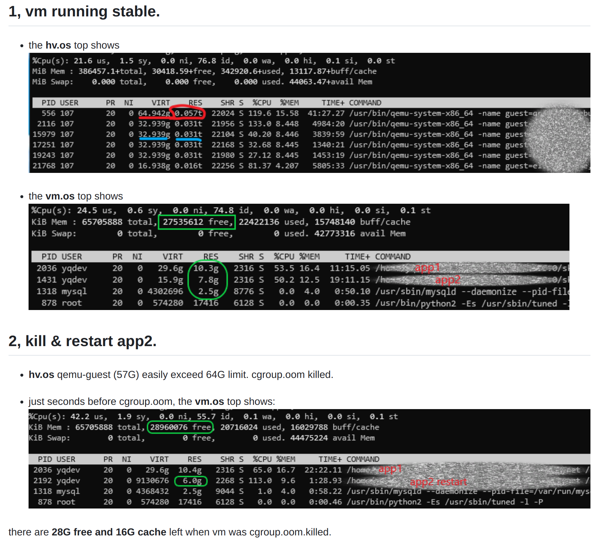

# OOM Related Issue Investigation

## Related Issues

### Harvester Issues

https://jira.suse.com/browse/SURE-8365

https://jira.suse.com/browse/SURE-8479

https://github.com/harvester/harvester/issues/2419

https://github.com/harvester/harvester/issues/2522

https://github.com/harvester/harvester/issues/5768


[windows server 2019 essentail failed to launch with KMODE exception](https://github.com/harvester/harvester/issues/276)

Root cause is unknown, the workaroud works.


[Windows Server ISOs reboot system before getting to the installation screen ](https://github.com/harvester/harvester/issues/1730)

Solution: set a big amount of reserved memory.


[vm killed by Memory cgroup out of memory OOM](https://github.com/harvester/harvester/issues/2419)

Solution: set a big amount of reserved memory.


Phenomenon: Even though the guest has 27G free, 22G in use, 15G buffer, the host side triggers cgroup (64G) oom.


[VMs are crashing when writing bulk data to additional volumes ](https://github.com/harvester/harvester/issues/1234)

Solution: set `spec.domain.memory.guest` with a smaller value than `spec.domain.resources.limit.memory`.

### Upstream Issues

[Investigating the virt-launcher overhead](https://github.com/kubevirt/kubevirt/issues/8067)

Aug 3, 2022
libvirt.org/go/libvirt v1.8006.0


now:
https://github.com/kubevirt/kubevirt/blob/49a58dbd0b91496570f9c86020aefb8276e00cb4/go.mod#L82C2-L82C35
libvirt.org/go/libvirt v1.10000.0


[virt-handler and virt-launcher pods are consuming an abnormally large amount of memory](https://github.com/kubevirt/kubevirt/issues/9820)

Not really solved, closed per not-reproduced.

```
# crictl --runtime-endpoint unix:///run/containerd/containerd.sock statsp
POD                                     POD ID              CPU %               MEM
...
virt-handler-dzbqz                      5489c082718b9       3.23                118.5GB
virt-launcher-asdf1-qxrgs               71c5ece039996       4.27                108.8GB
```

[virt-handler is consuming quite some memory](https://github.com/kubevirt/kubevirt/issues/1662)

finally sorted as https://github.com/kubevirt/kubevirt/issues/1663


https://github.com/kubevirt/kubevirt/issues/2109

Not really solved, closed per not-reproduced.


[qemu-kvm get oom-killer](https://github.com/kubevirt/kubevirt/issues/5958)

## Analysis

### OOM Characters

Example 1: Keyword: `virt-launcher invoked oom-killer`.

The `virt-launcher` is a KubeVirt related process running in the VM backed pod's related cgroup. Means when this process runs into memory operation, it triggers cgroup OOM killer.

```
Feb 03 19:57:08 ** kernel: virt-launcher invoked oom-killer: gfp_mask=0xcc0(GFP_KERNEL), order=0, oom_score_adj=986
Feb 03 19:57:08 ** kernel: CPU: 40 PID: 40785 Comm: virt-launcher Tainted: G          I    X    5.14.21-150400.24.60-default #1 SLE15-SP4 9096397fa6646928cc6d185ba417f2af65b536f1
...

Feb 03 19:57:08 ** kernel: memory: usage 17024340kB, limit 17024340kB, failcnt 1243
Feb 03 19:57:08 ** kernel: memory+swap: usage 17024340kB, limit 9007199254740988kB, failcnt 0                                                                       
Feb 03 19:57:08 ** kernel: kmem: usage 143556kB, limit 9007199254740988kB, failcnt 0
Feb 03 19:57:08 ** kernel: Memory cgroup stats for /kubepods.slice/kubepods-burstable.slice/kubepods-burstable-pod968a06fb_9ab9_4819_8caf_0392ddff3d9b.slice:
...
Feb 03 19:57:08 ** kernel: Tasks state (memory values in pages):
Feb 03 19:57:08 ** kernel: [  pid  ]   uid  tgid total_vm      rss pgtables_bytes swapents oom_score_adj name
Feb 03 19:57:08 ** kernel: [  38886]     0 38886      243        1    28672        0          -998 pause
Feb 03 19:57:08 ** kernel: [  38917]     0 38917   310400     6921   192512        0           986 virt-launcher-m
Feb 03 19:57:08 ** kernel: [  38934]     0 38934  1200940    25126   954368        0           986 virt-launcher
Feb 03 19:57:08 ** kernel: [  38951]     0 38951   386525     8247   466944        0           986 libvirtd
Feb 03 19:57:08 ** kernel: [  38952]     0 38952    33619     3940   290816        0           986 virtlogd
Feb 03 19:57:08 ** kernel: [  39079]   107 39079  4457263  4201766 34439168        0           986 qemu-system-x86
Feb 03 19:57:08 ** kernel: oom-kill:constraint=CONSTRAINT_MEMCG,nodemask=(null),cpuset=cri-containerd-0f32894de86edf3d3832702af794874ef8d400b4969acdea4976b12040756e0d.scope,mems_allowed=0-1,oom_memcg=/kubepods.slice/kubepods-burstable.slice/kubepods-burstable-pod968a06fb_9ab9_4819_8caf_0392ddff3d9b.slice,task_memcg=/kubepods.slice/kubepods-burstable.slice/kubepods-burstable-pod968a06fb_9ab9_4819_8caf_0392ddff3d9b.slice/cri-containerd-0f32894de86edf3d3832702af794874ef8d400b4969acdea4976b12040756e0d.scope,task=qemu-system-x86,pid=39079,uid=107

```

Example 2: Keyword: `CPU 11/KVM invoked oom-kille`

The `CPU 11/KVM` is a thread of `qemu-system-x86` process, which simulates the vCPU to guest OS. Means when this process runs into memory operation, it triggers cgroup OOM killer.

```
[Thu May  9 14:52:38 2024] CPU 11/KVM invoked oom-killer: gfp_mask=0xcc0(GFP_KERNEL), order=0, oom_score_adj=830
[Thu May  9 14:52:38 2024] CPU: 60 PID: 70888 Comm: CPU 11/KVM Not tainted 5.3.18-150300.59.101-default #1 SLE15-SP3
...
[Thu May  9 14:52:38 2024] memory: usage 67579904kB, limit 67579904kB, failcnt 67391
[Thu May  9 14:52:38 2024] memory+swap: usage 0kB, limit 9007199254740988kB, failcnt 0
[Thu May  9 14:52:38 2024] kmem: usage 633636kB, limit 9007199254740988kB, failcnt 0
...
[Thu May  9 14:52:38 2024] Tasks state (memory values in pages):
[Thu May  9 14:52:38 2024] [  pid  ]   uid  tgid total_vm      rss pgtables_bytes swapents oom_score_adj name
[Thu May  9 14:52:38 2024] [  70675]     0 70675      243        1    28672        0          -998 pause
[Thu May  9 14:52:38 2024] [  70728]     0 70728   310400     5467   188416        0           830 virt-launcher-m
[Thu May  9 14:52:38 2024] [  70746]     0 70746  1242373    25104  1073152        0           830 virt-launcher
[Thu May  9 14:52:38 2024] [  70762]     0 70762   455279    14110   770048        0           830 libvirtd
[Thu May  9 14:52:38 2024] [  70763]     0 70763    37704     3916   339968        0           830 virtlogd
[Thu May  9 14:52:38 2024] [  70870]   107 70870 18302464 16718510 135278592        0           830 qemu-system-x86
[Thu May  9 14:52:38 2024] oom-kill:constraint=CONSTRAINT_MEMCG,nodemask=(null),cpuset=cri-containerd-100093783c22a3ae1a42e21dd887b7c26eef52d56ba44c7273ef54507b6efe7c.scope,mems_allowed=0-3,oom_memcg=/kubepods.slice/kubepods-burstable.slice/kubepods-burstable-podef91e487_dec5_4613_800b_eb23e1a1617d.slice,task_memcg=/kubepods.slice/kubepods-urstable.slice/kubepods-burstable-podef91e487_dec5_4613_800b_eb23e1a1617d.slice/cri-containerd-100093783c22a3ae1a42e21dd887b7c26eef52d56ba44c7273ef54507b6efe7c.scope,task=qemu-system-x86,pid=70870,uid=107
[Thu May  9 14:52:38 2024] Memory cgroup out of memory: Killed process 70870 (qemu-system-x86) total-vm:73209856kB, anon-rss:66852088kB, file-rss:21948kB, shmem-rss:4kB
[Thu May  9 14:52:38 2024] oom_reaper: reaped process 70870 (qemu-system-x86), now anon-rss:0kB, file-rss:132kB, shmem-rss:4kB

```


Example 3: Keyword: `CPU 1/KVM invoked oom-killer`.

```
[ 8758.722811] CPU 1/KVM invoked oom-killer: gfp_mask=0xcc0(GFP_KERNEL), order=0, oom_score_adj=920
[ 8758.722817] CPU: 4 PID: 24808 Comm: CPU 1/KVM Not tainted 5.14.21-150400.24.116-default #1 SLE15-SP4 ff1e28259e46d1fe5c98a695c715341ba6a7fbe4
...
[ 8758.723232] memory: usage 2355880kB, limit 2355880kB, failcnt 0
[ 8758.723234] memory+swap: usage 2355880kB, limit 2355880kB, failcnt 2339
[ 8758.723235] kmem: usage 21292kB, limit 9007199254740988kB, failcnt 0
[ 8758.723236] Memory cgroup stats for /kubepods.slice/kubepods-burstable.slice/kubepods-burstable-podbc31d215_d48e_4416_8e2b_68716b8f5bcb.slice/cri-containerd-b545a34b33f1939f6256113274da85221b9bce0e51188b1e78ffabe615fad9b3.scope:
[ 8758.723254] anon 2390548480
...
[ 8758.723255] Tasks state (memory values in pages):
[ 8758.723256] [  pid  ]   uid  tgid total_vm      rss pgtables_bytes swapents oom_score_adj name
[ 8758.723258] [  24457]   107 24457   440598     3054   192512        0           920 virt-launcher-m
[ 8758.723261] [  24474]   107 24474   760671    13694   585728        0           920 virt-launcher
[ 8758.723264] [  24510]   107 24510   350756     8288   389120        0           920 virtqemud
[ 8758.723266] [  24511]   107 24511    36762     4696   241664        0           920 virtlogd
[ 8758.723269] [  24790]   107 24790   705165   472935  4374528        0           920 qemu-system-x86
[ 8758.723271] [   5688]   107  5688     1741     1067    49152        0           920 sh
[ 8758.723274] [  11572]   107 11572   103431   103103   864256        0           920 memhold
[ 8758.723276] oom-kill:constraint=CONSTRAINT_MEMCG,nodemask=(null),cpuset=cri-containerd-b545a34b33f1939f6256113274da85221b9bce0e51188b1e78ffabe615fad9b3.scope,mems_allowed=0,oom_memcg=/kubepods.slice/kubepods-burstable.slice/kubepods-burstable-podbc31d215_d48e_4416_8e2b_68716b8f5bcb.slice/cri-containerd-b545a34b33f1939f6256113274da85221b9bce0e51188b1e78ffabe615fad9b3.scope,task_memcg=/kubepods.slice/kubepods-burstable.slice/kubepods-burstable-podbc31d215_d48e_4416_8e2b_68716b8f5bcb.slice/cri-containerd-b545a34b33f1939f6256113274da85221b9bce0e51188b1e78ffabe615fad9b3.scope,task=qemu-system-x86,pid=24790,uid=107
[ 8758.723296] Memory cgroup out of memory: Killed process 24790 (qemu-system-x86) total-vm:2820660kB, anon-rss:1867320kB, file-rss:24420kB, shmem-rss:0kB, UID:107 pgtables:4272kB oom_score_adj:920
[ 8758.774802] oom_reaper: reaped process 24790 (qemu-system-x86), now anon-rss:0kB, file-rss:20kB, shmem-rss:0kB

```

From user perspective, it is the Guest VM OOM killed. Technically, it is one of the thread/process inside the VM's backed pod's cgroup which trigger the OOM (of this cgroup), and in all sitations the `qemu-system-x86` process is the victim of this OOM, as it uses most of the memory.


### Guest OS Memory Fragmentation and Slow Returning

```
       Guest OS: memory management
--------------------------------------------------
  Host OS: VM Pod: qemu-system-x86 process
```

After long time running, the Guest OS may still show a lower memory usage, but from the view of the Host OS, the related process has almost used up all it's memory. 

Following picture is a good example taken from [Issue 2419](https://github.com/harvester/harvester/issues/2419).



When Guest APP allocates & writes memory, the Guest OS will get memory from the Host OS, even after the APP frees the memory, the Guest OS will not return the memory to Host OS promptly, instead it holds them.

### Differences of a VM running on native Linux Host and Harvester.

#### Run a VM via Virtual Machine Manager

E.g. A Host OS with Ubuntu 20.04 runs a VM created via `Virtual Machine Manager`, this VM is further used as Harvester node.

```
$ systemd-cgls
Control group /:
-.slice
├─1173 bpfilter_umh
├─system.slice

└─machine.slice
  └─machine-qemu\x2d1\x2dharv41.scope 
    └─8632 /usr/bin/qemu-system-x86_64 -name guest=harv41,debug-threads=on -S -…
```

All CPU and memory resources are used by this `qemu-system-x86_64` process.

#### Run a VM via Harvester

This VM will be controlled by a cgroup slice comes from includes k8s pod.

```
-.slice
└─kubepods.slice
  │ ├─kubepods-burstable-pod99ee3a64_645b_4699_9384_5a3875d78b41.slice
  │ │ ├─cri-containerd-0c316eb8a4711bff1ce968b46ddb658e49378897454b4caf2a20704c808f33f1.scope …
  │ │ │ └─ 8505 /pause
  │ │ ├─cri-containerd-eb5deef29f064adfd2456d9f9c535674ac4d0c95c81b13afbdab5a89dc6a774b.scope …
  │ │ │ └─ 8590 /usr/bin/virt-tail --logfile /var/run/kubevirt-private/2ce151aa…
  │ │ └─cri-containerd-fd57a5cfc2b9b1f53eaf7b575c3273e6784f4c56a04a17d502ecfbd19e55b066.scope …
  │ │   ├─ 8542 /usr/bin/virt-launcher-monitor --qemu-timeout 301s --name vm2 -…
  │ │   ├─ 8558 /usr/bin/virt-launcher --qemu-timeout 301s --name vm2 --uid 2ce…
  │ │   ├─ 8591 /usr/sbin/virtqemud -f /var/run/libvirt/virtqemud.conf
  │ │   ├─ 8592 /usr/sbin/virtlogd -f /etc/libvirt/virtlogd.conf
  │ │   └─ 8823 /usr/bin/qemu-system-x86_64 -name guest=default_vm2,debug-threa…
```

All the above `processes` are included in the cgroup slices.

VM definition, user configured 2GiB, but Harvester reserved 100M, the memory.guest is 1948Mi.

```
apiVersion: kubevirt.io/v1
kind: VirtualMachine

        machine:
          type: q35
        memory:
          guest: 1948Mi
        resources:
          limits:
            cpu: "2"
            memory: 2Gi
          requests:
            cpu: 125m
            memory: 1365Mi
```


Limits on cgroup slices:

```
$cat /sys/fs/cgroup/memory/kubepods.slice/kubepods-burstable.slice/kubepods-burstable-pod99ee3a64_645b_4699_9384_5a3875d78b41.slice/memory.limit_in_bytes
2,472,419,328


$ cat /sys/fs/cgroup/memory/kubepods.slice/kubepods-burstable.slice/kubepods-burstable-pod99ee3a64_645b_4699_9384_5a3875d78b41.slice/memory.max_usage_in_bytes
341,999,616


$ cat /sys/fs/cgroup/memory/kubepods.slice/kubepods-burstable.slice/kubepods-burstable-pod99ee3a64_645b_4699_9384_5a3875d78b41.slice/memory.usage_in_bytes
341,094,400


$ cat /sys/fs/cgroup/memory/kubepods.slice/kubepods-burstable.slice/kubepods-burstable-pod99ee3a64_645b_4699_9384_5a3875d78b41.slice/memory.stat
cache 0
rss 0
rss_huge 0
shmem 0
mapped_file 0
dirty 0
writeback 0
swap 0
pgpgin 0
pgpgout 0
pgfault 0
pgmajfault 0
inactive_anon 0
active_anon 0
inactive_file 0
active_file 0
unevictable 0
hierarchical_memory_limit 2,472,419,328
hierarchical_memsw_limit 9223372036854771712
total_cache      2,019,328
total_rss      320,323,584
total_rss_huge 222,298,112
total_shmem 0
total_mapped_file 155,648
total_dirty 0
total_writeback 0
total_swap 0
total_pgpgin 38258
total_pgpgout 14511
total_pgfault 44898
total_pgmajfault 1
total_inactive_anon 268,607,488
total_active_anon    52,690,944
total_inactive_file   1,978,368
total_active_file 40960
total_unevictable 0
```

Memory overhead:

```
cgroup memory.limit_in_bytes: 2,412,421,120

overhead: >>> 2412421120-2*1024*1024*1024
264937472

264,937,472 (~ 252 M)
```

### Reserved Memory Calculation

KubeVirt latest version, used in Harvester v1.3.0 and onwards.

https://github.com/kubevirt/kubevirt/blob/3cfb32701d6aaa66063f9d11d73edbc406b85eef/pkg/virt-controller/services/template.go#L118

```
const (
	VirtLauncherMonitorOverhead = "25Mi"  // The `ps` RSS for virt-launcher-monitor
	VirtLauncherOverhead        = "100Mi" // The `ps` RSS for the virt-launcher process
	VirtlogdOverhead            = "20Mi"  // The `ps` RSS for virtlogd
	VirtqemudOverhead           = "35Mi"  // The `ps` RSS for virtqemud
	QemuOverhead                = "30Mi"  // The `ps` RSS for qemu, minus the RAM of its (stressed) guest, minus the virtual page table
	// Default: limits.memory = 2*requests.memory
	DefaultMemoryLimitOverheadRatio = float64(2.0)
)
```

KubeVirt v0.54 used in Harveter v1.2.1

https://github.com/kubevirt/kubevirt/blob/1b0ec7413fab92d171a5c70bf96a00d07d5798b3/pkg/virt-controller/services/template.go#L128C1-L134C2

```
const (
	VirtLauncherMonitorOverhead = "25Mi" // The `ps` RSS for virt-launcher-monitor
	VirtLauncherOverhead        = "75Mi" // The `ps` RSS for the virt-launcher process
	VirtlogdOverhead            = "17Mi" // The `ps` RSS for virtlogd
	LibvirtdOverhead            = "33Mi" // The `ps` RSS for libvirtd
	QemuOverhead                = "30Mi" // The `ps` RSS for qemu, minus the RAM of its (stressed) guest, minus the virtual page table
)

```

:::note

The LibVirtd was replaced by VirtQemud.

:::


## Reproduce

### Test 1: Exhuast Memory on Guest

1. Setup a VM on Harvester with guest OS Ubuntu

    The VM resources:

    ```
            machine:
              type: q35
            memory:
              guest: 1948Mi
            resources:
              limits:
                cpu: "2"
                memory: 2Gi
              requests:
                cpu: 125m
                memory: 1365Mi
    ```

    The memory on guest OS

    ```
    rancher@vm4:~$ cat /proc/meminfo 
    MemTotal:        1916188 kB
    MemFree:         1678612 kB
    MemAvailable:    1635264 kB
    Buffers:            5916 kB
    Cached:            42060 kB
    ```

1. Run a program which simply allocates memory.

    https://github.com/w13915984028/trouble-shooting/blob/master/oomtest/memtest.c

1. Result

    ```
    rancher@vm4:~$ ./memtest 
    ...
    allocated memory: 1616 M
    allocated memory: 1617 M
    allocated memory: 1618 M
    Killed
    ```

    When running a prgram which simply allocates memory from a Ubuntu VM, the OOM wont'n happen, instead, the program was simply killed by the guest OS when it is near the limit. From Host OS's view, this VM still runs well.


### Hold memory on VM POD and exhaust memory on guest VM

The OOM is reproduced.

Conditions:

(1) The summary of memory from all the processes (including those none `qemu-system-x86_64` and `qemu-system-x86_64`) is exceeding the limit of the cgroup.

(2) The none `qemu-system-x86_64` processes are using some memory which in theory belongs to the guest OS. To which content? is TBD.

#### Run a memhold application on VM Pod

Program source code: https://github.com/w13915984028/trouble-shooting/blob/master/oomtest/memhold.c

```
harv41:/home/rancher # kk exec -i -t virt-launcher-vm4-s98n4 -- /bin/sh

sh-4.4$ curl http://192.168.122.141:8000/memhold -o /tmp/memhold
  % Total    % Received % Xferd  Average Speed   Time    Time     Time  Current
                                 Dload  Upload   Total   Spent    Left  Speed
100 16912  100 16912    0     0  9819k      0 --:--:-- --:--:-- --:--:-- 16.1M
sh-4.4$ chmod +x /tmp/memhold


sh-4.4$ /tmp/memhold 100
this is a simple test to hold memory 100 M bytes
allocated 100 M bytes, enter sleeping
^C
sh-4.4$ /tmp/memhold 100
this is a simple test to hold memory 100 M bytes
allocated 100 M bytes, enter sleeping
^C
sh-4.4$ /tmp/memhold 200
this is a simple test to hold memory 200 M bytes
allocated 200 M bytes, enter sleeping
^C
sh-4.4$ /tmp/memhold 300
this is a simple test to hold memory 300 M bytes
allocated 300 M bytes, enter sleeping
^C
```

When the guest VM is only with empty OS, the above tests are OK.


#### Run a memhold application on VM Pod & run memory exhaust test on guest OS

VM POD:

```
sh-4.4$ /tmp/memhold 400
this is a simple test to hold memory 400 M bytes
allocated 400 M bytes, enter sleeping
```

Guest OS:
```
rancher@vm4:~$ ./memtest
this is a simple test to exhaust memory, allocate unit=1048576 bytes
allocated memory:       1024 kB,          1 MB

...
allocated memory:    1161216 kB,       1134 MB
allocated memory:    1162240 kB,       1135 MB
allocated memory:    1163264 kB,       1136 MB
```

It stucks on the last line.

Meanwhile, the VM POD:

```
command terminated with exit code 137
```

#### Host OS has an OOM record

The OOM is triggered on Host OS.

```
[ 8758.722811] CPU 1/KVM invoked oom-killer: gfp_mask=0xcc0(GFP_KERNEL), order=0, oom_score_adj=920
[ 8758.722817] CPU: 4 PID: 24808 Comm: CPU 1/KVM Not tainted 5.14.21-150400.24.116-default #1 SLE15-SP4 ff1e28259e46d1fe5c98a695c715341ba6a7fbe4
[ 8758.722821] Hardware name: QEMU Standard PC (i440FX + PIIX, 1996), BIOS 1.13.0-1ubuntu1.1 04/01/2014
[ 8758.722822] Call Trace:
[ 8758.722825]  <TASK>
[ 8758.722827]  dump_stack_lvl+0x45/0x5b
[ 8758.722833]  dump_header+0x4a/0x220
[ 8758.722837]  oom_kill_process+0xe8/0x140
[ 8758.722839]  out_of_memory+0x113/0x580
[ 8758.722842]  mem_cgroup_out_of_memory+0xe3/0x100
[ 8758.722848]  try_charge_memcg+0x6bb/0x700
[ 8758.722851]  ? srso_alias_return_thunk+0x5/0x7f
[ 8758.722854]  ? __alloc_pages+0x180/0x320
[ 8758.722857]  charge_memcg+0x40/0xa0
[ 8758.722860]  __mem_cgroup_charge+0x2c/0xa0
[ 8758.722862]  __handle_mm_fault+0xa37/0x1220
[ 8758.722865]  ? srso_alias_return_thunk+0x5/0x7f
[ 8758.722870]  handle_mm_fault+0xd5/0x290
[ 8758.722873]  __get_user_pages+0x15f/0x690
[ 8758.722877]  get_user_pages_unlocked+0xd9/0x320
[ 8758.722882]  __gfn_to_pfn_memslot+0x132/0x540 [kvm 26aa2d59a4dbb025cd24cb30a38eafe804bafab4]
[ 8758.722974]  try_async_pf+0xa3/0x2a0 [kvm 26aa2d59a4dbb025cd24cb30a38eafe804bafab4]
[ 8758.723000]  direct_page_fault+0x369/0x9a0 [kvm 26aa2d59a4dbb025cd24cb30a38eafe804bafab4]
[ 8758.723018]  kvm_mmu_page_fault+0x77/0x610 [kvm 26aa2d59a4dbb025cd24cb30a38eafe804bafab4]
[ 8758.723032]  ? svm_set_msr+0x3f0/0x840 [kvm_amd 469b6b50dbfd44f154923accc229e32bb90577ea]
[ 8758.723036]  ? kvm_msr_allowed+0xa1/0xd0 [kvm 26aa2d59a4dbb025cd24cb30a38eafe804bafab4]
[ 8758.723052]  ? srso_alias_return_thunk+0x5/0x7f
[ 8758.723053]  ? __svm_vcpu_run+0x11b/0x180 [kvm_amd 469b6b50dbfd44f154923accc229e32bb90577ea]
[ 8758.723057]  ? srso_alias_return_thunk+0x5/0x7f
[ 8758.723058]  ? load_fixmap_gdt+0x22/0x30
[ 8758.723062]  ? srso_alias_return_thunk+0x5/0x7f
[ 8758.723063]  ? apic_update_ppr+0x27/0x70 [kvm 26aa2d59a4dbb025cd24cb30a38eafe804bafab4]
[ 8758.723080]  ? srso_alias_return_thunk+0x5/0x7f
[ 8758.723082]  ? __SCT__kvm_x86_tlb_flush_guest+0x8/0x8 [kvm 26aa2d59a4dbb025cd24cb30a38eafe804bafab4]
[ 8758.723099]  vcpu_enter_guest+0x9bb/0x17e0 [kvm 26aa2d59a4dbb025cd24cb30a38eafe804bafab4]
[ 8758.723115]  ? srso_alias_return_thunk+0x5/0x7f
[ 8758.723116]  ? kvm_vcpu_kick+0x30/0x70 [kvm 26aa2d59a4dbb025cd24cb30a38eafe804bafab4]
[ 8758.723129]  ? srso_alias_return_thunk+0x5/0x7f
[ 8758.723131]  ? __apic_accept_irq+0x166/0x2c0 [kvm 26aa2d59a4dbb025cd24cb30a38eafe804bafab4]
[ 8758.723147]  ? kvm_arch_vcpu_ioctl_run+0x37d/0x570 [kvm 26aa2d59a4dbb025cd24cb30a38eafe804bafab4]
[ 8758.723161]  kvm_arch_vcpu_ioctl_run+0x37d/0x570 [kvm 26aa2d59a4dbb025cd24cb30a38eafe804bafab4]
[ 8758.723175]  kvm_vcpu_ioctl+0x418/0x660 [kvm 26aa2d59a4dbb025cd24cb30a38eafe804bafab4]
[ 8758.723190]  ? srso_alias_return_thunk+0x5/0x7f
[ 8758.723193]  __x64_sys_ioctl+0x92/0xd0
[ 8758.723196]  ? syscall_trace_enter.isra.20+0xa9/0x1e0
[ 8758.723200]  do_syscall_64+0x5b/0x80
[ 8758.723202]  ? syscall_exit_to_user_mode+0x1f/0x40
[ 8758.723204]  ? srso_alias_return_thunk+0x5/0x7f
[ 8758.723206]  ? do_syscall_64+0x67/0x80
[ 8758.723207]  ? srso_alias_return_thunk+0x5/0x7f
[ 8758.723209]  ? do_syscall_64+0x67/0x80
[ 8758.723210]  ? srso_alias_return_thunk+0x5/0x7f
[ 8758.723212]  entry_SYSCALL_64_after_hwframe+0x61/0xcb
[ 8758.723216] RIP: 0033:0x7fef49916527
[ 8758.723218] Code: 00 48 c7 c0 ff ff ff ff c3 66 2e 0f 1f 84 00 00 00 00 00 90 90 90 90 90 90 90 90 90 90 90 90 90 90 66 90 b8 10 00 00 00 0f 05 <48> 3d 01 f0 ff ff 73 01 c3 48 8b 0d 39 d9 0d 00 f7 d8 64 89 01 48
[ 8758.723220] RSP: 002b:00007fef3edbc4b8 EFLAGS: 00000246 ORIG_RAX: 0000000000000010
[ 8758.723222] RAX: ffffffffffffffda RBX: 000000000000ae80 RCX: 00007fef49916527
[ 8758.723224] RDX: 0000000000000000 RSI: 000000000000ae80 RDI: 000000000000001f
[ 8758.723225] RBP: 000055b765c6de60 R08: 000055b765066ae8 R09: 0000000000000000
[ 8758.723226] R10: 0000000000000000 R11: 0000000000000246 R12: 0000000000000000
[ 8758.723227] R13: 0000000000000000 R14: 00007ffedf680e10 R15: 00007fef4a459000
[ 8758.723231]  </TASK>
[ 8758.723232] memory: usage 2355880kB, limit 2355880kB, failcnt 0
[ 8758.723234] memory+swap: usage 2355880kB, limit 2355880kB, failcnt 2339
[ 8758.723235] kmem: usage 21292kB, limit 9007199254740988kB, failcnt 0
[ 8758.723236] Memory cgroup stats for /kubepods.slice/kubepods-burstable.slice/kubepods-burstable-podbc31d215_d48e_4416_8e2b_68716b8f5bcb.slice/cri-containerd-b545a34b33f1939f6256113274da85221b9bce0e51188b1e78ffabe615fad9b3.scope:
[ 8758.723254] anon 2390548480
               file 69632
               kernel_stack 1015808
               pagetables 6619136
               percpu 360
               sock 0
               shmem 0
               file_mapped 20480
               file_dirty 0
               file_writeback 0
               swapcached 0
               anon_thp 1702887424
               file_thp 0
               shmem_thp 0
               inactive_anon 2251886592
               active_anon 138661888
               inactive_file 65536
               active_file 4096
               unevictable 0
               slab_reclaimable 1021536
               slab_unreclaimable 1732808
               slab 2754344
               workingset_refault_anon 0
               workingset_refault_file 8483
               workingset_activate_anon 0
               workingset_activate_file 544
               workingset_restore_anon 0
               workingset_restore_file 0
               workingset_nodereclaim 0
               pgfault 382790
               pgmajfault 130
               pgrefill 3782
               pgscan 15202
               pgsteal 9689
               pgactivate 36951
               pgdeactivate 3721
               pglazyfree 0
               pglazyfreed 0
               thp_fault_alloc 822
               thp_collapse_alloc 0
[ 8758.723255] Tasks state (memory values in pages):
[ 8758.723256] [  pid  ]   uid  tgid total_vm      rss pgtables_bytes swapents oom_score_adj name
[ 8758.723258] [  24457]   107 24457   440598     3054   192512        0           920 virt-launcher-m
[ 8758.723261] [  24474]   107 24474   760671    13694   585728        0           920 virt-launcher
[ 8758.723264] [  24510]   107 24510   350756     8288   389120        0           920 virtqemud
[ 8758.723266] [  24511]   107 24511    36762     4696   241664        0           920 virtlogd
[ 8758.723269] [  24790]   107 24790   705165   472935  4374528        0           920 qemu-system-x86
[ 8758.723271] [   5688]   107  5688     1741     1067    49152        0           920 sh
[ 8758.723274] [  11572]   107 11572   103431   103103   864256        0           920 memhold
[ 8758.723276] oom-kill:constraint=CONSTRAINT_MEMCG,nodemask=(null),cpuset=cri-containerd-b545a34b33f1939f6256113274da85221b9bce0e51188b1e78ffabe615fad9b3.scope,mems_allowed=0,oom_memcg=/kubepods.slice/kubepods-burstable.slice/kubepods-burstable-podbc31d215_d48e_4416_8e2b_68716b8f5bcb.slice/cri-containerd-b545a34b33f1939f6256113274da85221b9bce0e51188b1e78ffabe615fad9b3.scope,task_memcg=/kubepods.slice/kubepods-burstable.slice/kubepods-burstable-podbc31d215_d48e_4416_8e2b_68716b8f5bcb.slice/cri-containerd-b545a34b33f1939f6256113274da85221b9bce0e51188b1e78ffabe615fad9b3.scope,task=qemu-system-x86,pid=24790,uid=107
[ 8758.723296] Memory cgroup out of memory: Killed process 24790 (qemu-system-x86) total-vm:2820660kB, anon-rss:1867320kB, file-rss:24420kB, shmem-rss:0kB, UID:107 pgtables:4272kB oom_score_adj:920
[ 8758.774802] oom_reaper: reaped process 24790 (qemu-system-x86), now anon-rss:0kB, file-rss:20kB, shmem-rss:0kB

```

### Test 2: Rapid IO on Guest

Guest writes file which is faster than host side LH.

### Test 3: Big Network Traffic on Guest

### Test 4: More devices on Guest

The `qemu-system-x86` includes following threads on a simple 2 vCPU VM.

```
$ ps -eT | grep 4180
 4180  4180 ?        00:00:08 qemu-system-x86
 4180  4182 ?        00:00:00 qemu-system-x86
 4180  4183 ?        00:00:00 IO iothread1
 4180  4186 ?        00:00:01 IO mon_iothread
 4180  4187 ?        00:01:24 CPU 0/KVM
 4180  4188 ?        00:01:03 CPU 1/KVM
 4180  4191 ?        00:00:00 vnc_worker
```

## Root Cause

### Example Setting

Example: A guest VM claims to have 16G memory, and on the Host OS, a cgroup is created for it with 17G memory limits. Assume the overhead is 1G.

```
                  Guest OS: 16G memory usable
----------------------------------------------------------------------

VM POD -> cgroup: 17G memory limitation

  processes:      threads

  virt-launcher-m    // VirtLauncherMonitorOverhead "25Mi"
  virt-launcher      // VirtLauncherOverhead        "100Mi"
  virtlogd           // VirtlogdOverhead            "20Mi"
  virtqemud          // VirtqemudOverhead           "35Mi"
  qemu-system-x86    //  QemuOverhead               "30Mi"
                 qemu-system-x86
                 qemu-system-x86
                 IO iothread1
                 ...
                 IO mon_iothread
                 CPU 0/KVM
                 ...
                 vnc_worker
```

### Well-Controlled

From the above test and many OOM instances analysis, as long as the guest OS can write to all it's 16G memory, the application inside guest OS will be OOM killed if memory is exhausted inside guest OS (guest side OOM). The VM itself still works well (no host side OOM).

### Out-of-controlled

All other processes/threads can be treated as overhead, and they are out-of-control. 1G memory is estimated and assumed enough.

### None-OOM Cases 1

Overhead uses far less 1G, guest OS (plus APP) use all 16G memory, no OOM on Host OS.

### Not happening OOM Cases 1

Overhead uses 5G, guest OS uses 2G, no OOM on Host OS yet but may happen in the future.

### OOM Cases1

Overhead uses 1G, guest OS uses all 16G memory, OOM on Host OS.

### OOM Cases2

Overhead uses 2G, guest OS uses 15G+ memory, OOM on Host OS.

### Solution 1

**As long as the overhead beyonds the reserved memory, the OOM may happen.**

To reduce the OOM, the correct solution is to set a high amount of [Reserved Memory](https://docs.harvesterhci.io/v1.3/vm/create-windows-vm/#vm-crashes-when-reserved-memory-not-enough).

Currently Harvester sets 100M as the default value as the reserved memory, it is not enough in many cases. And this value is not configurable in cases like Rancher/RKE2 creating machine (node) VM. A dynamic value calculation is required.

### Reservation Calculation

The Harvester Reserved Memory + KubeVirt reserved = Total reserved memory for a guest VM.

Consider to:

```
User Configured Guest Memmory     Auto-calculated reserved

1 G                                   256M
2~4 G                                 384M
>=5 G                                 512M
>=10G                                 1024M
```

### Solution 2: Remove the memory limitation of a VM

For those VM, we can set `resources.requests.memory` and `memory.guest` to be roughly the same as user desired, but remove `resources.limits.memory`.

:::note

The VM may exhaust all memories on the Host OS in extreme cases. Be careful to adopt this solution on production.

If your VM is zero-tolerant of OOM, then may try this solution.

:::


1. Re-define the VM like:

```
          machine:
            type: q35
          memory:
            guest: 1948Mi
          resources:
            limits:
              cpu: "2"
            requests:
              cpu: 125m
              memory: 2Gi
```

2. Start VM.

3. Hold memory (500M) on VM POD (simulate increasing overhead).

```
sh-4.4$ chmod +x memhold
sh-4.4$ ./memhold 500
this is a simple test to hold memory 500 M bytes
allocated 500 M bytes, enter sleeping
```

4. Run [memtest](#test-1-exhuast-memory-on-guest) on Guest OS, the APP was killed on Guest as usual; but VM still OK, no OOM.

```
rancher@vm4:~$ ./memtest
allocated memory:    1661952 kB,       1623 MB
allocated memory:    1662976 kB,       1624 MB
Killed

```

From Host, top command show the the VM backed process.

```
top - 15:39:38 up 48 min,  2 users,  load average: 2.88, 2.71, 2.31
Tasks:   1 total,   0 running,   1 sleeping,   0 stopped,   0 zombie
%Cpu(s):  6.2 us,  1.9 sy,  0.0 ni, 91.4 id,  0.2 wa,  0.0 hi,  0.2 si,  0.1 st
MiB Mem : 19984.58+total,  219.168 free, 12472.53+used, 7705.242 buff/cache
MiB Swap:    0.000 total,    0.000 free,    0.000 used. 7512.043 avail Mem 

  PID USER      PR  NI    VIRT    RES    SHR S  %CPU  %MEM     TIME+ COMMAND                                                                                                          
32277 107       20   0 2820660 2.005g  24496 S 0.664 10.27   0:37.95 qemu-system-x86                                                                                                  
```

(VM) Cgroup statistics shows `memory.usage_in_bytes ` is roughly 2.8G

```
harv41:/home/rancher # cat /sys/fs/cgroup/memory/kubepods.slice/kubepods-burstable.slice/kubepods-burstable-pod8c9e613d_36c6_4905_aa3c_43b887891479.slice/memory.limit_in_bytes 
9223372036854771712

harv41:/home/rancher # cat /sys/fs/cgroup/memory/kubepods.slice/kubepods-burstable.slice/kubepods-burstable-pod8c9e613d_36c6_4905_aa3c_43b887891479.slice/memory.usage_in_bytes 
2807840768 (2,807,840,768)

harv41:/home/rancher # cat /sys/fs/cgroup/memory/kubepods.slice/kubepods-burstable.slice/kubepods-burstable-pod8c9e613d_36c6_4905_aa3c_43b887891479.slice/memory.stat 
cache 0
rss 0
rss_huge 0
shmem 0
mapped_file 0
dirty 0
writeback 0
swap 0
pgpgin 0
pgpgout 0
pgfault 0
pgmajfault 0
inactive_anon 0
active_anon 0
inactive_file 0
active_file 0
unevictable 0
hierarchical_memory_limit 20955353088
hierarchical_memsw_limit 9223372036854771712
total_cache 60137472
total_rss 2720845824
total_rss_huge 1923088384
total_shmem 0
total_mapped_file 40095744
total_dirty 4096
total_writeback 0
total_swap 0
total_pgpgin 268004
total_pgpgout 58408
total_pgfault 230862
total_pgmajfault 148
total_inactive_anon 2585300992
total_active_anon 138678272
total_inactive_file 51351552
total_active_file 8785920
total_unevictable 0
harv41:/home/rancher # 
```


5. Hold memory (2Gi) on VM POD (simulate increasing overhead).

```
sh-4.4$ ./memhold 2048
this is a simple test to hold memory 2048 M bytes
allocated 2048 M bytes, enter sleeping

```

6. Memtest on Guest OS, still OK.


7. Cgroup shows `memory.usage_in_bytes ` is roughly 4.48G, increased but no OOM.

```

harv41:/home/rancher # cat /sys/fs/cgroup/memory/kubepods.slice/kubepods-burstable.slice/kubepods-burstable-pod8c9e613d_36c6_4905_aa3c_43b887891479.slice/memory.usage_in_bytes 
4434989056  (4,434,989,056)


harv41:/home/rancher # cat /sys/fs/cgroup/memory/kubepods.slice/kubepods-burstable.slice/kubepods-burstable-pod8c9e613d_36c6_4905_aa3c_43b887891479.slice/memory.stat 
..
hierarchical_memory_limit 20955353088
hierarchical_memsw_limit 9223372036854771712
total_cache 53993472
total_rss 4350717952
total_rss_huge 1923088384
total_shmem 0
total_mapped_file 40341504
total_dirty 4096
```

This VM will not sufferring the OOM when the overhead is over limits.
