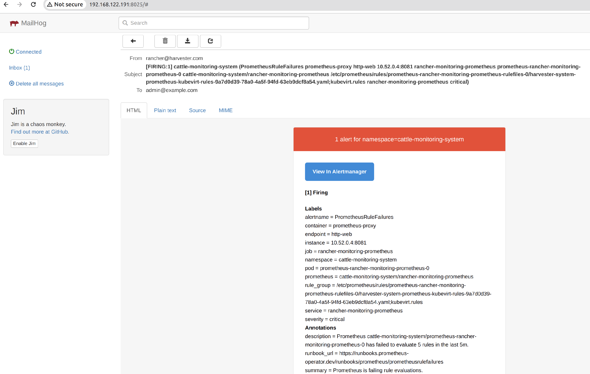

# Test the Harvester AlertManager With Email Server

It is not an easy task to set up a working email server to test with Alertmanager. This document will dive into the detail steps.

## Alertmanagerconfig Definition

CRD:

https://github.com/prometheus-operator/prometheus-operator/blob/1e113b4062795c3e6eee89bf57ed50bfc69ac4d5/jsonnet/prometheus-operator/alertmanagerconfigs-crd.json#L597C40-L597C49


Official documents:

https://prometheus.io/docs/alerting/latest/configuration/#email_config

```
# Whether to notify about resolved alerts.
[ send_resolved: <boolean> | default = false ]

# The email address to send notifications to.
to: <tmpl_string>

# The sender's address.
[ from: <tmpl_string> | default = global.smtp_from ]

# The SMTP host through which emails are sent.
[ smarthost: <string> | default = global.smtp_smarthost ]

# The hostname to identify to the SMTP server.
[ hello: <string> | default = global.smtp_hello ]

# SMTP authentication information.
# auth_password and auth_password_file are mutually exclusive.
[ auth_username: <string> | default = global.smtp_auth_username ]
[ auth_password: <secret> | default = global.smtp_auth_password ]
[ auth_password_file: <string> | default = global.smtp_auth_password_file ]
[ auth_secret: <secret> | default = global.smtp_auth_secret ]
[ auth_identity: <string> | default = global.smtp_auth_identity ]

# The SMTP TLS requirement.
# Note that Go does not support unencrypted connections to remote SMTP endpoints.
[ require_tls: <bool> | default = global.smtp_require_tls ]

# TLS configuration.
tls_config:
  [ <tls_config> ]

# The HTML body of the email notification.
[ html: <tmpl_string> | default = '{{ template "email.default.html" . }}' ]
# The text body of the email notification.
[ text: <tmpl_string> ]

# Further headers email header key/value pairs. Overrides any headers
# previously set by the notification implementation.
[ headers: { <string>: <tmpl_string>, ... } ]


<tls_config>
A tls_config allows configuring TLS connections.

# CA certificate to validate the server certificate with.
[ ca_file: <filepath> ]

# Certificate and key files for client cert authentication to the server.
[ cert_file: <filepath> ]
[ key_file: <filepath> ]

# ServerName extension to indicate the name of the server.
# http://tools.ietf.org/html/rfc4366#section-3.1
[ server_name: <string> ]

# Disable validation of the server certificate.
[ insecure_skip_verify: <boolean> | default = false]

# Minimum acceptable TLS version. Accepted values: TLS10 (TLS 1.0), TLS11 (TLS
# 1.1), TLS12 (TLS 1.2), TLS13 (TLS 1.3).
# If unset, Prometheus will use Go default minimum version, which is TLS 1.2.
# See MinVersion in https://pkg.go.dev/crypto/tls#Config.
[ min_version: <string> ]
# Maximum acceptable TLS version. Accepted values: TLS10 (TLS 1.0), TLS11 (TLS
# 1.1), TLS12 (TLS 1.2), TLS13 (TLS 1.3).
# If unset, Prometheus will use Go default maximum version, which is TLS 1.3.
# See MaxVersion in https://pkg.go.dev/crypto/tls#Config.
[ max_version: <string> ]
```


Source code: 

https://github.com/prometheus/common/blob/main/config/http_config.go

```
// TLSConfig configures the options for TLS connections.
type TLSConfig struct {
	// Text of the CA cert to use for the targets.
	CA string `yaml:"ca,omitempty" json:"ca,omitempty"`
	// Text of the client cert file for the targets.
	Cert string `yaml:"cert,omitempty" json:"cert,omitempty"`
	// Text of the client key file for the targets.
	Key Secret `yaml:"key,omitempty" json:"key,omitempty"`
	// The CA cert to use for the targets.
	CAFile string `yaml:"ca_file,omitempty" json:"ca_file,omitempty"`
	// The client cert file for the targets.
	CertFile string `yaml:"cert_file,omitempty" json:"cert_file,omitempty"`
	// The client key file for the targets.
	KeyFile string `yaml:"key_file,omitempty" json:"key_file,omitempty"`
	// CARef is the name of the secret within the secret manager to use as the CA cert for the
	// targets.
	CARef string `yaml:"ca_ref,omitempty" json:"ca_ref,omitempty"`
	// CertRef is the name of the secret within the secret manager to use as the client cert for
	// the targets.
	CertRef string `yaml:"cert_ref,omitempty" json:"cert_ref,omitempty"`
	// KeyRef is the name of the secret within the secret manager to use as the client key for
	// the targets.
	KeyRef string `yaml:"key_ref,omitempty" json:"key_ref,omitempty"`
	// Used to verify the hostname for the targets.
	ServerName string `yaml:"server_name,omitempty" json:"server_name,omitempty"`
	// Disable target certificate validation.
	InsecureSkipVerify bool `yaml:"insecure_skip_verify" json:"insecure_skip_verify"`
	// Minimum TLS version.
	MinVersion TLSVersion `yaml:"min_version,omitempty" json:"min_version,omitempty"`
	// Maximum TLS version.
	MaxVersion TLSVersion `yaml:"max_version,omitempty" json:"max_version,omitempty"`
}

```

## Prepare an Email Server with TLS enabled

The Harvester integrated `Alertmanager` is writen in go, to test an email receiver, your email server needs to support TLS. Refer: https://github.com/mailhog/MailHog/issues/84#issuecomment-472619909.

### Prepare Cert and Key

Follow instructions on https://ubuntu.com/server/docs/certificates, finally you wil get some files like "*.pem / *.crt, *.key"

1. Create a pair of key.

1. Certificate the public key, self-signed or priviate-certificated or public-certificate.


### Prepare an Email Server

Get the code from this repository https://github.com/kernle32dll/MailHog and run with:


```
$ go run main.go -certs-paths /home/rancher/sshkeys/email.example.com.pem,/home/rancher/sshkeys/server.key

2024/06/20 11:18:01 Using in-memory storage
2024/06/20 11:18:01 [SMTP] Binding to address: 0.0.0.0:1025
[HTTP] Binding to address: 0.0.0.0:8025
2024/06/20 11:18:01 Serving under http://0.0.0.0:8025/
Creating API v1 with WebPath: 
Creating API v2 with WebPath: 

```

## Create Alertmanagerconfig on Harvester

When the email server authenticate the client with password, do it as such.

### Create a secret with base64 encoded password.

```
// password: rancher
cat > emailpass.yaml << 'FOE'
apiVersion: v1
data:
  password: cmFuY2hlcgo=
kind: Secret
metadata:
  name: emailclientpass
  namespace: cattle-monitoring-system
type: opaque
FOE
```

### Create a secret with base64 encoded, mailhog crypted password

Per https://github.com/mailhog/MailHog/blob/master/docs/Auth.md#generating-a-bcrypted-password, generate a crypted password of `rancher`.

```
$ ./MailHog_linux_amd64 bcrypt rancher
$2a$04$F5jnsxo/Kvifb0FqLCLfXufvl0thmCK25p7DJ.axU1vjXao5c7T5O

echo "$2a$04$F5jnsxo/Kvifb0FqLCLfXufvl0thmCK25p7DJ.axU1vjXao5c7T5O" | base64 
YWJhc2g0L0t2aWZiMEZxTENMZlh1ZnZsMHRobUNLMjVwN0RKLmF4VTF2alhhbzVjN1Q1Two=

```

:::note

The crypted result changes on each run of `./MailHog_linux_amd64 bcrypt rancher`.

:::


Create secret.

```
// password: rancher

echo "DyQn75xNMEohwdLqw3FEWePbMCcHOurBkx1FjD7rwEmajO.FYxCtC" | base64
RHlRbjc1eE5NRW9od2RMcXczRkVXZVBiTUNjSE91ckJreDFGakQ3cndFbWFqTy5GWXhDdEMK


cat > emailpasscrypt.yaml << 'FOE'
apiVersion: v1
data:
  password: RHlRbjc1eE5NRW9od2RMcXczRkVXZVBiTUNjSE91ckJreDFGakQ3cndFbWFqTy5GWXhDdEMK
kind: Secret
metadata:
  name: emailclientpasscrypt
  namespace: cattle-monitoring-system
type: opaque
FOE

$ kubectly apply -f emailpasscrypt.yaml
```


The debug log of Mailhog shows the return AUTH value is:

```
[PROTO: MAIL] Processing line: AUTH PLAIN AHJhbmNoZXIARHlRbjc1eE5NRW9od2RMcXczRkVXZVBiTUNjSE91ckJreDFGakQ3cndFbWFqTy5GWXhDdEQK

$ echo "AHJhbmNoZXIARHlRbjc1eE5NRW9od2RMcXczRkVXZVBiTUNjSE91ckJreDFGakQ3cndFbWFqTy5GWXhDdEQK" | base64 -d
rancherDyQn75xNMEohwdLqw3FEWePbMCcHOurBkx1FjD7rwEmajO.FYxCtD

```

It is a combination of username and crypted password.

### Create Alertmanagerconfig which refers the above secret.

```
cat > amc5.yaml << 'FOE'

apiVersion: monitoring.coreos.com/v1alpha1
kind: AlertmanagerConfig
metadata:
  name: amc5
  namespace: cattle-monitoring-system
spec:
  receivers:
  - name: emailrouter5
    emailConfigs:
    - authUsername: rancher
      from: rancher@harvester.com
      requireTLS: true                  // enable TLS
      sendResolved: true
      smarthost: email.example.com:1025
      authPassword:
        key: password
        name: emailclientpasscrypt      // the secret to fetch required password; you may try both of the above secret to check which one works
      tlsConfig:
        insecureSkipVerify: true        // self-signed cert or private CA, this option is required
        serverName: email.example.com        
      to: admin@example.com
  route:
    groupBy:
    - namespace
    groupInterval: 1m
    groupWait: 30s
    receiver: emailrouter5
    repeatInterval: 1m
FOE

$ kubectly apply -f amc5.yaml
```

Promethues-operator log, if any warning/err, solve it.

```
level=info ts=2024-06-20T09:58:25.39448039Z caller=operator.go:660 component=alertmanageroperator key=cattle-monitoring-system/rancher-monitoring-alertmanager msg="sync alertmanager"
level=info ts=2024-06-20T09:58:26.70696269Z caller=operator.go:1394 component=prometheusoperator key=cattle-monitoring-system/rancher-monitoring-prometheus msg="update prometheus status"
```

Aertmanager log:

```
// until config reloaded
ts=2024-06-20T10:01:01.892Z caller=coordinator.go:113 level=info component=configuration msg="Loading configuration file" file=/etc/alertmanager/config_out/alertmanager.env.yaml
ts=2024-06-20T10:01:01.892Z caller=coordinator.go:126 level=info component=configuration msg="Completed loading of configuration file" file=/etc/alertmanager/config_out/

```

Successfully sent an alert email.

```
ts=2024-06-20T11:22:31.026Z caller=notify.go:743 level=info component=dispatcher receiver=cattle-monitoring-system/amc5/emailrouter5 integration=email[0] msg="Notify success" attempts=11
```

### (Optional) Email client TLS cert

If your client also uses TLS cert to talk with server, Alertmanagerconfig has related option.

1. Create tls sceret via kubeclt, kubectl will validate the crt/pem according to the key.

```
$ kubectl create secret tls emailsslsecret --cert=/home/rancher/sshkeys/server.pem --key=/home/rancher/sshkeys/server.key --namespace=cattle-monitoring-system
```

The output:

```
apiVersion: v1
data:
  tls.crt: LS0tLS1CRUdJTiBDRVJUSUZJQ0FURS0tLS0tCk1JSURzVENDQXBrQ0ZEQ2NuWlZoc1BzVmtaMzE3WmUxMXBXUDU1TG5NQTBHQ1NxR1NJYjNEUUVCQ3dVQU1JR1UKTVFzd0NRWURWUVFHRXdKRVJURVBNQTBHQTFVRUNBd0dTRVZUVTBWT01SUXdFZ1lEVlFRSERBdENZV1FnU0c5dApZblZ5WnpFUU1BNEdBMVVFQ2d3SFpYaGhiWEJzWlRFT01Bd0dBMVVFQ3d3RlpXMWhhV3d4R2pBWUJnTlZCQU1NCkVXVnRZV2xzTG1WNFlXMXdiR1V1WTI5dE1TQXdIZ1lKS29aSWh2Y05BUWtCRmhGaFpHMXBia0JsZUdGdGNHeGwKTG1OdmJUQWVGdzB5TkRBMk1UY3hOREUxTWpkYUZ3MHlOVEEyTVRjeE5ERTFNamRhTUlHVU1Rc3dDUVlEVlFRRwpFd0pFUlRFUE1BMEdBMVVFQ0F3R1NFVlRVMFZPTVJRd0VnWURWUVFIREF0Q1lXUWdTRzl0WW5WeVp6RVFNQTRHCkExVUVDZ3dIWlhoaGJYQnNaVEVPTUF3R0ExVUVDd3dGWlcxaGFXd3hHakFZQmdOVkJBTU1FV1Z0WVdsc0xtVjQKWVcxd2JHVXVZMjl0TVNBd0hnWUpLb1pJaHZjTkFRa0JGaEZoWkcxcGJrQmxlR0Z0Y0d4bExtTnZiVENDQVNJdwpEUVlKS29aSWh2Y05BUUVCQlFBRGdnRVBBRENDQVFvQ2dnRUJBTW05QXR4RnBsQkZNMHRvRjgyMHZEWkRNMEpXCk5BckJ2ZUJnZXdEZXpIbHdyQ2ZTaldicEJaSEkrZFNEcGhlclU2dGcvWUpNaEc4ZnhyTnlqS2RIdUxIK2dUVncKSjJDK2w4bDVHRUZNSUY0Tk1KSUhlL0I4c3FmOFJrTmdZZi9BT3docmFQdTl3T29QUmplVHIvL1czd0pxUXlSSwpPYUY1czJ2WndSbUNYS1FaN0FWTDRiS3duQ1JobXEyd1Q2eHpGZ1ZLNUZFcEMzNjJXdU1IRWhHVUtuNTJibThvClFLdmpYVmFXRzZTd050aHhqY0N3TjNQa1pVT2Z4bEZWVnNtMDVEcHVOYjBaVThnRjh1UzlVeXBlR3R6TDN4bnYKbTB5aEozYlNwWDFRR3daRU5URHVtZmhnRjlGMlU5czR4c3h5cUJlTWtYUXdmME5uaHMrUXZ1WFBIZ3NDQXdFQQpBVEFOQmdrcWhraUc5dzBCQVFzRkFBT0NBUUVBR2J3QjQ2eHo2eGtzVko3bGZWNVdvMFNMUHpPYnJyS1BCcEUxCnptOWx1RUtBak5QL3RXZlM1aXlEZnhxM3BzVlNiV3dWODhCdUJtK2V3RlJMbGI3WVFOeSt5MEdhbldnVWx0TkwKQmUwbCs1WkZVelRJRFV2QVZ6UEtCQ25pekNIdSt4ZDMvZ0pjMTVlR2xab01CbjRNN05aQmhaMWxmV2ViSjJNWQpGVGo3eEdKbm9QR3ByQmlYb21jVjlhcXRRanBaZUZVaXdPMVU3MmVkQWtOaEZtd1VINC9MdldDVGRSSEUyNlpDCjZMWFA0ekVOUmxlMHoyT2t2M3dyOGhqSDBVR0FaSklKR2MvbGJkMWZ2N08vd1hETTRqaUt0YjVNd0dnbjR3ZGEKa3ZrcXJHM2dHNjg1OXYvT25wbzJjcWdCRkdlSExkY0RYV3FFQ2ZvWWxTZ0NWQWd3cGc9PQotLS0tLUVORCBDRVJUSUZJQ0FURS0tLS0tCg==
  tls.key: LS0tLS1CRUdJTiBSU0EgUFJJVkFURSBLRVktLS0tLQpNSUlFcEFJQkFBS0NBUUVBeWIwQzNFV21VRVV6UzJnWHpiUzhOa016UWxZMENzRzk0R0I3QU43TWVYQ3NKOUtOClp1a0ZrY2o1MUlPbUY2dFRxMkQ5Z2t5RWJ4L0dzM0tNcDBlNHNmNkJOWEFuWUw2WHlYa1lRVXdnWGcwd2tnZDcKOEh5eXAveEdRMkJoLzhBN0NHdG8rNzNBNmc5R041T3YvOWJmQW1wREpFbzVvWG16YTluQkdZSmNwQm5zQlV2aApzckNjSkdHYXJiQlBySE1XQlVya1VTa0xmclphNHdjU0VaUXFmblp1YnloQXErTmRWcFlicExBMjJIR053TEEzCmMrUmxRNS9HVVZWV3liVGtPbTQxdlJsVHlBWHk1TDFUS2w0YTNNdmZHZStiVEtFbmR0S2xmVkFiQmtRMU1PNloKK0dBWDBYWlQyempHekhLb0Y0eVJkREIvUTJlR3o1Qys1YzhlQ3dJREFRQUJBb0lCQUJ5SnozakhwWkpmWjdVNApJWDNwSG1MeXVMS2VyVGdFVms4Q2R3UVZnSW1CWmVrd1FPNlk4ai9BVlk4NW5HcG13eXhRU1N5QWxJOS95RVVrClpEOVp4d2Z1LytwR1ZsdTZPcEMydjdhbEJVTW96SUVyNjkyR1ZtT3JMV2xrbmhobTRqTDd0dHM5NmFkeXg3VWYKQUZ2SjByeHR1ZGZOWkQreWpxNG9ITWYyQ0JMeWsxUlBPMDlmek8rY3dFY3daUDVQeERaSmxVTENGOVVJWlJjRApYd1ZFUGVRM1VRT1pLMzZkZ3lyM0RhaHZHNWJuakZSWW55dW9EM2tBTDJiWTNUcXZrRC9OV1ZYOFZZTVlZcjNlCktQeld1VzBTQlJiOFdobUNEMHJNMkE1U2JkUWNBUVFvNkRoLzZvQ1lRQ2RaaCtPTitlbjlwOWpqbTJpWTlWdWcKblRMRzNMRUNnWUVBOVRIRlZraE1tbkpLOVY2TldBTUc0M01vL3pnMjR2TDQ5RzlKZ21jVmVPcHllNzNDbDlxbApUdjBhZ2dCditybmZTTUxlb2tqeXVGL2Fjdk9nZkxGQ1pxTVUvWER6UnREbnhnYW1tQjNlNWFWa1IyZmRTTFpICjhPZmcvNzA3R3RSVTYySXBXYmFmV2J2dkkxeWwyUElFZEgrNUs0akpOZEl3cS9ycWVETk5seWtDZ1lFQTBxRDYKY21HcGNka2tVVE9ka0dXNDVGZDg4b2tab085Y2VhalQyQXkxQVFrazJ6bHA0YlMrNEdwOGZvTWZMbk5kOXN0ZgpBSXdHWWF1V2U1LzRaQ1V1dXVqWWRPMGtOdVhIblBFUHhyT1hUb1A5b3hsL1pEeGhoN2VBNzJyTXU4RlZaYzJBCm4wb2RxUUJVQUh5S0R3cXNrUHNwWEtCazRGZHc5Q25IK0FSZ2RoTUNnWUJkNUZrMDJTcThXZGZxYmZLaUtVYVMKQXA5SVhEWm9ZYktEcDduMmZaTHpZcFBFWHI0TmVHU2xBcmNMNFM4QVMvejgxK0o1TW9YL3BIVDZYK0NzM3hRVwpTWXpZSUZDSVphYmJaZUNWajVxelJjcElyYlZIQ3NZeHNobXUxTCsxWG1uR1dTaU1laW83S29SQWZsSGo2WWxiCk15MnRSZ3dHMkI1YlBSSmNSUWtKUVFLQmdRQ0lTcUFrZVd0eWZzYVFRS3o1TGNsWS8vK2ExUG9mZUNOSG1lWVMKakE1bnNDb0lMUHVGa0RaZThxakNHRWlKL3g3VFBqK29FL05oS2UzQzZ2MklsOExJTVRrM1YrZXlHamR6SjAxRgpEeHFlTkt4ZjZIVFZRSGovbjg4dm5OVUR2Uk5zUDNDMklmaFZUaUFNL0lrOU9IUDNrSDN3TU4xMWlUOU96dVpWClowZWZ2d0tCZ1FDRHlFRDJ3WWRQMzZwaEQ0MWZBWUZxbFhEaWloOU83eGJPZnl0UFJhcExRbXJrQUNNY1Ewb3EKMFo4S0N3RXhEcVlaci9oMmxHdnI3WHkreXRpdGtLbGFodXBvZmRSSkxBcFFWYWhmYWpZOEpwK2tNOXNQZHVUNQpPVDI5MzRxMjg2TnJ0VkQvZVJ2NXA4Z1lqb3QrbTVTWEZ6Qk9sL3diSkxDQUp3MHpNTFhnbWc9PQotLS0tLUVORCBSU0EgUFJJVkFURSBLRVktLS0tLQo=
kind: Secret
metadata:
  creationTimestamp: "2024-06-18T11:19:46Z"
  name: emailsslsecret
  namespace: cattle-monitoring-system
  resourceVersion: "3644985"
  uid: d5849c74-91cb-47e1-9c2e-713d3a2fb9ae
type: kubernetes.io/tls
```

2. Refer the secret in `Alertmanagerconfig`


```
      tlsConfig:
        cert:
          secret:
            key: tls.crt       // key is tls.crt
            name: emailclient
        keySecret:
            key: tls.key       // key is tls.key
            name: emailclient       
```

### (Optional) Email server cert CA

You may also add the CA for the `Alertmanager` to validate the server cert.

1. Create a secret to store the CA content, use base64 to encode.

2. Refer the CA secret in `Alertmanagerconfig`.

```
        tlsConfig:
          ca:
            secret:
              key: tls.crt
              name: emailsslsecret
```

### Alertmanager Status

The well-configured receiver can also be checked from the URL of embedded alertmanager.

```
https://192.168.122.144/api/v1/namespaces/cattle-monitoring-system/services/http:rancher-monitoring-alertmanager:9093/proxy/#/status

Version Information
Branch:
HEAD
BuildDate:
20221222-14:51:36
BuildUser:
root@abe866dd5717
GoVersion:
go1.19.4
Revision:
258fab7cdd551f2cf251ed0348f0ad7289aee789
Version:
0.25.0
Config
global:
  resolve_timeout: 5m
  http_config:
    follow_redirects: true
    enable_http2: true
  smtp_hello: localhost
  smtp_require_tls: true
  pagerduty_url: https://events.pagerduty.com/v2/enqueue
  opsgenie_api_url: https://api.opsgenie.com/
  wechat_api_url: https://qyapi.weixin.qq.com/cgi-bin/
  victorops_api_url: https://alert.victorops.com/integrations/generic/20131114/alert/
  telegram_api_url: https://api.telegram.org
  webex_api_url: https://webexapis.com/v1/messages
route:
  receiver: "null"
  group_by:
  - namespace
  continue: false
  routes:
  - receiver: cattle-monitoring-system/amc5/emailrouter5
    group_by:
    - namespace
    matchers:
    - namespace="cattle-monitoring-system"
    continue: true
    group_wait: 30s
    group_interval: 1m
    repeat_interval: 1m
  - receiver: "null"
    matchers:
    - alertname=~"InfoInhibitor|Watchdog"
    continue: false
  group_wait: 30s
  group_interval: 5m
  repeat_interval: 12h
inhibit_rules:
- source_matchers:
  - severity="critical"
  target_matchers:
  - severity=~"warning|info"
  equal:
  - namespace
  - alertname
- source_matchers:
  - severity="warning"
  target_matchers:
  - severity="info"
  equal:
  - namespace
  - alertname
- source_matchers:
  - alertname="InfoInhibitor"
  target_matchers:
  - severity="info"
  equal:
  - namespace
receivers:
- name: "null"
- name: cattle-monitoring-system/amc5/emailrouter5
  email_configs:
  - send_resolved: true
    to: admin@example.com
    from: rancher@harvester.com
    hello: localhost
    smarthost: email.example.com:1025
    auth_username: rancher
    auth_password: <secret>
    headers:
      From: rancher@harvester.com
      Subject: '{{ template "email.default.subject" . }}'
      To: admin@example.com
    html: '{{ template "email.default.html" . }}'
    require_tls: true
    tls_config:
      server_name: email.example.com
      insecure_skip_verify: true
templates:
- /etc/alertmanager/config/*.tmpl

```

### Troubleshooting

### The configured receiver is not shown on the Alertmanager `status` page

Check the log of `prometheus-operator`, it will deny any unqualified config.

```
$ kubectl logs -n cattle-monitoring-system rancher-monitoring-operator-595476bc84-r7bk4

level=warn ts=2024-06-18T09:54:16.464800804Z caller=operator.go:1091 component=alertmanageroperator msg="skipping alertmanagerconfig" error="failed to get CA: unable to get secret "emailtlsca": secrets "emailtlsca" not found" alertmanagerconfig=cattle-monitoring-system/amc2 namespace=cattle-monitoring-system alertmanager=rancher-monitoring-alertmanager
```

When a correct `Alertmanagerconfig` is added/updated, you will get such log:

The `prometheus-operator`:

```
level=info ts=2024-06-20T09:58:25.39448039Z caller=operator.go:660 component=alertmanageroperator key=cattle-monitoring-system/rancher-monitoring-alertmanager msg="sync alertmanager"
level=info ts=2024-06-20T09:58:26.70696269Z caller=operator.go:1394 component=prometheusoperator key=cattle-monitoring-system/rancher-monitoring-prometheus msg="update prometheus status"

```

The `Alertmanager` may take a few minutes to show:

```
$kubectl logs -n cattle-monitoring-system alertmanager-rancher-monitoring-alertmanager-0

// until config reloaded
ts=2024-06-20T10:01:01.892Z caller=coordinator.go:113 level=info component=configuration msg="Loading configuration file" file=/etc/alertmanager/config_out/alertmanager.env.yaml
ts=2024-06-20T10:01:01.892Z caller=coordinator.go:126 level=info component=configuration msg="Completed loading of configuration file" file=/etc/alertmanager/config_out/

```

If you don't want to wait some minutes, then kill this pod to trigger the fast reload.


#### The error like "*smtp.plainAuth auth: unencrypted connection".

```
ts=2024-06-20T10:01:01.898Z caller=notify.go:732 level=warn component=dispatcher receiver=cattle-monitoring-system/amc5/emailrouter5 integration=email[0] msg="Notify attempt failed, will retry later" attempts=1 err="*smtp.plainAuth auth: unencrypted connection"
```

A TLS-enabled email server is required. Refer https://github.com/mailhog/MailHog/issues/84#issuecomment-472619909.


## The Received Alert Email



The `MailHog` enables the debug by defualt, it is very test-friendly. An successfully received email has such log:


```
2024/06/20 11:36:47 [SMTP 192.168.122.141:7864] [PROTO: INVALID] Started session, switching to ESTABLISH state
2024/06/20 11:36:47 [SMTP 192.168.122.141:7864] Sent 35 bytes: '220 mailhog.example ESMTP MailHog\r\n'
2024/06/20 11:36:47 [SMTP 192.168.122.141:7864] Received 16 bytes: 'EHLO localhost\r\n'
2024/06/20 11:36:47 [SMTP 192.168.122.141:7864] [PROTO: ESTABLISH] Processing line: EHLO localhost
2024/06/20 11:36:47 [SMTP 192.168.122.141:7864] [PROTO: ESTABLISH] In state 1, got command 'EHLO', args 'localhost'
2024/06/20 11:36:47 [SMTP 192.168.122.141:7864] [PROTO: ESTABLISH] In ESTABLISH state
2024/06/20 11:36:47 [SMTP 192.168.122.141:7864] [PROTO: ESTABLISH] Got EHLO command, switching to MAIL state
2024/06/20 11:36:47 [SMTP 192.168.122.141:7864] Sent 21 bytes: '250-Hello localhost\r\n'
2024/06/20 11:36:47 [SMTP 192.168.122.141:7864] Sent 16 bytes: '250-PIPELINING\r\n'
2024/06/20 11:36:47 [SMTP 192.168.122.141:7864] Sent 14 bytes: '250-STARTTLS\r\n'
2024/06/20 11:36:47 [SMTP 192.168.122.141:7864] Sent 16 bytes: '250 AUTH PLAIN\r\n'
2024/06/20 11:36:47 [SMTP 192.168.122.141:7864] Received 10 bytes: 'STARTTLS\r\n'
2024/06/20 11:36:47 [SMTP 192.168.122.141:7864] [PROTO: MAIL] Processing line: STARTTLS
2024/06/20 11:36:47 [SMTP 192.168.122.141:7864] [PROTO: MAIL] In state 6, got command 'STARTTLS', args ''
2024/06/20 11:36:47 [SMTP 192.168.122.141:7864] [PROTO: MAIL] Got STARTTLS command outside ESTABLISH state
2024/06/20 11:36:47 [SMTP 192.168.122.141:7864] Sent 24 bytes: '220 Ready to start TLS\r\n'
2024/06/20 11:36:47 [SMTP 192.168.122.141:7864] Received 16 bytes: 'EHLO localhost\r\n'
2024/06/20 11:36:47 [SMTP 192.168.122.141:7864] [PROTO: ESTABLISH] Processing line: EHLO localhost
2024/06/20 11:36:47 [SMTP 192.168.122.141:7864] [PROTO: ESTABLISH] In state 1, got command 'EHLO', args 'localhost'
2024/06/20 11:36:47 [SMTP 192.168.122.141:7864] [PROTO: ESTABLISH] In ESTABLISH state
2024/06/20 11:36:47 [SMTP 192.168.122.141:7864] [PROTO: ESTABLISH] Got EHLO command, switching to MAIL state
2024/06/20 11:36:47 [SMTP 192.168.122.141:7864] Sent 21 bytes: '250-Hello localhost\r\n'
2024/06/20 11:36:47 [SMTP 192.168.122.141:7864] Sent 16 bytes: '250-PIPELINING\r\n'
2024/06/20 11:36:47 [SMTP 192.168.122.141:7864] Sent 16 bytes: '250 AUTH PLAIN\r\n'
2024/06/20 11:36:47 [SMTP 192.168.122.141:7864] Received 97 bytes: 'AUTH PLAIN AHJhbmNoZXIARHlRbjc1eE5NRW9od2RMcXczRkVXZVBiTUNjSE91ckJreDFGakQ3cndFbWFqTy5GWXhDdEQK\r\n'
2024/06/20 11:36:47 [SMTP 192.168.122.141:7864] [PROTO: MAIL] Processing line: AUTH PLAIN AHJhbmNoZXIARHlRbjc1eE5NRW9od2RMcXczRkVXZVBiTUNjSE91ckJreDFGakQ3cndFbWFqTy5GWXhDdEQK
2024/06/20 11:36:47 [SMTP 192.168.122.141:7864] [PROTO: MAIL] In state 6, got command 'AUTH', args 'PLAIN AHJhbmNoZXIARHlRbjc1eE5NRW9od2RMcXczRkVXZVBiTUNjSE91ckJreDFGakQ3cndFbWFqTy5GWXhDdEQK'
2024/06/20 11:36:47 [SMTP 192.168.122.141:7864] [PROTO: MAIL] In MAIL state
2024/06/20 11:36:47 [SMTP 192.168.122.141:7864] [PROTO: MAIL] Got AUTH command, staying in MAIL state
2024/06/20 11:36:47 [SMTP 192.168.122.141:7864] [PROTO: MAIL] Got PLAIN authentication: AHJhbmNoZXIARHlRbjc1eE5NRW9od2RMcXczRkVXZVBiTUNjSE91ckJreDFGakQ3cndFbWFqTy5GWXhDdEQK
2024/06/20 11:36:47 [SMTP 192.168.122.141:7864] Sent 31 bytes: '235 Authentication successful\r\n'
2024/06/20 11:36:47 [SMTP 192.168.122.141:7864] Received 35 bytes: 'MAIL FROM:<rancher@harvester.com>\r\n'
2024/06/20 11:36:47 [SMTP 192.168.122.141:7864] [PROTO: MAIL] Processing line: MAIL FROM:<rancher@harvester.com>
2024/06/20 11:36:47 [SMTP 192.168.122.141:7864] [PROTO: MAIL] In state 6, got command 'MAIL', args 'FROM:<rancher@harvester.com>'
2024/06/20 11:36:47 [SMTP 192.168.122.141:7864] [PROTO: MAIL] In MAIL state
2024/06/20 11:36:47 [SMTP 192.168.122.141:7864] [PROTO: MAIL] Got MAIL command, switching to RCPT state
2024/06/20 11:36:47 [SMTP 192.168.122.141:7864] Sent 37 bytes: '250 Sender rancher@harvester.com ok\r\n'
2024/06/20 11:36:47 [SMTP 192.168.122.141:7864] Received 29 bytes: 'RCPT TO:<admin@example.com>\r\n'
2024/06/20 11:36:47 [SMTP 192.168.122.141:7864] [PROTO: RCPT] Processing line: RCPT TO:<admin@example.com>
2024/06/20 11:36:47 [SMTP 192.168.122.141:7864] [PROTO: RCPT] In state 7, got command 'RCPT', args 'TO:<admin@example.com>'
2024/06/20 11:36:47 [SMTP 192.168.122.141:7864] [PROTO: RCPT] In RCPT state
2024/06/20 11:36:47 [SMTP 192.168.122.141:7864] [PROTO: RCPT] Got RCPT command
2024/06/20 11:36:47 [SMTP 192.168.122.141:7864] Sent 36 bytes: '250 Recipient admin@example.com ok\r\n'
2024/06/20 11:36:47 [SMTP 192.168.122.141:7864] Received 6 bytes: 'DATA\r\n'
2024/06/20 11:36:47 [SMTP 192.168.122.141:7864] [PROTO: RCPT] Processing line: DATA
2024/06/20 11:36:47 [SMTP 192.168.122.141:7864] [PROTO: RCPT] In state 7, got command 'DATA', args ''
2024/06/20 11:36:47 [SMTP 192.168.122.141:7864] [PROTO: RCPT] In RCPT state
2024/06/20 11:36:47 [SMTP 192.168.122.141:7864] [PROTO: RCPT] Got DATA command, switching to DATA state
2024/06/20 11:36:47 [SMTP 192.168.122.141:7864] Sent 37 bytes: '354 End data with <CR><LF>.<CR><LF>\r\n'
2024/06/20 11:36:47 [SMTP 192.168.122.141:7864] Received 1024 bytes: 'Subject: [FIRING:2] cattle-monitoring-system (cattle-monitoring-system/rancher-monitoring-prometheus)\r\nTo: admin@example.com\r\nFrom: rancher@harvester.com\r\nMessage-Id: <1718883407144751082.5656111497856958941@alertmanager-rancher-monitoring-alertmanager-0>\r\nDate: Thu, 20 Jun 2024 11:36:47 +0000\r\nContent-Type: multipart/alternative;  boundary=b503ffbbb510f08a243d84e0e37bf4cc3e61f05e0d1c9a1b5f706b4d207a\r\nMIME-Version: 1.0\r\n\r\n--b503ffbbb510f08a243d84e0e37bf4cc3e61f05e0d1c9a1b5f706b4d207a\r\nContent-Transfer-Encoding: quoted-printable\r\nContent-Type: text/html; charset=UTF-8\r\n\r\n\r\n\r\n<!DOCTYPE html PUBLIC "-//W3C//DTD XHTML 1.0 Transitional//EN" "http://www.=\r\nw3.org/TR/xhtml1/DTD/xhtml1-transitional.dtd">\r\n<html xmlns=3D"http://www.w3.org/1999/xhtml" style=3D"margin: 0; font-famil=\r\ny: 'Helvetica Neue', Helvetica, Arial, sans-serif; box-sizing: border-box; =\r\nfont-size: 14px;">\r\n<head>\r\n<meta name=3D"viewport" content=3D"width=3Ddevice-width">\r\n<meta http-equiv=3D"Content-Type" content=3D"text/html; charset=3DUTF-8">\r'
2024/06/20 11:36:47 [SMTP 192.168.122.141:7864] Received 1024 bytes: '\n<title>[FIRING:2] cattle-monitoring-system (cattle-monitoring-system/ranche=\r\nr-monitoring-prometheus)</title>\r\n<style>\r\n@media only screen and (max-width: 640px) {\r\n  body {\r\n    padding: 0 !important;\r\n  }\r\n\r\n  h1,\r\nh2,\r\nh3,\r\nh4 {\r\n    font-weight: 800 !important;\r\n    margin: 20px 0 5px !important;\r\n  }\r\n\r\n  h1 {\r\n    font-size: 22px !important;\r\n  }\r\n\r\n  h2 {\r\n    font-size: 18px !important;\r\n  }\r\n\r\n  h3 {\r\n    font-size: 16px !important;\r\n  }\r\n\r\n  .container {\r\n    padding: 0 !important;\r\n    width: 100% !important;\r\n  }\r\n\r\n  .content {\r\n    padding: 0 !important;\r\n  }\r\n\r\n  .content-wrap {\r\n    padding: 10px !important;\r\n  }\r\n\r\n  .invoice {\r\n    width: 100% !important;\r\n  }\r\n}\r\n</style>\r\n</head>\r\n\r\n<body itemscope itemtype=3D"http://schema.org/EmailMessage" style=3D"margin=\r\n: 0; font-family: 'Helvetica Neue', Helvetica, Arial, sans-serif; box-sizin=\r\ng: border-box; font-size: 14px; -webkit-font-smoothing: antialiased; -webki=\r\nt-text-size-adjust: none; height: 100%; line-height: 1.6em; background-colo='

...

```

## Known Limitations

### Mailhog AUTH seems not trully working

When run mailhog with auth-file, the WebUI will not allow the login of the example `test:test` user. With other users, it is also not working.

```
go run main.go -certs-paths /home/rancher/sshkeys/email.example.com.pem,/home/rancher/sshkeys/server.key -auth-file=/home/rancher/mailhog/example-auth

```

The code below seems not trully checking the auth.

https://github.com/mailhog/MailHog-Server/blob/50f74a1aa2991b96313144d1ac718ce4d6739dfd/smtp/session.go#L70

```

func (c *Session) validateAuthentication(mechanism string, args ...string) (errorReply *smtp.Reply, ok bool) {
	if c.monkey != nil {
		ok := c.monkey.ValidAUTH(mechanism, args...)
		if !ok {
			// FIXME better error?
			return smtp.ReplyUnrecognisedCommand(), false
		}
	}
	return nil, true
}
```

Tested with a wrong password of user `rancher`, it can still work.


### No cluster level Alertmanagerconfig

The `Alertmanagerconfig` is namespace scoped, it means some tedious processes to create `Alertmanager` for each namespace.

Refer:

https://docs.harvesterhci.io/v1.3/monitoring/harvester-monitoring#known-limitation

https://github.com/harvester/harvester/issues/2760
