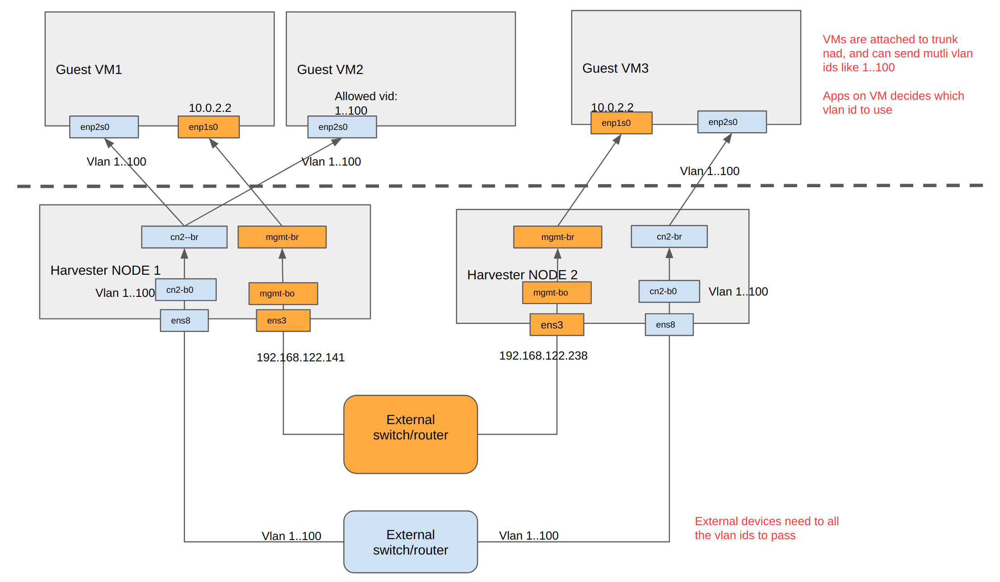

# Test Harvester vlan trunk mode nad

Issue: https://github.com/harvester/harvester/issues/766

PR: https://github.com/harvester/network-controller-harvester/pull/186

## Basic concepts

### `mgmt` cluster network set on day-0

Harvester has internal `mgmt` cluster network, which covers all nodes by default. The `up link (trunk) nics` are set when installing the cluster&node.

On each node, the `ip link` shows `mgmt-br` and `mgmt-bo`.

When `vlan id` is set on installation, it appears on the `bridge vlan show` under `mgmt-bo`.

### `non-mgmt` cluster network set on day-1

It is created later by user, independent nics are needed to work as the `up link (trunk)` of the cluster network. This cluster network is selectable to cover all/part of the nodes, which in turn affects the scheduling of `vm`. When a `vm` attachs to this cluster network, it's scheduling targets are same as this cluster network's participating nodes.

e.g. A cluster network `cn2` is created. Those target nodes have `cn2-br` and `cn2-bo` on `ip links`.

## User stories of vlan trunk nad

The `trunk mode` nad is mainly for guest VMs to run `layer 2` workloads.

### Harvester on Harvester

On Harvester

1. Create 2 trunk nads: nad1 `vid 1, 100..200` is attached to `mgmt cluster network`, nad2 `vid 1, 400..600` is attached to `cn2 cluster network`.

2. Create one VM which runs `harvester-v1.7.0.iso`, attaches to nad1, nad2.

The `trunk mode` nad allows the guest Harvester to provision multi vlan ids to it's VM too.

:::note

At the view of L3 IP, this VM (as guest Harvester node) normally has 1 IP as mgmt ip, (optional) 1 IP as vip.

:::

On guest Harvester

1. When VM starts, the ISO installation (manuall/pxe) starts, set vid as e.g. 100, and then get the node IP, VIP

2. When guest Harvester is up, create additional `cluster network cn2` with `uplink nic2`, which allows vlan `1, 400..600`; after this step, the `nic2` is binded to `cn2-bo`.

3. Create a new vlan tag nad nad500 `vid 500`.

4. Create a guest VM which attaches to nad500.

:::note

On step 3, there is no internal check now. The guest Harvester does not have a resource to store it's allowed vlan ids.

:::

### Some traditional network apps

On Harvester

1. Create 1 vlan nad: nad2 `vid 50` attached to cn2/mgmt.

2. Create 1 trunk nad: nad2 `vid 1, 400..600` attached to cn2.

3. Create one VM which attaches to nad1 (nic1), nad2 (nic2). enable dhcp on `nic1`

`cloud-init` works upon `nic1` &/ set/leave `nic2`.

On guest VM

1. The `nic1` has an ip from dhcp server like `192.168.50.30`, it is for the IP reachability of the VM, sometimes it is called `management IP`.

2. The `nic2` can bypass traffic with `vid 1, 400..600`

3. A network app is started which runs on `nic2` via `l2` mode.

## `nad` modes on Harvester

Harvester allows to create multi nads on each cluster network.

The `nad` has 3 `modes`:

### `Untag` nad with vid `0`

```
apiVersion: k8s.cni.cncf.io/v1
kind: NetworkAttachmentDefinition
metadata:
  creationTimestamp: '2025-07-03T12:30:04Z'
  labels:
    network.harvesterhci.io/clusternetwork: cn2
    network.harvesterhci.io/ready: 'true'
    network.harvesterhci.io/type: Untag
    network.harvesterhci.io/vlan-id: '0'
  name: nad3
  namespace: default
  resourceVersion: '526571'
  uid: 10ef5a8a-4dae-43d8-ae22-353157b6f9c5
spec:
  config: >-
    {"cniVersion":"0.3.1","name":"nad3","type":"bridge","bridge":"cn2-br","promiscMode":true,"vlan":0,"ipam":{},"mtu":1600}

```

### `Tag` nad with vid like `100`

```
apiVersion: k8s.cni.cncf.io/v1
kind: NetworkAttachmentDefinition
metadata:
  creationTimestamp: '2025-07-03T12:30:04Z'
  labels:
    network.harvesterhci.io/clusternetwork: cn2
    network.harvesterhci.io/ready: 'true'
    network.harvesterhci.io/type: L2VlanNetwork
    network.harvesterhci.io/vlan-id: '100'
  name: nad3
  namespace: default
  resourceVersion: '526571'
  uid: 10ef5a8a-4dae-43d8-ae22-353157b6f9c5
spec:
  config: >-
    {"cniVersion":"0.3.1","name":"nad3","type":"bridge","bridge":"cn2-br","promiscMode":true,"vlan":100,"ipam":{},"mtu":1600}

```

### `trunk` nad with vid range like `[66..88]`

:::note

The "vlan" field on spec.config can only be 0, or without "vlan" field`. Otherwise the webhook denies it.

:::


```
apiVersion: k8s.cni.cncf.io/v1
kind: NetworkAttachmentDefinition
metadata:
  creationTimestamp: '2025-07-03T12:30:04Z'
  labels:
    network.harvesterhci.io/clusternetwork: cn2
    network.harvesterhci.io/ready: 'true'
    network.harvesterhci.io/type: L2VlanTrunk
    network.harvesterhci.io/vlan-id: '0'
  name: nad3
  namespace: default
  resourceVersion: '526571'
  uid: 10ef5a8a-4dae-43d8-ae22-353157b6f9c5
spec:
  config: >-
    {"cniVersion":"0.3.1","name":"nad3","type":"bridge","bridge":"cn2-br","promiscMode":true,"vlan":0,"vlanTrunk":[{"minID":66,"maxID":88}],"ipam":{},"mtu":1600}

```

#### VM with trunk mode nad

When VM sends packets are in format untag, the outgoing packets are untag.

When VM sends packets are in format tag, the outgoing packets are tag.

It is VM's duty to add/remove tag. The `trunk` nad just allows the given tag traffic/untag to pass, but it does not add/remove tag.




### `nad`'s result on `bridge vlan show`

e..g `trunk` nad with vid `[40..50]` is created on `mgmt` cluster network, `trunk` nad with vid `[66..88]` is created on `cn2` cluster network.

The `bridge vlan show`:

```
mgmt-br           1 PVID Egress Untagged
mgmt-bo           1 PVID Egress Untagged
                  40
                  41
                  42
                  43
                  44
                  45
                  46
                  47
                  48
                  49
                  50
cn2-bo            1 PVID Egress Untagged
                  66
                  67
                  68
                  69
                  70
                  71
                  72
                  73
                  74
                  75
                  76
                  77
                  78
                  79
                  80
                  81
                  82
                  83
                  84
                  85
                  86
                  87
                  88
cn2-br            1 PVID Egress Untagged
```

### keep user manually configured vlans

e.g. user adds two manually configured vlan id 88, 99 on mgmt network for some customized usage.

```
bridge vlan add vid 88 dev mgmt-bo
bridge vlan add vid 88 dev mgmt-br self
ip link add link mgmt-br mgmt-br.88 up type vlan id 88


bridge vlan add vid 99 dev mgmt-bo
bridge vlan add vid 99 dev mgmt-br self
ip link add link mgmt-br mgmt-br.99 up type vlan id 99

harv21:/home/rancher # ip link | grep mgmt
2: ens3: <BROADCAST,MULTICAST,SLAVE,UP,LOWER_UP> mtu 1500 qdisc pfifo_fast master mgmt-bo state UP mode DEFAULT group default qlen 1000
4: mgmt-br: <BROADCAST,MULTICAST,PROMISC,UP,LOWER_UP> mtu 1500 qdisc noqueue state UP mode DEFAULT group default qlen 1000
5: mgmt-bo: <BROADCAST,MULTICAST,MASTER,UP,LOWER_UP> mtu 1500 qdisc noqueue master mgmt-br state UP mode DEFAULT group default qlen 1000
91: mgmt-br.88@mgmt-br: <BROADCAST,MULTICAST,UP,LOWER_UP> mtu 1500 qdisc noqueue state UP mode DEFAULT group default qlen 1000
```


current vids:

```
harv21:/home/rancher # bridge vlan show
port              vlan-id  
mgmt-br           1 PVID Egress Untagged
                  88
                  99
mgmt-bo           1 PVID Egress Untagged
                  77
                  88
                  99
                  100
```

create trunk nad vid [80..99]

vids 80 to 99 are added to `mgmt-bo`

```
harv21:/home/rancher # bridge vlan show
port              vlan-id  
mgmt-br           1 PVID Egress Untagged
                  88
                  99
mgmt-bo           1 PVID Egress Untagged
                  77
                  80
                  81
                  82
                  83
                  84
                  85
                  86
                  87
                  88
                  89
                  90
                  91
                  92
                  93
                  94
                  95
                  96
                  97
                  98
                  99
                  100
```

remove above trunk nad

all those manually added vids are still kept, they are not accidentlly removed

```
harv21:/home/rancher # bridge vlan show
port              vlan-id  
mgmt-br           1 PVID Egress Untagged
                  88
                  99
mgmt-bo           1 PVID Egress Untagged
                  77
                  88
                  99
                  100
```

this works for both `mgmt` and secondary clusternetwork.

## test vlan trunk mode nad on mgmt cluster network

### untag traffic

1. setup a vm with 2 nics, attache to pod network and trunk nad


`bridge vlan show` has a new linke like `vethcf036fba`, it is used for the above `vm34`.

```
vethcf036fba      1 PVID Egress Untagged
                  40
                  41
                  42
                  43
                  44
                  45
                  46
                  47
                  48
                  49
                  50
```

:::note

The `ip link vethcf036fba` is created by k8s brige cni dynamically, and cni sets it in trunk mode, when VM is migrated or off, it appears on another host or is gone.

:::

2. Setup an IP on the nic2 `enp2s0`.

:::note

nic2 is down by default

:::


```

rancher@vm34:~$ ip addr
1: lo: <LOOPBACK,UP,LOWER_UP> mtu 65536 qdisc noqueue state UNKNOWN group default qlen 1000
    link/loopback 00:00:00:00:00:00 brd 00:00:00:00:00:00
    inet 127.0.0.1/8 scope host lo
       valid_lft forever preferred_lft forever
    inet6 ::1/128 scope host 
       valid_lft forever preferred_lft forever
2: enp1s0: <BROADCAST,MULTICAST,UP,LOWER_UP> mtu 1450 qdisc fq_codel state UP group default qlen 1000
    link/ether ca:58:db:bc:7e:88 brd ff:ff:ff:ff:ff:ff
    inet 10.0.2.2/24 brd 10.0.2.255 scope global dynamic enp1s0
       valid_lft 86313058sec preferred_lft 86313058sec
    inet6 fe80::c858:dbff:febc:7e88/64 scope link 
       valid_lft forever preferred_lft forever
3: enp2s0: <BROADCAST,MULTICAST,UP,LOWER_UP> mtu 1500 qdisc fq_codel state UP group default qlen 1000
    link/ether 32:9e:c2:d3:58:b5 brd ff:ff:ff:ff:ff:ff
    inet 192.168.34.88/24 scope global enp2s0
       valid_lft forever preferred_lft forever
    inet6 fe80::309e:c2ff:fed3:58b5/64 scope link 
       valid_lft forever preferred_lft forever

```

3. Ping external


rancher@vm34:~$ ping -I enp2s0 8.8.8.8


4. tcpdump on host node:

```
harv2:/home/rancher # tcpdump -i vethcf036fba -e


15:20:31.008331 52:54:00:03:3a:e4 (oui Unknown) > Broadcast, ethertype ARP (0x0806), length 60: Request who-has 192.168.122.144 (Broadcast) tell 192.168.122.144, length 46
15:20:31.203848 32:9e:c2:d3:58:b5 (oui Unknown) > Broadcast, ethertype ARP (0x0806), length 42: Request who-has dns.google tell 192.168.34.88, length 28
15:20:32.227605 32:9e:c2:d3:58:b5 (oui Unknown) > Broadcast, ethertype ARP (0x0806), length 42: Request who-has dns.google tell 192.168.34.88, length 28
```

5. tcpdump on another node

```
harv41:/home/rancher # tcpdump -i mgmt-bo | grep "34.88"
tcpdump: verbose output suppressed, use -v[v]... for full protocol decode
listening on mgmt-bo, link-type EN10MB (Ethernet), snapshot length 262144 bytes
15:23:21.672164 ARP, Request who-has dns.google tell 192.168.34.88, length 46
15:23:22.403701 ARP, Request who-has dns.google tell 192.168.34.88, length 46
15:23:23.427541 ARP, Request who-has dns.google tell 192.168.34.88, length 46
15:23:24.081227 IP 192.168.122.141.34588 > 192.168.122.145.otv: OTV, flags [I] (0x08), overlay 0, instance 1
15:23:24.451646 ARP, Request who-has dns.google tell 192.168.34.88, length 46
15:23:25.475707 ARP, Request who-has dns.google tell 192.168.34.88, length 46
^C1506 packets captured
1698 packets received by filter
0 packets dropped by kernel
```


6. By default, the direct packet from vm's nic2, is `untag`.


### tag traffic from allowed given vid

1. set vlan sub-interface on vm with vid 44

```
root@vm34:~# ip link add link enp2s0 enp2s0.44 type vlan id 44
root@vm34:~# 

root@vm34:~# ip link set enp2s0.44 up
root@vm34:~# 
root@vm34:~# 
root@vm34:~# ip addr add dev enp2s0.44 192.168.44.100/24
root@vm34:~# 
```

```
root@vm34:~# ip addr
1: lo: <LOOPBACK,UP,LOWER_UP> mtu 65536 qdisc noqueue state UNKNOWN group default qlen 1000
    link/loopback 00:00:00:00:00:00 brd 00:00:00:00:00:00
    inet 127.0.0.1/8 scope host lo
       valid_lft forever preferred_lft forever
    inet6 ::1/128 scope host 
       valid_lft forever preferred_lft forever
2: enp1s0: <BROADCAST,MULTICAST,UP,LOWER_UP> mtu 1450 qdisc fq_codel state UP group default qlen 1000
    link/ether ca:58:db:bc:7e:88 brd ff:ff:ff:ff:ff:ff
    inet 10.0.2.2/24 brd 10.0.2.255 scope global dynamic enp1s0
       valid_lft 86311925sec preferred_lft 86311925sec
    inet6 fe80::c858:dbff:febc:7e88/64 scope link 
       valid_lft forever preferred_lft forever
3: enp2s0: <BROADCAST,MULTICAST,UP,LOWER_UP> mtu 1500 qdisc fq_codel state UP group default qlen 1000
    link/ether 32:9e:c2:d3:58:b5 brd ff:ff:ff:ff:ff:ff
    inet6 fe80::309e:c2ff:fed3:58b5/64 scope link 
       valid_lft forever preferred_lft forever
6: enp2s0.44@enp2s0: <BROADCAST,MULTICAST,UP,LOWER_UP> mtu 1500 qdisc noqueue state UP group default qlen 1000
    link/ether 32:9e:c2:d3:58:b5 brd ff:ff:ff:ff:ff:ff
    inet 192.168.44.100/24 scope global enp2s0.44
       valid_lft forever preferred_lft forever
    inet6 fe80::309e:c2ff:fed3:58b5/64 scope link 
       valid_lft forever preferred_lft forever
```

2. Ping external

root@vm34:~# ping 8.8.8.8 -I enp2s0.44


3. Tcpdump on host node

harv2: 

```
harv2:/home/rancher # tcpdump -i vethcf036fba -e  | grep "44.100"
tcpdump: verbose output suppressed, use -v[v]... for full protocol decode
listening on vethcf036fba, link-type EN10MB (Ethernet), snapshot length 262144 bytes
15:39:12.228793 32:9e:c2:d3:58:b5 (oui Unknown) > Broadcast, ethertype 802.1Q (0x8100), length 46: vlan 44, p 0, ethertype ARP (0x0806), Request who-has dns.google tell 192.168.44.100, length 28
15:39:13.252749 32:9e:c2:d3:58:b5 (oui Unknown) > Broadcast, ethertype 802.1Q (0x8100), length 46: vlan 44, p 0, ethertype ARP (0x0806), Request who-has dns.google tell 192.168.44.100, length 28
15:39:14.277032 32:9e:c2:d3:58:b5 (oui Unknown) > Broadcast, ethertype 802.1Q (0x8100), length 46: vlan 44, p 0, ethertype ARP (0x0806), Request who-has dns.google tell 192.168.44.100, length 28
```

3. Tcpdump on another node

harv41:

```
harv41:/home/rancher # tcpdump -i mgmt-bo -e | grep "44.100"
tcpdump: verbose output suppressed, use -v[v]... for full protocol decode
listening on mgmt-bo, link-type EN10MB (Ethernet), snapshot length 262144 bytes
15:39:32.307817 32:9e:c2:d3:58:b5 (oui Unknown) > Broadcast, ethertype 802.1Q (0x8100), length 64: vlan 44, p 0, ethertype ARP (0x0806), Request who-has dns.google tell 192.168.44.100, length 46
15:39:32.709678 32:9e:c2:d3:58:b5 (oui Unknown) > Broadcast, ethertype 802.1Q (0x8100), length 64: vlan 44, p 0, ethertype ARP (0x0806), Request who-has dns.google tell 192.168.44.100, length 46
15:39:33.733408 32:9e:c2:d3:58:b5 (oui Unknown) > Broadcast, ethertype 802.1Q (0x8100), length 64: vlan 44, p 0, ethertype ARP (0x0806), Request who-has dns.google tell 192.168.44.100, length 46
15:39:34.757424 32:9e:c2:d3:58:b5 (oui Unknown) > Broadcast, ethertype 802.1Q (0x8100), length 64: vlan 44, p 0, ethertype ARP (0x0806), Request who-has dns.google tell 192.168.44.100, length 46
15:39:35.781548 32:9e:c2:d3:58:b5 (oui Unknown) > Broadcast, ethertype 802.1Q (0x8100), length 64: vlan 44, p 0, ethertype ARP (0x0806), Request who-has dns.google tell 192.168.44.100, length 46
```

4. The direct packet from vm's nic2, is `tag` with vid `44`.


:::note

With the help of vlan sub-interface, the `sub-interface` is responsible for adding/removing tag to/from packets, upper layer app still works on L3 IP or above. It is helpful for test.

The apps on the VM are freely to manipulate the L2/L3 packets.

:::


## test vlan trunk mode nad on additional cluster network


### nad defintion

After a nad with vid `66..88` on clusternetwork `cn2`

#### vlans on Harvester node

```
harv41:/home/rancher # bridge vlan show
port              vlan-id  
mgmt-br           1 PVID Egress Untagged
mgmt-bo           1 PVID Egress Untagged
                  40
                  41
                  42
                  43
                  44
                  45
                  46
                  47
                  48
                  49
                  50
cn2-bo            1 PVID Egress Untagged
                  66
                  67
                  68
                  69
                  70
                  71
                  72
                  73
                  74
                  75
                  76
                  77
                  78
                  79
                  80
                  81
                  82
                  83
                  84
                  85
                  86
                  87
                  88
cn2-br            1 PVID Egress Untagged
```


#### vlan sub-interface on guest VM

To test traffic on any given vid, e.g. vid 77:

1. Create a vlan sub-interface and set an IP on it (even fake)

```
add a vlan 77 sub-if:

ip link set enp2s0 up

ip link add link enp2s0 enp2s0.77 type vlan id 77

ip link set enp2s0.77 up

ip addr add dev enp2s0.77 192.168.77.100/24
```

2. Ping a public IP like `8.8.8.8`

```
root@vm34:~# ping 8.8.8.8 -I enp2s0.77
```


3. Tcpdump on the vm's host node


host to run the vm:
```
harv2:/home/rancher # tcpdump -i cn2-bo -e | grep "vlan 77"

16:18:54.452102 32:9e:c2:d3:58:b5 (oui Unknown) > Broadcast, ethertype 802.1Q (0x8100), length 46: vlan 77, p 0, ethertype ARP (0x0806), Request who-has dns.google tell 192.168.77.100, length 28
16:18:55.476001 32:9e:c2:d3:58:b5 (oui Unknown) > Broadcast, ethertype 802.1Q (0x8100), length 46: vlan 77, p 0, ethertype ARP (0x0806), Request who-has dns.google tell 192.168.77.100, length 28
16:18:56.499913 32:9e:c2:d3:58:b5 (oui Unknown) > Broadcast, ethertype 802.1Q (0x8100), length 46: vlan 77, p 0, ethertype ARP (0x0806), Request who-has dns.google tell 192.168.77.100, length 28
^C41 packets captured
42 packets received by filter
0 packets dropped by kernel
```

4. Tcpdump on other node in the cluster, when the clusternetwork covers it

```
harv41:/home/rancher # tcpdump -i cn2-bo -e | grep "vlan 77"
tcpdump: verbose output suppressed, use -v[v]... for full protocol decode
listening on cn2-bo, link-type EN10MB (Ethernet), snapshot length 262144 bytes
16:18:24.756034 32:9e:c2:d3:58:b5 (oui Unknown) > Broadcast, ethertype 802.1Q (0x8100), length 64: vlan 77, p 0, ethertype ARP (0x0806), Request who-has dns.google tell 192.168.77.100, length 46
16:18:25.779917 32:9e:c2:d3:58:b5 (oui Unknown) > Broadcast, ethertype 802.1Q (0x8100), length 64: vlan 77, p 0, ethertype ARP (0x0806), Request who-has dns.google tell 192.168.77.100, length 46
16:18:26.804070 32:9e:c2:d3:58:b5 (oui Unknown) > Broadcast, ethertype 802.1Q (0x8100), length 64: vlan 77, p 0, ethertype ARP (0x0806), Request who-has dns.google tell 192.168.77.100, length 46
16:18:27.827913 32:9e:c2:d3:58:b5 (oui Unknown) > Broadcast, ethertype 802.1Q (0x8100), length 64: vlan 77, p 0, ethertype ARP (0x0806), Request who-has dns.google tell 192.168.77.100, length 46
```

The broadcast packets are on expected vlan `77`.


## Additional

### Setup the test env on KVM which provisions Harvester NODE

When KVM VM is used to work as Harvester NODE.

1. Add addtional NIC to vm, and attached to a KVM network like `virbr1`

2. When NODE VM starts, the host adds new link like `vnet2`, `vnet3` to the default `virbr0` and new network bridge `virbr1`.

```
node: in the kvm test env, you need to:

15: vnet0: <BROADCAST,MULTICAST,UP,LOWER_UP> mtu 1500 qdisc fq_codel master virbr0 state UNKNOWN mode DEFAULT group default qlen 1000
    link/ether fe:54:00:03:3a:e4 brd ff:ff:ff:ff:ff:ff
16: vnet1: <BROADCAST,MULTICAST,UP,LOWER_UP> mtu 1500 qdisc fq_codel master virbr1 state UNKNOWN mode DEFAULT group default qlen 1000
    link/ether fe:54:00:9c:83:1d brd ff:ff:ff:ff:ff:ff
17: vnet2: <BROADCAST,MULTICAST,UP,LOWER_UP> mtu 1500 qdisc fq_codel master virbr0 state UNKNOWN mode DEFAULT group default qlen 1000
    link/ether fe:54:00:e1:2e:23 brd ff:ff:ff:ff:ff:ff
18: vnet3: <BROADCAST,MULTICAST,UP,LOWER_UP> mtu 1500 qdisc fq_codel master virbr1 state UNKNOWN mode DEFAULT group default qlen 1000
    link/ether fe:54:00:b2:4b:0e brd ff:ff:ff:ff:ff:ff
```


3. Let your test env allow vid like `77` pass

```
$ sudo -i bridge vlan add dev vnet1 vid 77
$ sudo -i bridge vlan add dev vnet3 vid 77
$ bridge vlan show

port	vlan ids
virbr0	 1 PVID Egress Untagged

virbr0-nic	 1 PVID Egress Untagged

virbr1	 1 PVID Egress Untagged

virbr1-nic	 1 PVID Egress Untagged

docker0	 1 PVID Egress Untagged

br-51ec8482a208	 1 PVID Egress Untagged

br-ab141905edae	 1 PVID Egress Untagged

vnet0	 1 PVID Egress Untagged

vnet1	 1 PVID Egress Untagged
	 77

vnet2	 1 PVID Egress Untagged

vnet3	 1 PVID Egress Untagged
	 77
```

4. Above test on addtional network will work.
