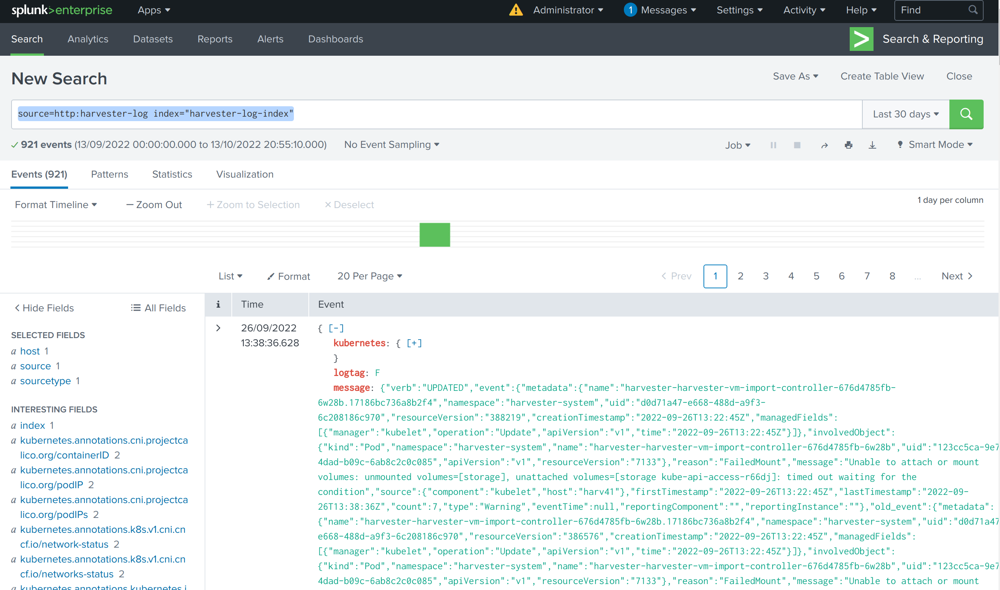

# Test logging, audit, event with splunk

## Reference

### HEP DOC:
https://github.com/joshmeranda/harvester/blob/logging/enhancements/20220525-system-logging.md
https://github.com/w13915984028/harvester/blob/hep578/enhancements/20220822-event-and-audit.md


### Graylog investigation
https://github.com/w13915984028/harvester-develop-summary/blob/main/integrate-harvester-logging-with-log-servers.md

## General concept

The `Harvester Logging` has an output plugin type `Splunk HEC`, which is used to send log to `Splunk`.

It needs configuration in both `Splunk` and `Harvester` to make it work.

note: `HEC` is the abbreviation of (Splunk) `Http Event Collector`.

## Test

### Setup splunk

Set up splunk out of the cluster.

Let's start it in a docker container, with splunk version v8.2.

```
$ docker run -d -p 8000:8000 -p 8088:8088 -p 8089:8089 -e "SPLUNK_START_ARGS=--accept-license" -e "SPLUNK_PASSWORD=PasswordPlus1234" --name splunk splunk/splunk:8.2
```

note: port `8000` is for `Splunk` http based webUI, `8088` is for `HTTP Event Collector`. those ports are mapped from host to container.


The `Splunk` can be logined from `http://ip:8000`. The username is `admin`, password is `PasswordPlus1234` as `"SPLUNK_PASSWORD=PasswordPlus1234"` in docker container env.


#### add new index

`Settings` -> `Add Data` -> `Indexes`

add new index, e.g. `harvester-log-index`


Create new index.


Note the `Max Size of Entire Index`, it defaults to `500 GB`, for test, a smaller size can be set, e.g. `5 GB`


#### add input

`Settings` -> `Add Data` -> `Data inputs`


From `Local inputs`, select `HTTP Event Collector`.


Those existing `HTTP Event Collector` will be shown as:


note the token value `91e3e196-2048-417c-94de-2a8141bf6be5`, it will be used later.


Add new `HTTP Event Collector`, add a proper name.


input setting, select previously defined `Index`


review hec input, finally click `Submit>`


note the `Global Settings` left to `New Token`, remember the `HTTP Port Number`, default to `8088`.


#### query log


From `apps` -> `Search & Reporting`, input `source=http:harvester-log index="harvester-log-index"`, to search log:


Click `[+]` to expand the detailed log.


The log are saved for long time. Even when `Harvester cluster` is offline, `splunk` can still search the history log data.




### Test Logging

#### set ClusterOutput and ClusterFlow

The `Splunk` `hec token` needs to be set into a `secret`.

```
echo -n '91e3e196-2048-417c-94de-2a8141bf6be5' | base64
OTFlM2UxOTYtMjA0OC00MTdjLTk0ZGUtMmE4MTQxYmY2YmU1
```

```
cat > co-splunk-token.yaml << 'EOF'
apiVersion: v1
kind: Secret
metadata:
  name: splunk-hec-token2
  namespace: cattle-logging-system
type: Opaque
data:
  HECTOKEN: OTFlM2UxOTYtMjA0OC00MTdjLTk0ZGUtMmE4MTQxYmY2YmU1
EOF


kubectl apply -f co-splunk-token.yaml
```

The created index `harvester-log-index` in `Splunk` needs also be set into `ClusterOutput`.

```
cat > co-splunk.yaml << 'EOF'
apiVersion: logging.banzaicloud.io/v1beta1
kind: ClusterOutput
metadata:
  name: harvester-logging-splunk
  namespace: cattle-logging-system 
spec:
 splunkHec:
    hec_host: 192.168.122.101
    hec_port: 8088
    insecure_ssl: true
    index: harvester-log-index
    hec_token:
      valueFrom:
        secretKeyRef:
          key: HECTOKEN
          name: splunk-hec-token2
    buffer:
      chunk_limit_size: 3MB
      timekey: 2m
      timekey_wait: 1m          
EOF

kubectl apply -f co-splunk.yaml
```

Add flow to filter log.
```
cat > cf-splunk.yaml << 'EOF'
apiVersion: logging.banzaicloud.io/v1beta1
kind: ClusterFlow
metadata:
  name: harvester-logging-splunk
  namespace: cattle-logging-system
spec:
  filters:
  - tag_normaliser: {}
  match: 
  globalOutputRefs:
    - harvester-logging-splunk
EOF

kubectl apply -f cf-splunk.yaml

```

#### check the configuration

Normally, after the `apply`, the related objects are created and the `ACTIVE` is `true`.

```
harv41:~ # kk get clusterflow -A
NAMESPACE               NAME                       ACTIVE   PROBLEMS
cattle-logging-system   harvester-logging-splunk   true     


harv41:~ # kk get clusteroutput -A
NAMESPACE               NAME                       ACTIVE   PROBLEMS
cattle-logging-system   harvester-logging-splunk   true     
```

#### check the log in `Splunk`

Use `source=http:harvester-log index="harvester-log-index"` to search in `Splunk`.


