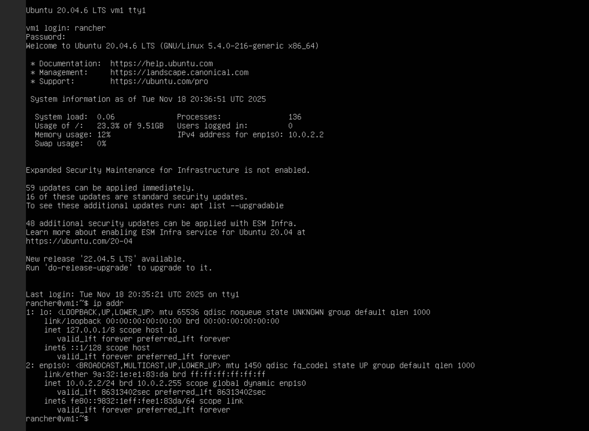
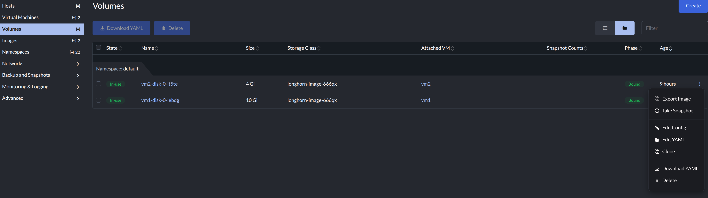
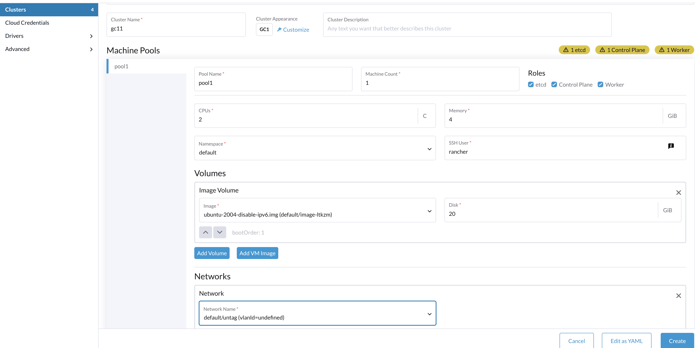
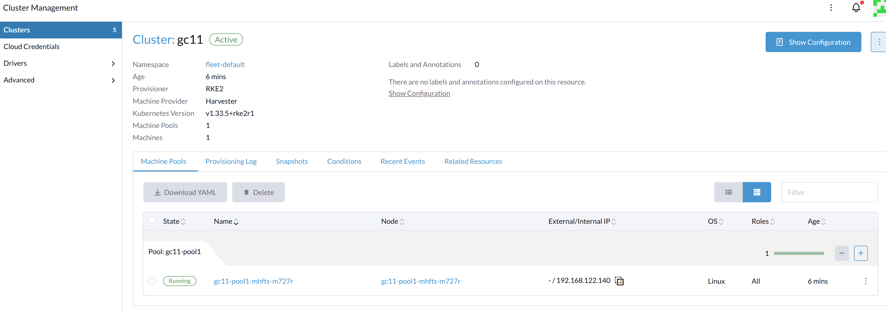
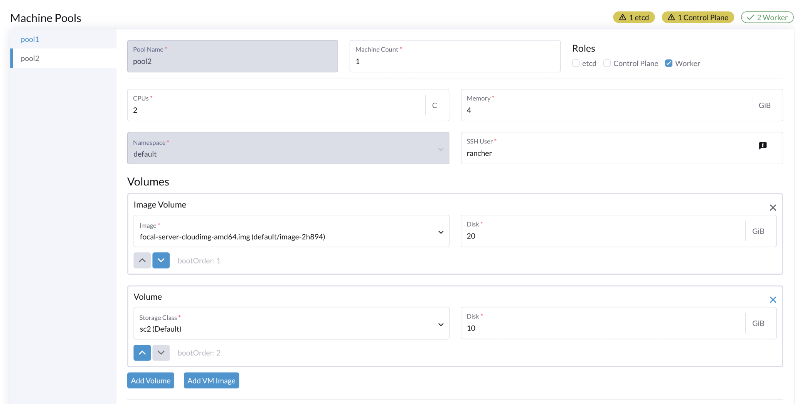

# Customize Ubuntu Image to Disable IPv6

## Background

https://github.com/harvester/harvester/issues/3990
https://github.com/kubevirt/kubevirt/issues/12698

When a VM OS is running with IPv6 enabled, it might trigger a [known issue](https://github.com/kubevirt/kubevirt/issues/12698), where the vmi object shows the IP addresses intermittently.

## Workaround 1: disable IPv6 via cloud-init

A partial workaround:  when create guest-cluster on Rancher Manager, add the last 4 lines to the cloud-config if guest VM's OS is ubuntu.

This will guide the VM to start and then disable the ipv6, it might eliminate the issue. 

note: When the node is rebooted, the IPv6 will come back again.

```
#cloud-config
package_update: true
packages:
  - qemu-guest-agent
runcmd:
  - - systemctl
    - enable
    - '--now'
    - qemu-guest-agent.service
  - echo "net.ipv6.conf.all.disable_ipv6 = 1" >> /etc/sysctl.conf
  - echo "net.ipv6.conf.default.disable_ipv6 = 1" >> /etc/sysctl.conf
  - echo "net.ipv6.conf.lo.disable_ipv6 = 1" >> /etc/sysctl.conf
  - sysctl -p    
```

## Workaround 2: Customize the image

The following steps show how to customize the cloud image to disable the IPv6 by default.

### Create a vm with the existing cloud image

Suppose the `ubuntu 20.04` cloud image is downloaded/uploaded to Harvester cluster, and a new VM is created with the image and attached to the default mgmt network.

By default, the IPv6 addresses are added to the nics.



### Disable IPv6 from guest OS

$ cat /etc/default/grub

```
# If you change this file, run 'update-grub' afterwards to update
# /boot/grub/grub.cfg.
# For full documentation of the options in this file, see:
#   info -f grub -n 'Simple configuration'

GRUB_DEFAULT=0
GRUB_TIMEOUT_STYLE=hidden
GRUB_TIMEOUT=0
GRUB_DISTRIBUTOR=`lsb_release -i -s 2> /dev/null || echo Debian`
GRUB_CMDLINE_LINUX_DEFAULT="quiet splash ipv6.disable=1"                                       # is changed
GRUB_CMDLINE_LINUX="ipv6.disable=1"                                                            # is changed

# Uncomment to enable BadRAM filtering, modify to suit your needs
# This works with Linux (no patch required) and with any kernel that obtains
# the memory map information from GRUB (GNU Mach, kernel of FreeBSD ...)
#GRUB_BADRAM="0x01234567,0xfefefefe,0x89abcdef,0xefefefef"

# Uncomment to disable graphical terminal (grub-pc only)
#GRUB_TERMINAL=console

# The resolution used on graphical terminal
# note that you can use only modes which your graphic card supports via VBE
# you can see them in real GRUB with the command `vbeinfo'
#GRUB_GFXMODE=640x480

# Uncomment if you don't want GRUB to pass "root=UUID=xxx" parameter to Linux
#GRUB_DISABLE_LINUX_UUID=true

# Uncomment to disable generation of recovery mode menu entries
#GRUB_DISABLE_RECOVERY="true"

# Uncomment to get a beep at grub start
#GRUB_INIT_TUNE="480 440 1"
```

1. Change the `/etc/default/grub` 


$ sudo nano /etc/default/grub

Set below two lines with `ipv6.disable=1`.

```
GRUB_CMDLINE_LINUX_DEFAULT="quiet splash ipv6.disable=1"
GRUB_CMDLINE_LINUX="ipv6.disable=1"
```

2. Run `sudo update-grub`.

$ sudo update-grub

Above changes ensure that the OS will disable IPv6 from boot.

3. From Harvester UI, stop the VM.

### Export the image

Click **Volumes** and then click the right side three dot menu to select **Export Image**.



### Create a new VM with to validate


After the new VM is up, run `ip addr`, it shows the VM is up without any IPv6 address.

```
rancher@vm3:~$ ip addr
1: lo: <LOOPBACK,UP,LOWER_UP> mtu 65536 qdisc noqueue state UNKNOWN group default qlen 1000
    link/loopback 00:00:00:00:00:00 brd 00:00:00:00:00:00
    inet 127.0.0.1/8 scope host lo
       valid_lft forever preferred_lft forever
2: enp1s0: <BROADCAST,MULTICAST,UP,LOWER_UP> mtu 1500 qdisc fq_codel state UP group default qlen 1000
    link/ether 2e:c0:1d:36:15:d0 brd ff:ff:ff:ff:ff:ff
    inet 192.168.122.235/24 brd 192.168.122.255 scope global dynamic enp1s0
       valid_lft 3099sec preferred_lft 3099sec

$ dmesg | grep ipv6 -i
[    0.000000] Command line: BOOT_IMAGE=/boot/vmlinuz-5.4.0-216-generic root=UUID=56f4cfa9-ae0f-4b78-812a-6e96c604085f ro ipv6.disable=1 console=tty1 console=ttyS0
[    0.046551] Kernel command line: BOOT_IMAGE=/boot/vmlinuz-5.4.0-216-generic root=UUID=56f4cfa9-ae0f-4b78-812a-6e96c604085f ro ipv6.disable=1 console=tty1 console=ttyS0
[    6.215192] IPv6: Loaded, but administratively disabled, reboot required to enable

```

### (Optional) Download the image

The image can be downloaded via Harvester UI and saved for further usage.

:::note

The downloaded file is like `abc.gz`, extract it and rename as `abc.img`.

:::


## Create new guest cluster with the customized image





Guest VM OS does not have any IPv6 address.

```
rancher@gc11-pool1-mhfts-m727r:~$ ip addr
1: lo: <LOOPBACK,UP,LOWER_UP> mtu 65536 qdisc noqueue state UNKNOWN group default qlen 1000
    link/loopback 00:00:00:00:00:00 brd 00:00:00:00:00:00
    inet 127.0.0.1/8 scope host lo
       valid_lft forever preferred_lft forever
2: enp1s0: <BROADCAST,MULTICAST,UP,LOWER_UP> mtu 1500 qdisc fq_codel state UP group default qlen 1000
    link/ether ce:b9:be:98:77:03 brd ff:ff:ff:ff:ff:ff
    inet 192.168.122.140/24 brd 192.168.122.255 scope global dynamic enp1s0
       valid_lft 3243sec preferred_lft 3243sec
3: cali8fcaf6b1ef5@if2: <BROADCAST,MULTICAST,UP,LOWER_UP> mtu 1500 qdisc noqueue state UP group default qlen 1000
    link/ether ee:ee:ee:ee:ee:ee brd ff:ff:ff:ff:ff:ff link-netns cni-f847f9a6-0b87-4503-0c86-52d81e695330
5: calid2aa177c91a@if2: <BROADCAST,MULTICAST,UP,LOWER_UP> mtu 1500 qdisc noqueue state UP group default qlen 1000
    link/ether ee:ee:ee:ee:ee:ee brd ff:ff:ff:ff:ff:ff link-netns cni-3a5673cc-cdf8-9d88-0d48-7ec4facbb7e5
6: cali469f9d194da@if2: <BROADCAST,MULTICAST,UP,LOWER_UP> mtu 1500 qdisc noqueue state UP group default qlen 1000
    link/ether ee:ee:ee:ee:ee:ee brd ff:ff:ff:ff:ff:ff link-netns cni-8e3514fb-014a-8cbb-56c7-b87a938b9fd7
7: cali9c74512ebd5@if2: <BROADCAST,MULTICAST,UP,LOWER_UP> mtu 1500 qdisc noqueue state UP group default qlen 1000
    link/ether ee:ee:ee:ee:ee:ee brd ff:ff:ff:ff:ff:ff link-netns cni-1f861269-15b0-86a5-4779-d75b0c94c6f4
8: cali7ee6d2d78e5@if2: <BROADCAST,MULTICAST,UP,LOWER_UP> mtu 1500 qdisc noqueue state UP group default qlen 1000
    link/ether ee:ee:ee:ee:ee:ee brd ff:ff:ff:ff:ff:ff link-netns cni-fc3c33ca-dbe7-9fd3-f5f5-5c005b6af38c
10: cali7a750443b1b@if2: <BROADCAST,MULTICAST,UP,LOWER_UP> mtu 1500 qdisc noqueue state UP group default qlen 1000
    link/ether ee:ee:ee:ee:ee:ee brd ff:ff:ff:ff:ff:ff link-netns cni-2b962c9a-452e-b6b6-9af5-50cf01bd8777
15: calidb3ae172dbe@if2: <BROADCAST,MULTICAST,UP,LOWER_UP> mtu 1500 qdisc noqueue state UP group default qlen 1000
    link/ether ee:ee:ee:ee:ee:ee brd ff:ff:ff:ff:ff:ff link-netns cni-1ac17c6b-082a-7ae1-414f-aa851f79d0dd
16: cali5b40308d956@if2: <BROADCAST,MULTICAST,UP,LOWER_UP> mtu 1500 qdisc noqueue state UP group default qlen 1000
    link/ether ee:ee:ee:ee:ee:ee brd ff:ff:ff:ff:ff:ff link-netns cni-9717a882-19c5-c80a-7e02-766faaf5ea58
18: vxlan.calico: <BROADCAST,MULTICAST,UP,LOWER_UP> mtu 1450 qdisc noqueue state UNKNOWN group default qlen 1000
    link/ether 66:97:23:7f:52:81 brd ff:ff:ff:ff:ff:ff
    inet 10.42.110.128/32 scope global vxlan.calico
       valid_lft forever preferred_lft forever
21: cali2d98895fabc@if2: <BROADCAST,MULTICAST,UP,LOWER_UP> mtu 1450 qdisc noqueue state UP group default qlen 1000
    link/ether ee:ee:ee:ee:ee:ee brd ff:ff:ff:ff:ff:ff link-netns cni-46d8d844-b896-67ef-2d85-638a5e6d1b54
23: caliec930032f35@if2: <BROADCAST,MULTICAST,UP,LOWER_UP> mtu 1450 qdisc noqueue state UP group default qlen 1000
    link/ether ee:ee:ee:ee:ee:ee brd ff:ff:ff:ff:ff:ff link-netns cni-7b9e1d48-4b0f-9749-807e-8c240771e790
29: cali74e7a2d30d1@if2: <BROADCAST,MULTICAST,UP,LOWER_UP> mtu 1450 qdisc noqueue state UP group default qlen 1000
    link/ether ee:ee:ee:ee:ee:ee brd ff:ff:ff:ff:ff:ff link-netns cni-e9c5e3d0-71d4-7fcb-2227-4e7f144f1299
31: cali77d5ceb3630@if2: <BROADCAST,MULTICAST,UP,LOWER_UP> mtu 1450 qdisc noqueue state UP group default qlen 1000
    link/ether ee:ee:ee:ee:ee:ee brd ff:ff:ff:ff:ff:ff link-netns cni-574c565d-6984-2c4e-553a-082ee4e301c0


rancher@gc11-pool1-mhfts-m727r:~$ uname -a
Linux gc11-pool1-mhfts-m727r 5.4.0-216-generic #236-Ubuntu SMP Fri Apr 11 19:53:21 UTC 2025 x86_64 x86_64 x86_64 GNU/Linux
```

:::note

In above example: guest OS is running a guest RKE2 k8s cluster with the default CNI driver calico.

The guest k8s version, CNI drivers and workload affect the real `ip addr/ip link` output.

:::

## Update the existing guest clusters

For existing `guest-cluster`, from Rancher Manager UI, click the right side three dot menu and then select **Edit Config**, select the new image, Rancher will update the cluster machines (Harvester VMs) with the new OS image, which disable IPv6.



