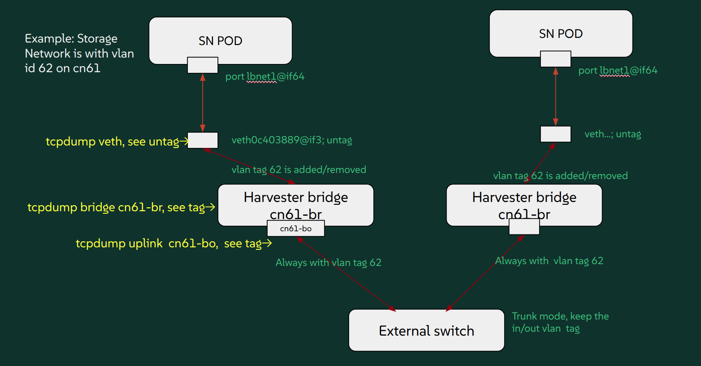

# Dive into Harvester Storage Network Vlans

Understand how vlans are added/removed on the storage-network path and how to troubleshooting.



## StorageNetwork NAD and vlans on v1.5.1

test on v151 cluster

```sh

SN on mgmt cluster network

mgmt-bo           1 PVID Egress Untagged
                  2
                  3
                  4
                  5
                  6
..............

                 4094
                 
port              vlan-id  
mgmt-br           1 PVID Egress Untagged
                  2
                  3
                  4
                  5
                  6
                  7
                  8
                 ...
                 4094


veth55976fa2      1 Egress Untagged                         (SN LH pod)
                  50 PVID Egress Untagged


SN on secondary cluster-network CN2

cn2-bo            1 PVID Egress Untagged
                  200
cn2-br            1 PVID Egress Untagged
vethaa99a39a      1 Egress Untagged                         (SN LH POD)
                  200 PVID Egress Untagged
```

cni plugin:

```sh
/opt/cni/bin/bridge --version
CNI bridge plugin v1.6.2
CNI protocol versions supported: 0.1.0, 0.2.0, 0.3.0, 0.3.1, 0.4.0, 1.0.0, 1.1.0
```

## StorageNetwork NAD and vlans on v1.6.1

test on v161 cluster

```sh
SN on mgmt:

{
  "vlan": 61,
  "clusterNetwork": "mgmt",
  "range": "192.168.61.0/24",
  "exclude": [
    "192.168.61.1/32"
  ]
}

harv2:~ # bridge vlan show
port              vlan-id  
mgmt-br           1 PVID Egress Untagged
mgmt-bo           1 PVID Egress Untagged
                  61
vethb11c78b4      61 PVID Egress Untagged


SN on seconday-network cn61

{
  "vlan": 62,
  "clusterNetwork": "cn61",
  "range": "192.168.62.0/24",
  "exclude": [
    "192.168.62.1/32"
  ]
}


harv2:~ # bridge vlan show
port              vlan-id  
mgmt-br           1 PVID Egress Untagged
mgmt-bo           1 PVID Egress Untagged
cn61-bo           1 PVID Egress Untagged
                  62
cn61-br           1 PVID Egress Untagged
veth25d8f884      62 PVID Egress Untagged
```


cni plugin:

```sh
harv2:~ # /opt/cni/bin/bridge --version
CNI bridge plugin v1.8.0
CNI protocol versions supported: 0.1.0, 0.2.0, 0.3.0, 0.3.1, 0.4.0, 1.0.0, 1.1.0

...
runtimeversion: v1.33.5+rke2r1
rancherversion: v2.12.2
harvesterchartversion: 1.6.1
monitoringchartversion: 105.1.2+up61.3.2

```


## How to debug SN


### Setup SN

```
{
  "vlan": 62,
  "clusterNetwork": "cn61",
  "range": "192.168.62.0/24",
  "exclude": [
    "192.168.62.1/32"
  ]
}
```


### Check LH PODs

```sh
harv2:/home/rancher # kubectl get pods -n longhorn-system instance-manager-b0d0b7881fc62c5b8b14bbabc216dabb -oyaml
apiVersion: v1
kind: Pod
metadata:
  annotations:
    cni.projectcalico.org/containerID: 6cce4820d0adb83d8c272d7c3df07f4bbe850bae427d2a3fefe7094269b9cbdb
    cni.projectcalico.org/podIP: 10.52.0.54/32
    cni.projectcalico.org/podIPs: 10.52.0.54/32
    k8s.v1.cni.cncf.io/network-status: |-
      [{
          "name": "k8s-pod-network",
          "ips": [
              "10.52.0.54"
          ],
          "default": true,
          "dns": {}
      },{
          "name": "harvester-system/storagenetwork-q5dxh",
          "interface": "lhnet1",
          "ips": [
              "192.168.62.2"
          ],
          "mac": "ba:d8:54:3f:3f:a9",
          "dns": {}
      }]
    k8s.v1.cni.cncf.io/networks: '[{"namespace": "harvester-system", "name": "storagenetwork-q5dxh",
      "interface": "lhnet1"}]'
    longhorn.io/last-applied-tolerations: '[{"key":"kubevirt.io/drain","operator":"Exists","effect":"NoSchedule"}]'
  creationTimestamp: "2025-12-10T14:38:27Z"
  generation: 1
  labels:
    longhorn.io/component: instance-manager
    longhorn.io/data-engine: v1
    longhorn.io/instance-manager-image: imi-80f7696e
    longhorn.io/instance-manager-type: aio
    longhorn.io/managed-by: longhorn-manager
    longhorn.io/node: harv2
  name: instance-manager-b0d0b7881fc62c5b8b14bbabc216dabb
  namespace: longhorn-system
```


```sh
16: cn61-bo: <BROADCAST,MULTICAST,MASTER,UP,LOWER_UP> mtu 1500 qdisc noqueue master cn61-br state UP group default qlen 1000
    link/ether 52:54:00:b2:4b:0e brd ff:ff:ff:ff:ff:ff
17: cn61-br: <BROADCAST,MULTICAST,PROMISC,UP,LOWER_UP> mtu 1500 qdisc noqueue state UNKNOWN group default 
    link/ether b6:c3:99:80:f2:9f brd ff:ff:ff:ff:ff:ff

64: veth0c403889@if3: <BROADCAST,MULTICAST,UP,LOWER_UP> mtu 1500 qdisc noqueue master cn61-br state UP group default 
    link/ether ea:b4:58:a5:1b:24 brd ff:ff:ff:ff:ff:ff link-netns cni-9c9d02e3-88cb-66ba-97f5-d158428b6ed1


harv2:/home/rancher # kubectl exec  -n longhorn-system instance-manager-b0d0b7881fc62c5b8b14bbabc216dabb -- ip addr
1: lo: <LOOPBACK,UP,LOWER_UP> mtu 65536 qdisc noqueue state UNKNOWN group default qlen 1000
    link/loopback 00:00:00:00:00:00 brd 00:00:00:00:00:00
    inet 127.0.0.1/8 scope host lo
       valid_lft forever preferred_lft forever
    inet6 ::1/128 scope host 
       valid_lft forever preferred_lft forever
2: eth0@if63: <BROADCAST,MULTICAST,UP,LOWER_UP> mtu 1450 qdisc noqueue state UP group default qlen 1000
    link/ether b6:88:9b:91:cb:7e brd ff:ff:ff:ff:ff:ff link-netnsid 0
    inet 10.52.0.54/32 scope global eth0
       valid_lft forever preferred_lft forever
    inet6 fe80::b488:9bff:fe91:cb7e/64 scope link 
       valid_lft forever preferred_lft forever
3: lhnet1@if64: <BROADCAST,MULTICAST,UP,LOWER_UP> mtu 1500 qdisc noqueue state UP group default qlen 1000
    link/ether ba:d8:54:3f:3f:a9 brd ff:ff:ff:ff:ff:ff link-netnsid 0
    inet 192.168.62.2/24 brd 192.168.62.255 scope global lhnet1
       valid_lft forever preferred_lft forever
    inet6 fe80::b8d8:54ff:fe3f:3fa9/64 scope link 
       valid_lft forever preferred_lft forever
```


### Test1: SN network to others (on Harvester v161 cluster)

From the LH `instance-manager-` to test a non-existing same-subnet IP.

```
sh-4.4# curl -k 192.168.62.5 --interface 192.168.62.2
curl: (7) Failed to connect to 192.168.62.5 port 80 after 3058 ms: Could not connect to server
sh-4.4# 
```

#### The dynamic veth interface for POD

The `veth` itself is like an untag access port to pod, and at linux-bridge side, the tag (62) is add/removed automatically.

```sh
harv2:/home/rancher # tcpdump -e -i veth0c403889
tcpdump: verbose output suppressed, use -v[v]... for full protocol decode
listening on veth0c403889, link-type EN10MB (Ethernet), snapshot length 262144 bytes
15:14:10.116944 ba:d8:54:3f:3f:a9 (oui Unknown) > 33:33:00:00:00:02 (oui Unknown), ethertype IPv6 (0x86dd), length 70: fe80::b8d8:54ff:fe3f:3fa9 > ipv6-allrouters: ICMP6, router solicitation, length 16
15:24:41.678641 ba:d8:54:3f:3f:a9 (oui Unknown) > Broadcast, ethertype ARP (0x0806), length 42: Request who-has 192.168.62.5 tell 192.168.62.2, length 28
15:24:42.688941 ba:d8:54:3f:3f:a9 (oui Unknown) > Broadcast, ethertype ARP (0x0806), length 42: Request who-has 192.168.62.5 tell 192.168.62.2, length 28
15:24:43.712958 ba:d8:54:3f:3f:a9 (oui Unknown) > Broadcast, ethertype ARP (0x0806), length 42: Request who-has 192.168.62.5 tell 192.168.62.2, length 28
^C
4 packets captured
4 packets received by filter
0 packets dropped by kernel

```

#### The Cluster-Network bridge

The cluster-network bridge like `cn61-br` gets ARP broadcast with given vlan tag `62`.

```sh
harv2:/home/rancher # tcpdump -e -i cn61-br
tcpdump: verbose output suppressed, use -v[v]... for full protocol decode
...

15:26:32.096973 ba:d8:54:3f:3f:a9 (oui Unknown) > Broadcast, ethertype 802.1Q (0x8100), length 46: vlan 62, p 0, ethertype ARP (0x0806), Request who-has 192.168.62.5 tell 192.168.62.2, length 28
15:26:33.121018 ba:d8:54:3f:3f:a9 (oui Unknown) > Broadcast, ethertype 802.1Q (0x8100), length 46: vlan 62, p 0, ethertype ARP (0x0806), Request who-has 192.168.62.5 tell 192.168.62.2, length 28

^C
7 packets captured
7 packets received by filter
0 packets dropped by kernel
```

#### The Cluster-Network uplink bond inteface

The cluster-network bridge uplink like `cn61-bo` gets ARP broadcast with given vlan tag `62`. The packets are sent to external switch/router with the tag.

```sh
harv2:/home/rancher # tcpdump -e -i cn61-bo

tcpdump: verbose output suppressed, use -v[v]... for full protocol decode
..
15:28:18.797058 ba:d8:54:3f:3f:a9 (oui Unknown) > Broadcast, ethertype 802.1Q (0x8100), length 46: vlan 62, p 0, ethertype ARP (0x0806), Request who-has 192.168.62.5 tell 192.168.62.2, length 28
15:28:19.808958 ba:d8:54:3f:3f:a9 (oui Unknown) > Broadcast, ethertype 802.1Q (0x8100), length 46: vlan 62, p 0, ethertype ARP (0x0806), Request who-has 192.168.62.5 tell 192.168.62.2, length 28
...
^C
6 packets captured
6 packets received by filter
0 packets dropped by kernel
```


### Test2: SN network to others (on Harvester v151 cluster)

Via the similar test process, the observed result is similar:

LH POD

```sh
harv21:/home/rancher # kubectl exec -n longhorn-system instance-manager-d6c71732e09cfb2a2a35d8255faeda8b -i -t -- bin/sh

sh-4.4# ip addr
1: lo: <LOOPBACK,UP,LOWER_UP> mtu 65536 qdisc noqueue state UNKNOWN group default qlen 1000
    link/loopback 00:00:00:00:00:00 brd 00:00:00:00:00:00
    inet 127.0.0.1/8 scope host lo
       valid_lft forever preferred_lft forever
    inet6 ::1/128 scope host 
       valid_lft forever preferred_lft forever
2: eth0@if63: <BROADCAST,MULTICAST,UP,LOWER_UP> mtu 1450 qdisc noqueue state UP group default qlen 1000
    link/ether 5e:08:3b:6f:aa:b0 brd ff:ff:ff:ff:ff:ff link-netnsid 0
    inet 10.52.0.54/32 scope global eth0
       valid_lft forever preferred_lft forever
    inet6 fe80::5c08:3bff:fe6f:aab0/64 scope link 
       valid_lft forever preferred_lft forever
3: lhnet1@if64: <BROADCAST,MULTICAST,UP,LOWER_UP> mtu 1500 qdisc noqueue state UP group default qlen 1000
    link/ether 52:8d:1c:f0:20:7f brd ff:ff:ff:ff:ff:ff link-netnsid 0
    inet 192.168.200.2/24 brd 192.168.200.255 scope global lhnet1
       valid_lft forever preferred_lft forever
    inet6 fe80::508d:1cff:fef0:207f/64 scope link 
       valid_lft forever preferred_lft forever


sh-4.4# curl 192.168.200.5 --interface 192.168.200.2
curl: (7) Failed to connect to 192.168.200.5 port 80 after 3052 ms: Couldn't connect to server

sh-4.4# curl 192.168.200.5 --interface 192.168.200.2
curl: (7) Failed to connect to 192.168.200.5 port 80 after 3071 ms: Couldn't connect to server
sh-4.4# 
```

veth port, untag

```sh
harv21:/home/rancher # tcpdump -e -i veth35b3467b
tcpdump: verbose output suppressed, use -v[v]... for full protocol decode
listening on veth35b3467b, link-type EN10MB (Ethernet), snapshot length 262144 bytes
...
16:16:00.160240 52:8d:1c:f0:20:7f (oui Unknown) > Broadcast, ethertype ARP (0x0806), length 42: Request who-has 192.168.200.5 tell 192.168.200.2, length 28

16:16:01.182643 52:8d:1c:f0:20:7f (oui Unknown) > Broadcast, ethertype ARP (0x0806), length 42: Request who-has 192.168.200.5 tell 192.168.200.2, length 28
```

bridge, with vlan tag

```sh
harv21:/home/rancher # tcpdump -e -i cn2-br

16:16:54.831502 52:8d:1c:f0:20:7f (oui Unknown) > Broadcast, ethertype 802.1Q (0x8100), length 46: vlan 200, p 0, ethertype ARP (0x0806), Request who-has 192.168.200.5 tell 192.168.200.2, length 28

16:16:55.838756 52:8d:1c:f0:20:7f (oui Unknown) > Broadcast, ethertype 802.1Q (0x8100), length 46: vlan 200, p 0, ethertype ARP (0x0806), Request who-has 192.168.200.5 tell 192.168.200.2, length 28
```

bridge uplink, with vlan tag

```sh
harv21:/home/rancher # tcpdump -e -i cn2-bo
tcpdump: verbose output suppressed, use -v[v]... for full protocol decode
listening on cn2-bo, link-type EN10MB (Ethernet), snapshot length 262144 bytes

16:17:12.542652 52:8d:1c:f0:20:7f (oui Unknown) > Broadcast, ethertype 802.1Q (0x8100), length 46: vlan 200, p 0, ethertype ARP (0x0806), Request who-has 192.168.200.5 tell 192.168.200.2, length 28

16:17:13.566661 52:8d:1c:f0:20:7f (oui Unknown) > Broadcast, ethertype 802.1Q (0x8100), length 46: vlan 200, p 0, ethertype ARP (0x0806), Request who-has 192.168.200.5 tell 192.168.200.2, length 28
```