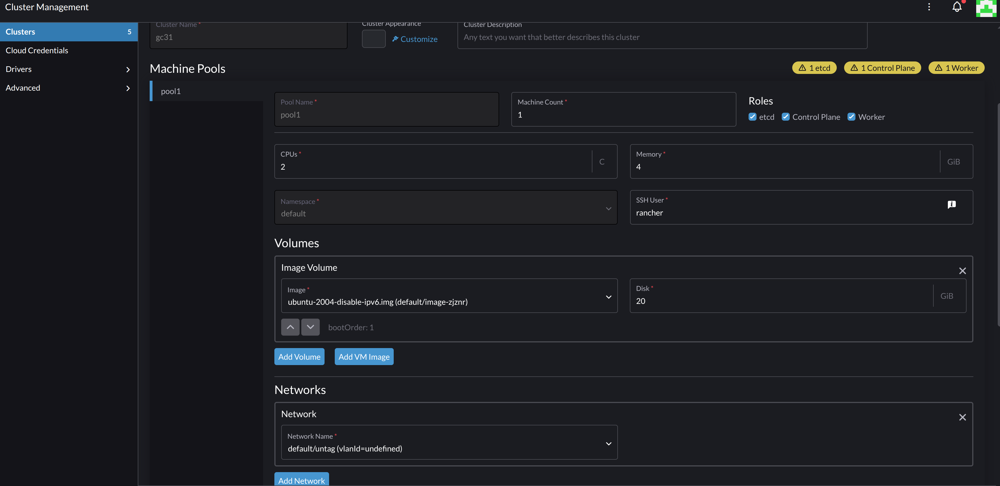
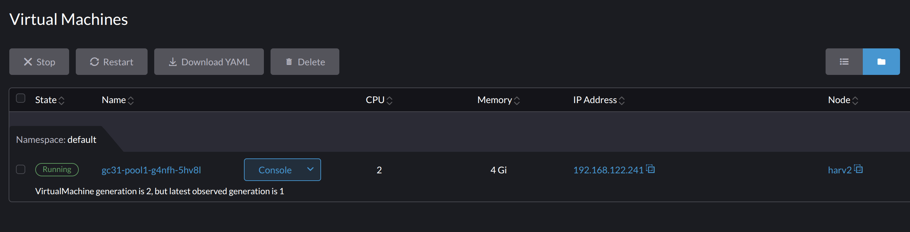
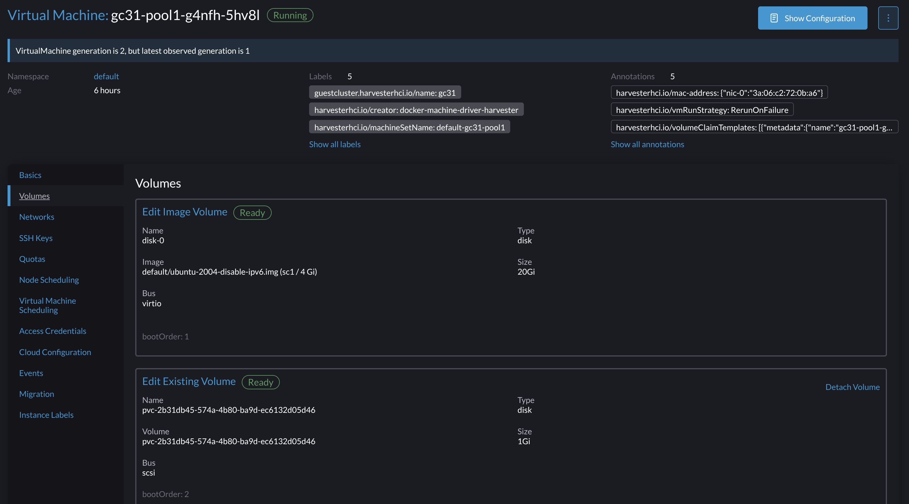

# Dive into VM and Guest Cluster CSI driver

Understand how guest-cluster csi-driver add and remove volumes to Harvester VMs dynamically


## What happend when guest cluster claim a PVC


### Spawn a guest cluster




### Create a PVC based deployment on guest cluster

```sh

cat > pvc.yaml << 'EOF'
apiVersion: v1
kind: PersistentVolumeClaim
metadata:
  name: task-pv-claim
spec:
  storageClassName: harvester
  accessModes:
    - ReadWriteOnce
  resources:
    requests:
      storage: 1Gi
EOF


cat > deployment.yaml << 'EOF'
apiVersion: v1
kind: Pod
metadata:
  name: task-pv-pod
spec:
  volumes:
    - name: task-pv-storage
      persistentVolumeClaim:
        claimName: task-pv-claim
  containers:
    - name: task-pv-container
      image: nginx
      ports:
        - containerPort: 80
          name: "http-server"
      volumeMounts:
        - mountPath: "/usr/share/nginx/html"
          name: task-pv-storage      
EOF

```


created pvc and pod:

```yaml
apiVersion: v1
kind: PersistentVolume
metadata:
  annotations:
    pv.kubernetes.io/provisioned-by: driver.harvesterhci.io
  creationTimestamp: '2025-12-11T20:56:09Z'
  finalizers:
    - kubernetes.io/pv-protection
    - external-attacher/driver-harvesterhci-io
  managedFields:
    - apiVersion: v1
      fieldsType: FieldsV1
      fieldsV1:
        f:metadata:
          f:annotations:
            .: {}
            f:pv.kubernetes.io/provisioned-by: {}
        f:spec:
          f:accessModes: {}
          f:capacity:
            .: {}
            f:storage: {}
          f:claimRef:
            .: {}
            f:apiVersion: {}
            f:kind: {}
            f:name: {}
            f:namespace: {}
            f:resourceVersion: {}
            f:uid: {}
          f:csi:
            .: {}
            f:driver: {}
            f:fsType: {}
            f:volumeAttributes:
              .: {}
              f:storage.kubernetes.io/csiProvisionerIdentity: {}
            f:volumeHandle: {}
          f:persistentVolumeReclaimPolicy: {}
          f:storageClassName: {}
          f:volumeMode: {}
      manager: csi-provisioner
      operation: Update
      time: '2025-12-11T20:56:09Z'
    - apiVersion: v1
      fieldsType: FieldsV1
      fieldsV1:
        f:status:
          f:phase: {}
      manager: kube-controller-manager
      operation: Update
      subresource: status
      time: '2025-12-11T20:56:09Z'
    - apiVersion: v1
      fieldsType: FieldsV1
      fieldsV1:
        f:metadata:
          f:finalizers:
            v:"external-attacher/driver-harvesterhci-io": {}
      manager: csi-attacher
      operation: Update
      time: '2025-12-11T20:56:27Z'
  name: pvc-2b31db45-574a-4b80-ba9d-ec6132d05d46
  resourceVersion: '33812'
  uid: 7a9ac1f0-1fe6-4eb3-b9f0-5efa01b0bc49
spec:
  accessModes:
    - ReadWriteOnce
  capacity:
    storage: 1Gi
  claimRef:
    apiVersion: v1
    kind: PersistentVolumeClaim
    name: task-pv-claim
    namespace: default
    resourceVersion: '33675'
    uid: 2b31db45-574a-4b80-ba9d-ec6132d05d46
  csi:
    driver: driver.harvesterhci.io
    fsType: ext4
    volumeAttributes:
      storage.kubernetes.io/csiProvisionerIdentity: 1765482771544-8081-driver.harvesterhci.io
    volumeHandle: pvc-2b31db45-574a-4b80-ba9d-ec6132d05d46
  persistentVolumeReclaimPolicy: Delete
  storageClassName: harvester
  volumeMode: Filesystem
status:
  lastPhaseTransitionTime: '2025-12-11T20:56:09Z'
  phase: Bound
```

```yaml
apiVersion: v1
kind: Pod
metadata:
  annotations:
    cni.projectcalico.org/containerID: 6c2161bb2f20c7f54eafaec3f77e7fd992753505ba13f9bdb355f6da1ddbe571
    cni.projectcalico.org/podIP: 10.42.186.241/32
    cni.projectcalico.org/podIPs: 10.42.186.241/32
  creationTimestamp: '2025-12-11T20:56:27Z'
  generation: 1
  managedFields:
    - apiVersion: v1
      fieldsType: FieldsV1
      fieldsV1:
        f:spec:
          f:containers:
            k:{"name":"task-pv-container"}:
              .: {}
              f:image: {}
              f:imagePullPolicy: {}
              f:name: {}
              f:ports:
                .: {}
                k:{"containerPort":80,"protocol":"TCP"}:
                  .: {}
                  f:containerPort: {}
                  f:name: {}
                  f:protocol: {}
              f:resources: {}
              f:terminationMessagePath: {}
              f:terminationMessagePolicy: {}
              f:volumeMounts:
                .: {}
                k:{"mountPath":"/usr/share/nginx/html"}:
                  .: {}
                  f:mountPath: {}
                  f:name: {}
          f:dnsPolicy: {}
          f:enableServiceLinks: {}
          f:restartPolicy: {}
          f:schedulerName: {}
          f:securityContext: {}
          f:terminationGracePeriodSeconds: {}
          f:volumes:
            .: {}
            k:{"name":"task-pv-storage"}:
              .: {}
              f:name: {}
              f:persistentVolumeClaim:
                .: {}
                f:claimName: {}
      manager: kubectl-create
      operation: Update
      time: '2025-12-11T20:56:27Z'
    - apiVersion: v1
      fieldsType: FieldsV1
      fieldsV1:
        f:metadata:
          f:annotations:
            .: {}
            f:cni.projectcalico.org/containerID: {}
            f:cni.projectcalico.org/podIP: {}
            f:cni.projectcalico.org/podIPs: {}
      manager: calico
      operation: Update
      subresource: status
      time: '2025-12-11T20:56:46Z'
    - apiVersion: v1
      fieldsType: FieldsV1
      fieldsV1:
        f:status:
          f:conditions:
            k:{"type":"ContainersReady"}:
              .: {}
              f:lastProbeTime: {}
              f:lastTransitionTime: {}
              f:status: {}
              f:type: {}
            k:{"type":"Initialized"}:
              .: {}
              f:lastProbeTime: {}
              f:lastTransitionTime: {}
              f:status: {}
              f:type: {}
            k:{"type":"PodReadyToStartContainers"}:
              .: {}
              f:lastProbeTime: {}
              f:lastTransitionTime: {}
              f:status: {}
              f:type: {}
            k:{"type":"Ready"}:
              .: {}
              f:lastProbeTime: {}
              f:lastTransitionTime: {}
              f:status: {}
              f:type: {}
          f:containerStatuses: {}
          f:hostIP: {}
          f:hostIPs: {}
          f:phase: {}
          f:podIP: {}
          f:podIPs:
            .: {}
            k:{"ip":"10.42.186.241"}:
              .: {}
              f:ip: {}
          f:startTime: {}
      manager: kubelet
      operation: Update
      subresource: status
      time: '2025-12-11T20:56:55Z'
  name: task-pv-pod
  namespace: default
  resourceVersion: '34026'
  uid: ea86be67-17fb-4c2e-a90c-03b889aa9142
spec:
  containers:
    - image: nginx
      imagePullPolicy: Always
      name: task-pv-container
      ports:
        - containerPort: 80
          name: http-server
          protocol: TCP
      resources: {}
      terminationMessagePath: /dev/termination-log
      terminationMessagePolicy: File
      volumeMounts:
        - mountPath: /usr/share/nginx/html
          name: task-pv-storage
        - mountPath: /var/run/secrets/kubernetes.io/serviceaccount
          name: kube-api-access-qtkqw
          readOnly: true
  dnsPolicy: ClusterFirst
  enableServiceLinks: true
  nodeName: gc31-pool1-g4nfh-5hv8l
  preemptionPolicy: PreemptLowerPriority
  priority: 0
  restartPolicy: Always
  schedulerName: default-scheduler
  securityContext: {}
  serviceAccount: default
  serviceAccountName: default
  terminationGracePeriodSeconds: 30
  tolerations:
    - effect: NoExecute
      key: node.kubernetes.io/not-ready
      operator: Exists
      tolerationSeconds: 300
    - effect: NoExecute
      key: node.kubernetes.io/unreachable
      operator: Exists
      tolerationSeconds: 300
  volumes:
    - name: task-pv-storage
      persistentVolumeClaim:
        claimName: task-pv-claim
    - name: kube-api-access-qtkqw
      projected:
        defaultMode: 420
        sources:
          - serviceAccountToken:
              expirationSeconds: 3607
              path: token
          - configMap:
              items:
                - key: ca.crt
                  path: ca.crt
              name: kube-root-ca.crt
          - downwardAPI:
              items:
                - fieldRef:
                    apiVersion: v1
                    fieldPath: metadata.namespace
                  path: namespace
status:
  conditions:
    - lastProbeTime: null
      lastTransitionTime: '2025-12-11T20:56:55Z'
      status: 'True'
      type: PodReadyToStartContainers
    - lastProbeTime: null
      lastTransitionTime: '2025-12-11T20:56:27Z'
      status: 'True'
      type: Initialized
    - lastProbeTime: null
      lastTransitionTime: '2025-12-11T20:56:55Z'
      status: 'True'
      type: Ready
    - lastProbeTime: null
      lastTransitionTime: '2025-12-11T20:56:55Z'
      status: 'True'
      type: ContainersReady
    - lastProbeTime: null
      lastTransitionTime: '2025-12-11T20:56:27Z'
      status: 'True'
      type: PodScheduled
  containerStatuses:
    - containerID: >-
        containerd://0eabfb42d8fa6c01cb573472e8ac99cdbe54168b6500625a43b583cd60dda905
      image: docker.io/library/nginx:latest
      imageID: >-
        docker.io/library/nginx@sha256:fb01117203ff38c2f9af91db1a7409459182a37c87cced5cb442d1d8fcc66d19
      lastState: {}
      name: task-pv-container
      ready: true
      resources: {}
      restartCount: 0
      started: true
      state:
        running:
          startedAt: '2025-12-11T20:56:54Z'
      user:
        linux:
          gid: 0
          supplementalGroups:
            - 0
          uid: 0
      volumeMounts:
        - mountPath: /usr/share/nginx/html
          name: task-pv-storage
        - mountPath: /var/run/secrets/kubernetes.io/serviceaccount
          name: kube-api-access-qtkqw
          readOnly: true
          recursiveReadOnly: Disabled
  hostIP: 192.168.122.241
  hostIPs:
    - ip: 192.168.122.241
  phase: Running
  podIP: 10.42.186.241
  podIPs:
    - ip: 10.42.186.241
  qosClass: BestEffort
  startTime: '2025-12-11T20:56:27Z'

```


### guest-cluster CSI-driver log on 


```sh
> kubectl logs -n kube-system harvester-csi-driver-controllers-847b6f645f-x6rsp

...
I1211 20:56:09.458921       1 controller.go:291] Started PVC processing "default/task-pv-claim"
W1211 20:56:09.459842       1 controller.go:318] PV "" bound to PVC default/task-pv-claim not found
I1211 20:56:09.699758       1 controller.go:291] Started PVC processing "default/task-pv-claim"
I1211 20:56:09.704959       1 controller.go:334] No need to resize PVC "default/task-pv-claim"
...
```


### The changes on Harvester

vm generation



vm has a hot-plug volume




The vm yaml:

```yaml

apiVersion: v1
items:
- apiVersion: kubevirt.io/v1
  kind: VirtualMachine
  metadata:
    annotations:
      harvesterhci.io/mac-address: '{"nic-0":"3a:06:c2:72:0b:a6"}'
      harvesterhci.io/vmRunStrategy: RerunOnFailure
      harvesterhci.io/volumeClaimTemplates: '[{"metadata":{"name":"gc31-pool1-g4nfh-5hv8l-disk-0-4r9pq","creationTimestamp":null,"annotations":{"harvesterhci.io/imageId":"default/image-zjznr"}},"spec":{"accessModes":["ReadWriteMany"],"resources":{"requests":{"storage":"20Gi"}},"storageClassName":"longhorn-image-zjznr","volumeMode":"Block"},"status":{}}]'
      kubevirt.io/latest-observed-api-version: v1
      kubevirt.io/storage-observed-api-version: v1
    creationTimestamp: "2025-12-11T14:30:09Z"
    finalizers:
    - kubevirt.io/virtualMachineControllerFinalize
    - wrangler.cattle.io/VMController.CleanupPVCAndSnapshot
    generation: 2
    labels:
      guestcluster.harvesterhci.io/name: gc31
      harvesterhci.io/creator: docker-machine-driver-harvester
      harvesterhci.io/machineSetName: default-gc31-pool1
      harvesterhci.io/vmName: gc31-pool1-g4nfh-5hv8l
      nodepool.harvesterhci.io/name: pool1-g4nfh
    name: gc31-pool1-g4nfh-5hv8l
    namespace: default
    resourceVersion: "416384"
    uid: cf6d1340-c8b1-4e0a-b946-a6c8e57c59e7
  spec:
    runStrategy: RerunOnFailure
    template:
      metadata:
        annotations:
          harvesterhci.io/sshNames: '[]'
          harvesterhci.io/waitForLeaseInterfaceNames: '[]'
        creationTimestamp: null
        labels:
          guestcluster.harvesterhci.io/name: gc31
          harvesterhci.io/creator: docker-machine-driver-harvester
          harvesterhci.io/machineSetName: default-gc31-pool1
          harvesterhci.io/vmName: gc31-pool1-g4nfh-5hv8l
          nodepool.harvesterhci.io/name: pool1-g4nfh
      spec:
        affinity:
          nodeAffinity:
            requiredDuringSchedulingIgnoredDuringExecution:
              nodeSelectorTerms:
              - matchExpressions:
                - key: network.harvesterhci.io/mgmt
                  operator: In
                  values:
                  - "true"
          podAntiAffinity:
            preferredDuringSchedulingIgnoredDuringExecution:
            - podAffinityTerm:
                labelSelector:
                  matchExpressions:
                  - key: harvesterhci.io/creator
                    operator: Exists
                topologyKey: kubernetes.io/hostname
              weight: 100
        architecture: amd64
        domain:
          cpu:
            cores: 2
            maxSockets: 1
          devices:
            disks:
            - disk:
                bus: virtio
              name: cloudinitdisk
            - bootOrder: 1
              disk:
                bus: virtio
              name: disk-0
            - disk:
                bus: scsi
              name: pvc-2b31db45-574a-4b80-ba9d-ec6132d05d46
            interfaces:
            - bridge: {}
              model: virtio
              name: nic-0
          machine:
            type: q35
          memory:
            guest: 4Gi
          resources:
            limits:
              cpu: "2"
              memory: 4Gi
            requests:
              cpu: 125m
              memory: 2730Mi
        evictionStrategy: LiveMigrateIfPossible
        networks:
        - multus:
            networkName: default/untag
          name: nic-0
        terminationGracePeriodSeconds: 120
        volumes:
        - cloudInitNoCloud:
            secretRef:
              name: gc31-pool1-g4nfh-5hv8l-cloudinit
          name: cloudinitdisk
        - name: disk-0
          persistentVolumeClaim:
            claimName: gc31-pool1-g4nfh-5hv8l-disk-0-4r9pq
        - name: pvc-2b31db45-574a-4b80-ba9d-ec6132d05d46
          persistentVolumeClaim:
            claimName: pvc-2b31db45-574a-4b80-ba9d-ec6132d05d46
            hotpluggable: true
  status:
    conditions:
    - lastProbeTime: null
      lastTransitionTime: "2025-12-11T19:47:24Z"
      status: "True"
      type: Ready
    - lastProbeTime: null
      lastTransitionTime: null
      status: "True"
      type: LiveMigratable
    - lastProbeTime: null
      lastTransitionTime: null
      status: "True"
      type: StorageLiveMigratable
    - lastProbeTime: "2025-12-11T19:47:45Z"
      lastTransitionTime: null
      status: "True"
      type: AgentConnected
    created: true
    desiredGeneration: 2
    observedGeneration: 1
    printableStatus: Running
    ready: true
    runStrategy: RerunOnFailure
    volumeSnapshotStatuses:
    - enabled: false
      name: cloudinitdisk
      reason: Snapshot is not supported for this volumeSource type [cloudinitdisk]
    - enabled: true
      name: disk-0
    - enabled: true
      name: pvc-2b31db45-574a-4b80-ba9d-ec6132d05d46
kind: List
metadata:
  resourceVersion: ""


```


pvc and volume on Harvester

```yaml
apiVersion: v1
kind: PersistentVolumeClaim
metadata:
  annotations:
    pv.kubernetes.io/bind-completed: "yes"
    pv.kubernetes.io/bound-by-controller: "yes"
    volume.beta.kubernetes.io/storage-provisioner: driver.longhorn.io
    volume.kubernetes.io/storage-provisioner: driver.longhorn.io
  creationTimestamp: "2025-12-11T20:56:09Z"
  finalizers:
  - kubernetes.io/pvc-protection
  - wrangler.cattle.io/persistentvolumeclaim-controller
  name: pvc-2b31db45-574a-4b80-ba9d-ec6132d05d46
  namespace: default
  resourceVersion: "416182"
  uid: f012dd43-a0b9-4f48-92a3-416071a08875
spec:
  accessModes:
  - ReadWriteMany
  resources:
    requests:
      storage: 1Gi
  storageClassName: sc1
  volumeMode: Block
  volumeName: pvc-f012dd43-a0b9-4f48-92a3-416071a08875
status:
  accessModes:
  - ReadWriteMany
  capacity:
    storage: 1Gi
  phase: Bound
```

```yaml
apiVersion: longhorn.io/v1beta2
kind: Volume
metadata:
  creationTimestamp: "2025-12-11T20:56:11Z"
  finalizers:
  - longhorn.io
  generation: 2
  labels:
    backup-target: default
    longhornvolume: pvc-f012dd43-a0b9-4f48-92a3-416071a08875
    recurring-job-group.longhorn.io/default: enabled
    setting.longhorn.io/remove-snapshots-during-filesystem-trim: ignored
    setting.longhorn.io/replica-auto-balance: ignored
    setting.longhorn.io/snapshot-data-integrity: ignored
  name: pvc-f012dd43-a0b9-4f48-92a3-416071a08875
  namespace: longhorn-system
  resourceVersion: "416701"
  uid: 7b0e7e06-31a3-41af-983b-edd07b22cd8f
spec:
  Standby: false
  accessMode: rwx
  backingImage: ""
  backupCompressionMethod: lz4
  backupTargetName: default
  dataEngine: v1
  dataLocality: disabled
  dataSource: ""
  disableFrontend: false
  diskSelector: []
  encrypted: false
  freezeFilesystemForSnapshot: ignored
  fromBackup: ""
  frontend: blockdev
  image: longhornio/longhorn-engine:v1.9.2
  lastAttachedBy: ""
  migratable: true
  migrationNodeID: ""
  nodeID: harv2
  nodeSelector: []
  numberOfReplicas: 1
  offlineRebuilding: ignored
  replicaAutoBalance: ignored
  replicaDiskSoftAntiAffinity: ignored
  replicaSoftAntiAffinity: ignored
  replicaZoneSoftAntiAffinity: ignored
  restoreVolumeRecurringJob: ignored
  revisionCounterDisabled: true
  size: "1073741824"
  snapshotDataIntegrity: ignored
  snapshotMaxCount: 250
  snapshotMaxSize: "0"
  staleReplicaTimeout: 30
  unmapMarkSnapChainRemoved: ignored
status:
  actualSize: 51003392
  cloneStatus:
    attemptCount: 0
    nextAllowedAttemptAt: ""
    snapshot: ""
    sourceVolume: ""
    state: ""
  conditions:
  - lastProbeTime: ""
    lastTransitionTime: "2025-12-11T20:56:11Z"
    message: ""
    reason: ""
    status: "False"
    type: WaitForBackingImage
  - lastProbeTime: ""
    lastTransitionTime: "2025-12-11T20:56:11Z"
    message: ""
    reason: ""
    status: "False"
    type: TooManySnapshots
  - lastProbeTime: ""
    lastTransitionTime: "2025-12-11T20:56:11Z"
    message: ""
    reason: ""
    status: "True"
    type: Scheduled
  - lastProbeTime: ""
    lastTransitionTime: "2025-12-11T20:56:11Z"
    message: ""
    reason: ""
    status: "False"
    type: Restore
  currentImage: longhornio/longhorn-engine:v1.9.2
  currentMigrationNodeID: ""
  currentNodeID: harv2
  expansionRequired: false
  frontendDisabled: false
  isStandby: false
  kubernetesStatus:
    lastPVCRefAt: ""
    lastPodRefAt: ""
    namespace: default
    pvName: pvc-f012dd43-a0b9-4f48-92a3-416071a08875
    pvStatus: Bound
    pvcName: pvc-2b31db45-574a-4b80-ba9d-ec6132d05d46
    workloadsStatus:
    - podName: hp-volume-gpk9n
      podStatus: Running
      workloadName: virt-launcher-gc31-pool1-g4nfh-5hv8l-qkwb9
      workloadType: Pod
  lastBackup: ""
  lastBackupAt: ""
  lastDegradedAt: ""
  ownerID: harv2
  remountRequestedAt: ""
  restoreInitiated: false
  restoreRequired: false
  robustness: healthy
  shareEndpoint: ""
  shareState: ""
  state: attached
```