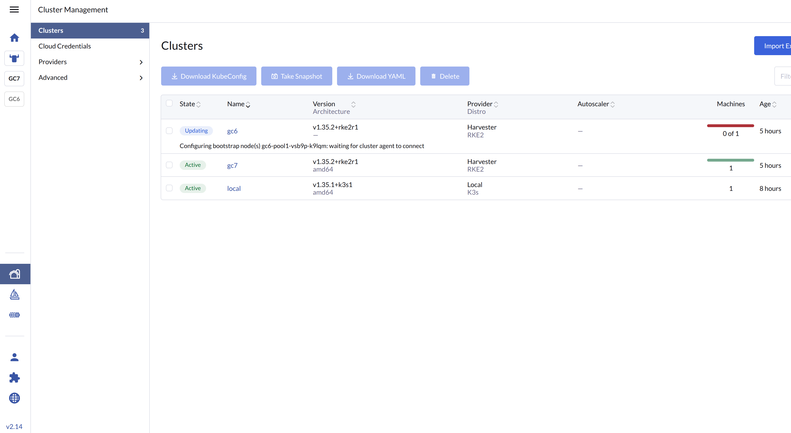
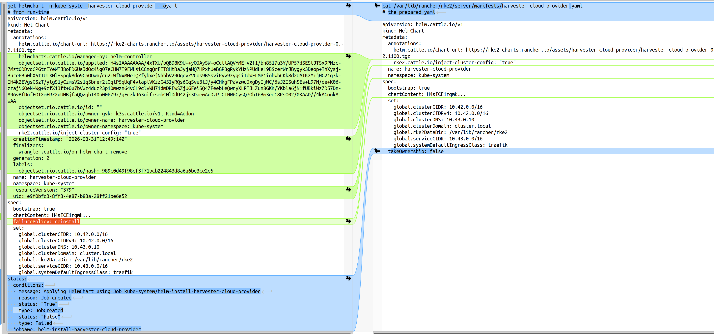

## Rancher Manager rke2 guest cluster provision stucking

You might observe:




Issue: [Harvester 10188](ttps://github.com/harvester/harvester/issues/10188)


### What's observed

First glance:

```
root@gc6-pool1-vsb9p-k9lqm:~# kk get pods -A
NAMESPACE         NAME                                                    READY   STATUS             RESTARTS        AGE
calico-system     calico-kube-controllers-5874d9cb7f-pvxqm                0/1     Pending            0               5h32m
calico-system     calico-node-vdpgm                                       0/1     Running            0               5h32m
calico-system     calico-typha-79c6748d69-lh5dd                           0/1     Pending            0               5h32m
cattle-system     cattle-cluster-agent-796f69f684-sdnsv                   0/1     Pending            0               5h33m
kube-system       etcd-gc6-pool1-vsb9p-k9lqm                              1/1     Running            0               5h33m
kube-system       helm-install-harvester-csi-driver-r7cxw                 0/1     CrashLoopBackOff   70 (2m7s ago)   5h33m
kube-system       helm-install-rke2-calico-crd-qfgzs                      0/1     Completed          0               5h33m
kube-system       helm-install-rke2-calico-g4ljv                          0/1     Completed          2               5h33m
kube-system       helm-install-rke2-coredns-xwnvw                         0/1     Completed          0               5h33m
kube-system       helm-install-rke2-metrics-server-s45dr                  0/1     Pending            0               5h33m
kube-system       helm-install-rke2-runtimeclasses-8xmtq                  0/1     Pending            0               5h33m
kube-system       helm-install-rke2-snapshot-controller-5zxbj             0/1     Pending            0               5h33m
kube-system       helm-install-rke2-snapshot-controller-crd-bkwmk         0/1     Pending            0               5h33m
kube-system       helm-install-rke2-traefik-c9tq6                         0/1     Pending            0               5h33m
kube-system       helm-install-rke2-traefik-crd-tg8s2                     0/1     Pending            0               5h33m
kube-system       kube-apiserver-gc6-pool1-vsb9p-k9lqm                    1/1     Running            0               5h33m
kube-system       kube-controller-manager-gc6-pool1-vsb9p-k9lqm           1/1     Running            0               5h33m
kube-system       kube-proxy-gc6-pool1-vsb9p-k9lqm                        1/1     Running            0               5h33m
kube-system       kube-scheduler-gc6-pool1-vsb9p-k9lqm                    1/1     Running            0               5h33m
kube-system       rke2-coredns-rke2-coredns-5d4dd4bdd9-wpcrp              0/1     Pending            0               5h33m
kube-system       rke2-coredns-rke2-coredns-autoscaler-67b9856946-z7cvf   0/1     Pending            0               5h33m
tigera-operator   tigera-operator-6db5b6cfd8-x8gdh                        1/1     Running            0               5h32m
```


Further look: `job is frozen`: `Pods Statuses:    0 Active (0 Ready) / 0 Succeeded / 0 Failed`


```

root@gc6-pool1-vsb9p-k9lqm:~# kk describe job -n kube-system helm-install-harvester-cloud-provider
Name:             helm-install-harvester-cloud-provider
Namespace:        kube-system
Selector:         batch.kubernetes.io/controller-uid=f18caaf9-a7ab-4409-b07d-7807530e74f9
Labels:           helmcharts.helm.cattle.io/chart=harvester-cloud-provider
                  objectset.rio.cattle.io/hash=39ec6fc21ae4d503a047bc2eeba987a59a25dc0b
Annotations:      objectset.rio.cattle.io/applied:
                    H4sIAAAAAAAA/6xXX2/iPhb9Kis/JyH8Kf+kPqSQLuxQQAlT7WpUIce5AS+OnbUdZtiK775yEjqBMrRd/d6I43Nyr+/xuZdXhDP6DFJRwdEQRViTbWPfRBbaUR6jIfqHiJCFUtA4xh...
                  objectset.rio.cattle.io/id: helm-controller-chart-registration
                  objectset.rio.cattle.io/owner-gvk: helm.cattle.io/v1, Kind=HelmChart
                  objectset.rio.cattle.io/owner-name: harvester-cloud-provider
                  objectset.rio.cattle.io/owner-namespace: kube-system
Parallelism:      1
Completions:      1
Completion Mode:  NonIndexed
Suspend:          false
Backoff Limit:    1000
Start Time:       Tue, 31 Mar 2026 12:49:15 +0000
Pods Statuses:    0 Active (0 Ready) / 0 Succeeded / 0 Failed
Pod Template:
...

root@gc6-pool1-vsb9p-k9lqm:~# kk get job -A
NAMESPACE     NAME                                        STATUS     COMPLETIONS   DURATION   AGE
kube-system   helm-install-harvester-cloud-provider       Running    0/1           5h33m      5h33m
kube-system   helm-install-harvester-csi-driver           Running    0/1           5h33m      5h33m
kube-system   helm-install-rke2-calico                    Complete   1/1           29s        5h33m
kube-system   helm-install-rke2-calico-crd                Complete   1/1           19s        5h33m
kube-system   helm-install-rke2-coredns                   Complete   1/1           16s        5h33m
kube-system   helm-install-rke2-metrics-server            Running    0/1           5h33m      5h33m
kube-system   helm-install-rke2-runtimeclasses            Running    0/1           5h33m      5h33m
kube-system   helm-install-rke2-snapshot-controller       Running    0/1           5h33m      5h33m
kube-system   helm-install-rke2-snapshot-controller-crd   Running    0/1           5h33m      5h33m
kube-system   helm-install-rke2-traefik                   Running    0/1           5h33m      5h33m
kube-system   helm-install-rke2-traefik-crd               Running    0/1           5h33m      5h33m
root@gc6-pool1-vsb9p-k9lqm:~# kk get job -n kube-system helm-install-harvester-cloud-provider
NAME                                    STATUS    COMPLETIONS   DURATION   AGE
helm-install-harvester-cloud-provider   Running   0/1           5h34m      5h34m
root@gc6-pool1-vsb9p-k9lqm:~# kk get job -n kube-system helm-install-harvester-cloud-provider -oyaml
apiVersion: batch/v1
kind: Job
metadata:
  annotations:
    objectset.rio.cattle.io/applied: H4sIAAAAAAAA/6xXX2/iPhb9Kis/JyH8Kf+kPqSQLuxQQAlT7WpUIce5AS+OnbUdZtiK775yEjqBMrRd/d6I43Nyr+/xuZdXhDP6DFJRwdEQRViTbWPfRBbaUR6jIfqHiJCFUtA4xhqj4SvCnAuNNRVcmUcR/RuIVqAdSYVDsNYMHCoa1KC3wFKbCK6lYAykTbZYalvChiotCw5k/ZFB/OQg7c1+VxHVXu2b1t++UR7fT4ClI0P6IQ/HKRgiLPegtImFiTy2Myn2NAb5KbzKMDEkuzwCWx2UhhQdLcRwBKw4DBNmkaNyLiIuVv+/72+x2qIhag+AdBPSamLoxHduG7udXkRaABEe9Hv4boBbdzFxIxPRKVlz/JQrjRmzb3z5T7lZqMg9gAQkcAIKDX9cKOZdYZCFIibIbmGQY2BQVHmYYKbAQr+18LZUCa1eyY9rlRfygkHiRglp2/0kadsd3O/ZUb+N7VY/SVrNCLr4roWOL0cLqQyIKVCEyU4kyYymVKNh03VdC2lIM4Y1mPc3hH6jtoIndDMpyxROvNZd97712H50/f5o4Pd8v9V3H/rj0ajt3T32vd6D3+uOHwcPzW7THfR63buHQbfT97rNQaf18JcJ6lhL2xw7phxkVUG5MT9QJQ1kIdtWoG2lJeUbZKENExFmDmG5YR5Nx8F903U6Lcd13Eaz+xnAvvMlyHgeFvvbjus03Q93ixRTfl89OUwQ/Ocs5A5aY6zxmMr7xh7LBqNRQ2JOtiAb5uUfkQrknhJ4y7/9UTLlvRlDgnOmp3wjQakRw0rda4khoTv0YiHg+6IKlcrn3pOPLLTHLL8p+qP1Bnn2g3C6mNeXAn+5qD9P/NnTehxMn/2gRq6ASND1faOJF6zWJoZw6Y3qgZyb3Dng3ZeuRLTygr/7X6L2vq8m66UXhutR4I/9+WrqzcIarDCMOmA6D/3R98Bfh9+my/VqFpo4po//uoVZzrzpfD1ZrZa3dn37/uAHc3/lh+vQD56nI389WYSrGqTZ6hk1OM0PYMtFUId1O512HfGwWKzCVeDVo9EyPwtmvlgvg8U/62k5ak8s50z/Vv26WWdyrXE9etOZObHlYjYd1RklnNzg+GIhmuJNsVpdkx2jWQbSNiY03LvOwGl27CinLG65ra7bKq5sAVrmjC0Fo+RgCpTMhV5KUMDrvg7M9BYJSuSy6CqvxquA5JLqw0hwDb904cCMiZ9LSfeUwQZ8RTDD5+0EZziijGpasKBYiswYmzebIWP7EnC84OwQCKEfKYNKc0NzwkcL7QXLU3gSOdelMabm5xJrY+SNrUjhLPGGU0Ve5VF/V5zxR3CCyRbe48vlTxEUneYKQ7n+jkKn2e/N5uHdjkvGQg7qyr7z1mwaiqnp8cWoZSuUnoP+KeSuPFsLcRFDCAyIFtJUxlx5yUGDKkYqhYaIUZ7/QuVWWwoGzvmmalawM4Z57VoY3Wgs9ZvIFvwRU5ZLc7JXRCRz7qm54EYDp+gUECLSbClFQlnR+PUhK2w055qmUDl42UPLJuARYs5jXpusbswnWjCQp9nhxyuCJAFi2vVchGQLcc5MtDsw8Zv8L1LnwkzJOD4UhfgquKyEnXO8x5ThiMHnaIosTklckOaccqopZvS/EJvBMDP5mdoi/z950X3f2VdJPZJUU4KZF8eCK3MbL+C/qNLqMkL/F5Bcnwd4TSSgyWU4V/muZvyx6q4yv5yco6ptmunDmMpyfoxpnqIheoJUyENtFn9nFl+D/faIL+J+O8PngCeXOPcDC2VSmL8nEBv4m3H/eD3NFMNXRDWk5Vp5xG8j/agI4rmgGlXOYaGstJbyC3bTdl3XvoDYZxjngNOyPZ1cqPg7WRHcGIRfjiaj8iiecGZiPWOo3OwGxTXjK8xBY50XDez4vwAAAP//EdHwF0sPAAA
    objectset.rio.cattle.io/id: helm-controller-chart-registration
    objectset.rio.cattle.io/owner-gvk: helm.cattle.io/v1, Kind=HelmChart
    objectset.rio.cattle.io/owner-name: harvester-cloud-provider
    objectset.rio.cattle.io/owner-namespace: kube-system
  creationTimestamp: "2026-03-31T12:49:15Z"
  generation: 1
  labels:
    helmcharts.helm.cattle.io/chart: harvester-cloud-provider
    objectset.rio.cattle.io/hash: 39ec6fc21ae4d503a047bc2eeba987a59a25dc0b
  name: helm-install-harvester-cloud-provider
  namespace: kube-system
  ownerReferences:
  - apiVersion: helm.cattle.io/v1
    blockOwnerDeletion: false
    controller: false
    kind: HelmChart
    name: harvester-cloud-provider
    uid: e9f0bfc3-8ff3-4a87-b83a-28ff21be6a52
  resourceVersion: "498"
  uid: f18caaf9-a7ab-4409-b07d-7807530e74f9
spec:
  backoffLimit: 1000
  completionMode: NonIndexed
  completions: 1
  manualSelector: false
  parallelism: 1
  podReplacementPolicy: TerminatingOrFailed
  selector:
    matchLabels:
      batch.kubernetes.io/controller-uid: f18caaf9-a7ab-4409-b07d-7807530e74f9
  suspend: false
  template:
    metadata:
      annotations:
        helmcharts.helm.cattle.io/configHash: SHA256=2F3F0E8C9E7EE280B8DCC3A5F8A7BE76DF9B161097765B9648A61942BAEC5557
      labels:
        batch.kubernetes.io/controller-uid: f18caaf9-a7ab-4409-b07d-7807530e74f9
        batch.kubernetes.io/job-name: helm-install-harvester-cloud-provider
        controller-uid: f18caaf9-a7ab-4409-b07d-7807530e74f9
        helmcharts.helm.cattle.io/chart: harvester-cloud-provider
        job-name: helm-install-harvester-cloud-provider
    spec:
      containers:
      - args:
        - install
        - --set-string
        - global.clusterCIDR=10.42.0.0/16
        - --set-string
        - global.clusterCIDRv4=10.42.0.0/16
        - --set-string
        - global.clusterDNS=10.43.0.10
        - --set-string
        - global.clusterDomain=cluster.local
        - --set-string
        - global.rke2DataDir=/var/lib/rancher/rke2
        - --set-string
        - global.serviceCIDR=10.43.0.0/16
        - --set-string
        - global.systemDefaultIngressClass=traefik
        env:
        - name: NAME
          value: harvester-cloud-provider
        - name: VERSION
        - name: REPO
        - name: HELM_DRIVER
          value: secret
        - name: CHART_NAMESPACE
          value: kube-system
        - name: CHART
        - name: HELM_VERSION
        - name: TARGET_NAMESPACE
          value: kube-system
        - name: AUTH_PASS_CREDENTIALS
          value: "false"
        - name: INSECURE_SKIP_TLS_VERIFY
          value: "false"
        - name: PLAIN_HTTP
          value: "false"
        - name: KUBERNETES_SERVICE_HOST
          value: 127.0.0.1
        - name: KUBERNETES_SERVICE_PORT
          value: "6443"
        - name: BOOTSTRAP
          value: "true"
        - name: NO_PROXY
          value: .svc,.cluster.local,10.42.0.0/16,10.43.0.0/16
        - name: FAILURE_POLICY
          value: reinstall
        image: rancher/klipper-helm:v0.9.14-build20260210
        imagePullPolicy: IfNotPresent
        name: helm
        resources: {}
        securityContext:
          allowPrivilegeEscalation: false
          capabilities:
            drop:
            - ALL
          readOnlyRootFilesystem: true
        terminationMessagePath: /dev/termination-log
        terminationMessagePolicy: File
        volumeMounts:
        - mountPath: /home/klipper-helm/.helm
          name: klipper-helm
        - mountPath: /home/klipper-helm/.cache
          name: klipper-cache
        - mountPath: /home/klipper-helm/.config
          name: klipper-config
        - mountPath: /tmp
          name: tmp
        - mountPath: /config
          name: values
        - mountPath: /chart
          name: content
      dnsPolicy: ClusterFirst
      hostNetwork: true
      nodeSelector:
        kubernetes.io/os: linux
        node-role.kubernetes.io/control-plane: "true"
      restartPolicy: OnFailure
      schedulerName: default-scheduler
      securityContext:
        runAsNonRoot: true
        seccompProfile:
          type: RuntimeDefault
      serviceAccount: helm-harvester-cloud-provider
      serviceAccountName: helm-harvester-cloud-provider
      terminationGracePeriodSeconds: 30
      tolerations:
      - effect: NoSchedule
        key: node.kubernetes.io/not-ready
      - effect: NoSchedule
        key: node.kubernetes.io/network-unavailable
      - effect: NoSchedule
        key: node.cloudprovider.kubernetes.io/uninitialized
        operator: Equal
        value: "true"
      - key: CriticalAddonsOnly
        operator: Exists
      - effect: NoExecute
        key: node-role.kubernetes.io/etcd
        operator: Exists
      - effect: NoSchedule
        key: node-role.kubernetes.io/control-plane
        operator: Exists
      volumes:
      - emptyDir:
          medium: Memory
        name: klipper-helm
      - emptyDir:
          medium: Memory
        name: klipper-cache
      - emptyDir:
          medium: Memory
        name: klipper-config
      - emptyDir:
          medium: Memory
        name: tmp
      - name: values
        projected:
          defaultMode: 420
          sources:
          - secret:
              items:
              - key: HelmChartConfigValuesContent
                path: values-1-000-HelmChartConfig-ValuesContent.yaml
              name: chart-values-harvester-cloud-provider
      - configMap:
          defaultMode: 420
          name: chart-content-harvester-cloud-provider
        name: content
status:
  ready: 0
  startTime: "2026-03-31T12:49:15Z"
  terminating: 0
  uncountedTerminatedPods: {}

```

### kube-controller-manager Key log

```
E0331 12:49:15.777348       1 job_controller.go:659] "Unhandled Error" err="syncing job: tracking status: adding uncounted pods to status: Operation cannot be fulfilled on jobs.batch \"helm-install-harvester-cloud-provider\": StorageError: invalid object, Code: 4, Key: /registry/jobs/kube-system/helm-install-harvester-cloud-provider, ResourceVersion: 0, AdditionalErrorMsg: Precondition failed: UID in precondition: ca2a4a3e-7335-4c66-a337-00bf70e8356e, UID in object meta: f18caaf9-a7ab-4409-b07d-7807530e74f9" logger="UnhandledError"
```

### What happened?

#### Manifest and crd objects

Chart customization file: `/var/lib/rancher/rke2/server/manifests/harvester-cloud-provider.yaml`

```yaml

cat /var/lib/rancher/rke2/server/manifests/harvester-cloud-provider.yaml
apiVersion: helm.cattle.io/v1
kind: HelmChart
metadata:
  annotations:
    helm.cattle.io/chart-url: https://rke2-charts.rancher.io/assets/harvester-cloud-provider/harvester-cloud-provider-0.2.1100.tgz
    rke2.cattle.io/inject-cluster-config: "true"
  name: harvester-cloud-provider
  namespace: kube-system
spec:
  bootstrap: true
  chartContent: H4sICE1rqmkCA3Rtc...
  set:
    global.clusterCIDR: 10.42.0.0/16
    global.clusterCIDRv4: 10.42.0.0/16
    global.clusterDNS: 10.43.0.10
    global.clusterDomain: cluster.local
    global.rke2DataDir: /var/lib/rancher/rke2
    global.serviceCIDR: 10.43.0.0/16
    global.systemDefaultIngressClass: traefik
  takeOwnership: false
```

Chart customization file: `/var/lib/rancher/rke2/server/manifests/rancher/managed-chart-config.yaml`

```yaml
root@gc6-pool1-vsb9p-k9lqm:~# cat /var/lib/rancher/rke2/server/manifests/rancher/managed-chart-config.yaml
apiVersion: helm.cattle.io/v1
kind: HelmChartConfig
metadata:
  name: harvester-cloud-provider
  namespace: kube-system
spec:
  valuesContent: '{"cloudConfigPath":"/var/lib/rancher/rke2/etc/config-files/cloud-provider-config","global":{"cattle":{"clusterId":"c-m-4t2fhkpd","clusterName":"gc6"}}}'

---
apiVersion: helm.cattle.io/v1
kind: HelmChartConfig
metadata:
  name: rke2-calico
  namespace: kube-system
spec:
  valuesContent: '{"global":{"cattle":{"clusterId":"c-m-4t2fhkpd"}}}'

---
apiVersion: helm.cattle.io/v1
kind: HelmChartConfig
metadata:
  name: rke2-ingress-nginx
  namespace: kube-system
spec:
  valuesContent: '{"global":{"cattle":{"clusterId":"c-m-4t2fhkpd"}}}'

---
apiVersion: helm.cattle.io/v1
kind: HelmChartConfig
metadata:
  name: rke2-traefik
  namespace: kube-system
spec:
  valuesContent: '{"global":{"cattle":{"clusterId":"c-m-4t2fhkpd"}}}'
```

Run-time objects:

HelmChartConfig:

```yaml
root@gc6-pool1-vsb9p-k9lqm:~# kk get helmchartconfig -n kube-system harvester-cloud-provider  -oyaml
apiVersion: helm.cattle.io/v1
kind: HelmChartConfig
metadata:
  annotations:
    objectset.rio.cattle.io/applied: H4sIAAAAAAAA/4SRMW/yQAyG/8onzwkHISR8J3WoWCp16dSJxblzyDUXX3RnUlWI/14FWqkdKKNlv48e2yfA0b1STC4waOjIDwuDIp4WLqhpBRn0ji1oeCI/7DqMsgvcugNkMJCgRUHQJ0DmICgucJrL0LyRkUSyiC78ALqZBNnNfnhnivlh6kFDv06/VLJ/z47tw6O1ge8iGAcCDQMyHsjmZhbPzbf5/Wwa0cyA/thQnj6S0ADnDDw25P/csMPUgQbb1tWyMrYosG7r/6uyWreIdbnalsv1dmPKTVNUdosz9Mu1wzhREoq58eFo8zGGyVmKcJ24YZRGMrPPhP5IaRdYiAU0nPZwwVy/9YLS7UHvQU0YlXeNisimo6hiT4UiMep6nLx1npK6ROF8/gwAAP//nH77RB8CAAA
    objectset.rio.cattle.io/id: ""
    objectset.rio.cattle.io/owner-gvk: k3s.cattle.io/v1, Kind=Addon
    objectset.rio.cattle.io/owner-name: managed-chart-config
    objectset.rio.cattle.io/owner-namespace: kube-system
  creationTimestamp: "2026-03-31T12:49:15Z"
  generation: 1
  labels:
    objectset.rio.cattle.io/hash: df7606cd22a7f791463faa741840385c45b26d8a
  name: harvester-cloud-provider
  namespace: kube-system
  resourceVersion: "398"
  uid: 51c1bc78-b5b6-48b0-850e-e4b37e456378
spec:
  failurePolicy: reinstall
  valuesContent: '{"cloudConfigPath":"/var/lib/rancher/rke2/etc/config-files/cloud-provider-config","global":{"cattle":{"clusterId":"c-m-4t2fhkpd","clusterName":"gc6"}}}'
```


```
root@gc6-pool1-vsb9p-k9lqm:~# kk get helmchartconfig -A
NAMESPACE     NAME                       AGE
kube-system   harvester-cloud-provider   6h39m
kube-system   rke2-calico                6h39m
kube-system   rke2-ingress-nginx         6h39m
kube-system   rke2-traefik               6h39m

root@gc6-pool1-vsb9p-k9lqm:~# kk get helmchartconfig -A -oyaml | grep failure -i
    failurePolicy: reinstall
    failurePolicy: reinstall
    failurePolicy: reinstall
    failurePolicy: reinstall
```
:::note

`HelmChartConfig` is generated from `managed-chart-config`, but the `failurePolicy` is appended later.

:::


HelmChart:

```
root@gc6-pool1-vsb9p-k9lqm:~# kk get helmchart -n kube-system harvester-cloud-provider  -oyaml
apiVersion: helm.cattle.io/v1
kind: HelmChart
metadata:
  annotations:
    helm.cattle.io/chart-url: https://rke2-charts.rancher.io/assets/harvester-cloud-provider/harvester-cloud-provider-0.2.1100.tgz
    helmcharts.cattle.io/managed-by: helm-controller
    objectset.rio.cattle.io/applied: H4sIAAAAAAAA/4xTXU/bQBD8K9U++yOJAySW+oCctlAQVYMEfV2f1/bh8517u3Y/UP57dSEStJTSx9PNzc7Mzt0DDvqGPGtnIYeWTJ8oFDGUaJdOc4ig07aCHM7I9EWLXiCCngQrFIT8HtBaJyjaWQ7HPxhUeBGP3gRykYHzNPUdLeL9BScerWrJBygyk3Daop+IhXysjBurePBu0hX5tIUIXHlHSpgk8do9GaODwn/cu2+WfNxMHeTQZfybxejNhbbV29OqcvZVCos9BSsviPyv9zygCiTdWFLMP1iohwhCKk8d2UATKzM+jHG21g3kIH4k2EVgsCSzT/ylgS1yCzmsV2s1q5brer2iOqtP5qUqF4vlaplVKzzG45IyRQs6CqSvu3tJ/y4CHkgFPaVzwuJxgDyIjWC/6sJZISuhSEs+L97N/de+K06zraji6OeN+Wg+9zfX13ft+0u7bVWz4duz23p10mwzn64vCL9clvWH71dmDREwSZjUGFeiSQ4ZFeebLeQwnyXLRTJLZun8GKK/YKbla6jN1fUBkiWzZD57DnA96vBfDufEOIXmERZ2uUHBjfaQQzqhT40u00PZ9x/gEczkJ63oifzsmbCHlDdU42jk3DaemAuDzPtGINW6CysQ7OhT6Bm3eoC8RsO02/0KAAD//4kAGonkAwAA
    objectset.rio.cattle.io/id: ""
    objectset.rio.cattle.io/owner-gvk: k3s.cattle.io/v1, Kind=Addon
    objectset.rio.cattle.io/owner-name: harvester-cloud-provider
    objectset.rio.cattle.io/owner-namespace: kube-system
    rke2.cattle.io/inject-cluster-config: "true"
  creationTimestamp: "2026-03-31T12:49:14Z"
  finalizers:
  - wrangler.cattle.io/on-helm-chart-remove
  generation: 2
  labels:
    objectset.rio.cattle.io/hash: 989c0d49f98ef3f71bcb224843d8a6a6be3ce2e5
  name: harvester-cloud-provider
  namespace: kube-system
  resourceVersion: "379"
  uid: e9f0bfc3-8ff3-4a87-b83a-28ff21be6a52
spec:
  bootstrap: true
  ...
  failurePolicy: reinstall
  set:
    global.clusterCIDR: 10.42.0.0/16
    global.clusterCIDRv4: 10.42.0.0/16
    global.clusterDNS: 10.43.0.10
    global.clusterDomain: cluster.local
    global.rke2DataDir: /var/lib/rancher/rke2
    global.serviceCIDR: 10.43.0.0/16
    global.systemDefaultIngressClass: traefik
status:
  conditions:
  - message: Applying HelmChart using Job kube-system/helm-install-harvester-cloud-provider
    reason: Job created
    status: "True"
    type: JobCreated
  - status: "False"
    type: Failed
  jobName: helm-install-harvester-cloud-provider
root@gc6-pool1-vsb9p-k9lqm:~# 
```

Why this object has `generation: 2`?

#### rke2-server logs


```
Mar 31 12:48:15 gc6-pool1-vsb9p-k9lqm rke2[2282]: time="2026-03-31T12:48:15Z" level=info msg="certificate CN=rke2-cloud-controller-manager signed by CN=rke2-client-ca@1774961295: notBefore=2026-03-31 12:48:15 +0000 UTC notAfter=2027-03-31 12:48:15 +0000 UTC"
Mar 31 12:48:24 gc6-pool1-vsb9p-k9lqm rke2[2282]: time="2026-03-31T12:48:24Z" level=info msg="Extracting file charts/harvester-cloud-provider.yaml to /var/lib/rancher/rke2/data/v1.35.2-rke2r1-6a3c0ebad32c/charts/harvester-cloud-provider.yaml"
Mar 31 12:48:25 gc6-pool1-vsb9p-k9lqm rke2[2282]: time="2026-03-31T12:48:25Z" level=info msg="Updated manifest /var/lib/rancher/rke2/server/manifests/harvester-cloud-provider.yaml to set cluster configuration values"

Mar 31 12:48:25 gc6-pool1-vsb9p-k9lqm rke2[2282]: time="2026-03-31T12:48:25Z" level=info msg="No cluster configuration value changes necessary for manifest /var/lib/rancher/rke2/server/manifests/rancher/managed-chart-config.yaml"

Mar 31 12:49:09 gc6-pool1-vsb9p-k9lqm rke2[2282]: time="2026-03-31T12:49:09Z" level=info msg="Creating embedded CRD helmchartconfigs.helm.cattle.io"
Mar 31 12:49:09 gc6-pool1-vsb9p-k9lqm rke2[2282]: time="2026-03-31T12:49:09Z" level=info msg="Creating embedded CRD helmcharts.helm.cattle.io"
Mar 31 12:49:09 gc6-pool1-vsb9p-k9lqm rke2[2282]: time="2026-03-31T12:49:09Z" level=info msg="Waiting for CRD helmcharts.helm.cattle.io to become available"
Mar 31 12:49:09 gc6-pool1-vsb9p-k9lqm rke2[2282]: time="2026-03-31T12:49:09Z" level=info msg="Done waiting for CRD helmcharts.helm.cattle.io to become available"

Mar 31 12:49:15 gc6-pool1-vsb9p-k9lqm rke2[2282]: time="2026-03-31T12:49:15Z" level=error msg="error syncing 'kube-system/harvester-cloud-provider': handler helm-controller-chart-registration: DesiredSet - Replace Wait batch/v1, Kind=Job kube-system/helm-install-harvester-cloud-provider for helm-controller-chart-registration kube-system/harvester-cloud-provider, requeuing"
```

#### Root cause: the race analysis

Why this object has `generation: 2`?



First: `HelmChartConfig` object is created after `HelmChart`.

```yaml
kind: HelmChartConfig
metadata:
  annotations:
...
    objectset.rio.cattle.io/owner-gvk: k3s.cattle.io/v1, Kind=Addon
    objectset.rio.cattle.io/owner-name: managed-chart-config
    objectset.rio.cattle.io/owner-namespace: kube-system
  creationTimestamp: "2026-03-31T12:49:15Z"                         // note
```

```yaml
kind: HelmChart
metadata:
  annotations:
    helm.cattle.io/chart-url: https://rke2-charts.rancher.io/assets/harvester-cloud-provider/harvester-cloud-provider-0.2.1100.tgz
    helmcharts.cattle.io/managed-by: helm-controller
...
    objectset.rio.cattle.io/owner-gvk: k3s.cattle.io/v1, Kind=Addon
    objectset.rio.cattle.io/owner-name: harvester-cloud-provider
    objectset.rio.cattle.io/owner-namespace: kube-system
    rke2.cattle.io/inject-cluster-config: "true"                    // note
  creationTimestamp: "2026-03-31T12:49:14Z"
```


Second: the auto appended `.spec.failurePolicy: reinstall` on HelmChartConfig.

```
root@gc6-pool1-vsb9p-k9lqm:~# kk get helmchartconfig -n kube-system harvester-cloud-provider  -oyaml
apiVersion: helm.cattle.io/v1
kind: HelmChartConfig
...
  creationTimestamp: "2026-03-31T12:49:15Z"
..
  name: harvester-cloud-provider
  namespace: kube-system
  resourceVersion: "398"
  uid: 51c1bc78-b5b6-48b0-850e-e4b37e456378
spec:
  failurePolicy: reinstall                                          // note
  valuesContent: '{"cloudConfigPath":"/var/lib/rancher/rke2/etc/config-files/cloud-provider-config","global":{"cattle":{"clusterId":"c-m-4t2fhkpd","clusterName":"gc6"}}}'
```

Third: the annotation `objectset.rio.cattle.io/applied:` shows the inital values does not have `failurePolicy: reinstall`

```
echo "H4sIAAA...CysQ7OhT6Bm3eoC8RsO02/0KAAD//4kAGonkAwAA" | base64 -d | gunzip


{"apiVersion":"helm.cattle.io/v1","kind":"HelmChart","metadata":{"annotations":{"helm.cattle.io/chart-url":"https://rke2-charts.rancher.io/assets/harvester-cloud-provider/h","objectset.rio.cattle.io/id":"","objectset.rio.cattle.io/owner-gvk":"k3s.cattle.io/v1, Kind=Addon","objectset.rio.cattle.io/owner-name":"harvester-cloud-provider","objectset.rio.cattle.io/owner-namespace":"kube-system","rke2.cattle.io/inject-cluster-config":"true"},"labels":{"objectset.rio.cattle.io/hash":"989c0d49f98ef3f71bcb224843d8a6a6be3ce2e5"},"name":"harvester-cloud-provider","namespace":"kube-system"},"spec":{"bootstrap":true,"chartContent":"H4sICE1rqmkCA3RtcC5zVlJlQmVSSjhFLnRhcgDsWHWf87gR3r/9KeaXLbfGxNl9","set":{"global.clusterCIDR":"10.42.0.0/16","global.clusterCIDRv4":"10.42.0.0/16","global.clusterDNS":"10.43.0.10","global.clusterDomain":"cluster.local","global.rke2DataDir":"/var/lib/rancher/rke2","global.serviceCIDR":"10.43.0.0/16","global.systemDefaultIngressClass":"traefik"},"takeOwnership":false}}
```

#### Root cause


##### Executive Summary
A race condition exists between the creation of `HelmChart` and `HelmChartConfig` resources. When a `HelmChart` is initialized without its corresponding `HelmChartConfig`, the subsequent arrival of the config triggers an immediate spec update. This causes the `helm-controller` to delete and recreate the installation Job so rapidly that the `kube-controller-manager` encounters a UID mismatch, resulting in an orphaned or "dead" Job.

##### Detailed Analysis

###### 1. Race Condition in Resource Initialization
The `HelmChart` is often created prior to the `HelmChartConfig` (likely due to the generation order from `managed-chart-config`).
* **The Trigger**: The arrival of the `HelmChartConfig` updates the `HelmChart` spec.
* **The Result**: This triggers an unintended increment of the `.metadata.generation` field almost immediately after the first controller loop begins.

###### 2. Immutable Job Specification & Controller Logic
Per the [helm-controller source](https://github.com/k3s-io/helm-controller/blob/ba204460e7b73a275ec10f57f79a823ad0aa28a4/pkg/controllers/chart/chart.go#L510-L517), the controller identifies configuration changes as a conflict.
* Because the `failurePolicy` is set to `reinstall` (the default), the controller is forced to **delete and recreate** the Job to reconcile the state, it is not possible to perform an in-place patch upon job spec.

###### 3. The "Dead Job" Phenomenon (Kube-Controller-Manager Conflict)
The rapid "Delete -> Create" cycle creates a collision in the `kube-controller-manager`.
* **The Error**: The manager attempts to sync a Job based on an old UID, but find a new Job with the same name but a different UID in etcd.
* **Log Evidence (Standard):**
  > `level=error msg="error syncing... Replace Wait batch/v1, Kind=Job... requeuing"`
* **Log Evidence (The "Smoking Gun"):**
  > `E0331 12:49:15... job_controller.go:659] "Unhandled Error" err="syncing job... Precondition failed: UID in precondition: [OLD-UID], UID in object meta: [NEW-UID]"`

We see below log on almost each guest cluster.

>Mar 31 12:54:52 gc7-pool1-fcm5x-p6lbp rke2[2281]: time="2026-03-31T12:54:52Z" level=error msg="error syncing 'kube-system/harvester-cloud-provider': handler helm-controller-chart-registration: DesiredSet - Replace Wait batch/v1, Kind=Job kube-system/helm-install-harvester-cloud-provider for helm-controller-chart-registration kube-system/harvester-cloud-provider, requeuing"


And log on some guest clusters (when bug happens).
>E0331 12:49:15.777348       1 job_controller.go:659] "Unhandled Error" err="syncing job: tracking status: adding uncounted pods to status: Operation cannot be fulfilled on jobs.batch \"helm-install-harvester-cloud-provider\": StorageError: invalid object, Code: 4, Key: /registry/jobs/kube-system/helm-install-harvester-cloud-provider, ResourceVersion: 0, AdditionalErrorMsg: Precondition failed: UID in precondition: ca2a4a3e-7335-4c66-a337-00bf70e8356e, UID in object meta: f18caaf9-a7ab-4409-b07d-7807530e74f9" logger="UnhandledError"


##### Proposed Remediation Strategies

###### Strategy 1: Deterministic Creation Order
Modify the `managed-chart-config` logic to ensure **Atomic Creation**.
* **Action**: The `HelmChartConfig` must be successfully applied and present in the API server before the `HelmChart` is created. This ensures the controller sees the full configuration in its first reconciliation loop, preventing the `generation` increment.

###### Strategy 2: Controller "Debouncing" (Code Change)
Introduce a "Settling Time" or "Debounce" period in the `helm-controller`.
* **Action**: When a `HelmChart` change is detected, wait a short duration (e.g., 2-5 seconds) before triggering Job creation. This allows the `HelmChartConfig` to arrive and be processed in a single batch.

###### Strategy 3: Dynamic Job Naming
Avoid static naming for the installation Jobs.
* **Action**: Append a hash of the `generation` or spec to the Job name (e.g., `helm-install-provider-v2`). This prevents UID conflicts because the `kube-controller-manager` treats the updated configuration as an entirely new resource rather than a replacement of a still-active resource.


##### References
* **Controller Logic**: [chart.go L510-L517](https://github.com/k3s-io/helm-controller/blob/ba204460e7b73a275ec10f57f79a823ad0aa28a4/pkg/controllers/chart/chart.go#L510-L517)
* **Default Policies**: `DefaultFailurePolicy = FailurePolicyReinstall` [chart.go L65](https://github.com/k3s-io/helm-controller/blob/ba204460e7b73a275ec10f57f79a823ad0aa28a4/pkg/controllers/chart/chart.go#L65)


