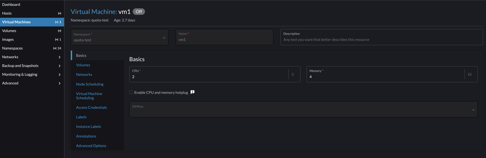
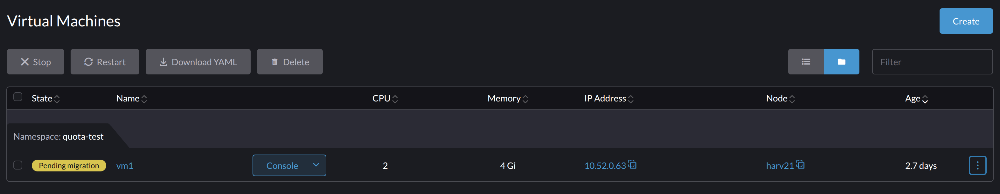
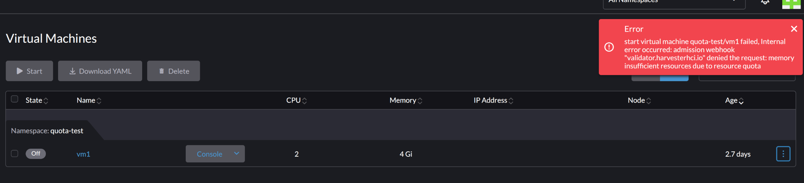

# Test VM Migration with ResourceQuota

## Background

In old version, there was [a bug about resource quota](https://github.com/w13915984028/harvester-develop-summary/blob/main/v121-vm-migration-with-resources-quota.md) and it was fixed on Harvester v1.4.0 via Enhancement [Improve the resourcequota autoscaling](https://github.com/harvester/harvester/issues/7161).

With the new feature [additional-guest-memory-overhead-ratio](https://docs.harvesterhci.io/v1.4/advanced/index#additional-guest-memory-overhead-ratio), we noticed below phenomenon when the limits of a `ResourceQuota` is quite close to the real `usage`.

## Description

### Environment Setup

#### Install a Harvester v1.7.0 cluster

v1.6 or v1.5 cluster are all OK.

Keep all default settings.

```sh
$ kubectl  get settings.harvesterhci additional-guest-memory-overhead-ratio

NAME                                     VALUE
additional-guest-memory-overhead-ratio   1.5
```

#### Create a Namespace with ResourceQuota

```yaml
cat > test-namespace.yaml << 'EOF'
apiVersion: v1
kind: Namespace
metadata:
  annotations:
    field.cattle.io/resourceQuota: '{"limit":{"limitsCpu":"3000m","limitsMemory":"5000Mi"}}' # namesapce must have this annotation
  name: quota-test
EOF
```

```sh
$ kubectl create -f test-quota.yaml 
```

#### Create a ResourceQuota

```yaml
cat > test-quota.yaml << 'EOF'
apiVersion: v1
kind: ResourceQuota
metadata:
  generateName: default-
  annotations:
    field.cattle.io/resourceQuota: '{"limit":{"limitsCpu":"3000m","limitsMemory":"5000Mi"}}' # ResourceQuota must have this annotation, and be same with above
  labels:
    cattle.io/creator: norman
    resourcequota.management.cattle.io/default-resource-quota: "true"
  namespace: quota-test
spec:
  hard:
    limits.cpu: 3
    limits.memory: 5000Mi
EOF
```

```sh
$ kubectl create -f test-quota.yaml 
resourcequota/default-6jbns created
```


The Resource Quota object `default-z4g94` is set and up.

```sh
$ kubectl  get resourcequota -n quota-test
NAME            REQUEST   LIMIT                                      AGE
default-z4g94             limits.cpu: 0/3, limits.memory: 0/5000Mi   2d16h


$ kubectl get resourcequota -n quota-test -oyaml
```

```yaml
apiVersion: v1
items:
- apiVersion: v1
  kind: ResourceQuota
  metadata:
    annotations:
      field.cattle.io/resourceQuota: '{"limit":{"limitsCpu":"3000m","limitsMemory":"5000Mi"}}'
    creationTimestamp: "2025-11-03T20:51:25Z"
    generateName: default-
    labels:
      cattle.io/creator: norman
      resourcequota.management.cattle.io/default-resource-quota: "true"
    name: default-z4g94
    namespace: quota-test
    resourceVersion: "793706"
    uid: 3bd12276-e263-412b-94f2-2d203a20e44d
  spec:
    hard:
      limits.cpu: "3"
      limits.memory: 5000Mi
  status:
    hard:
      limits.cpu: "3"
      limits.memory: 5000Mi
    used:
      limits.cpu: "0"
      limits.memory: "0"
kind: List
metadata:
  resourceVersion: ""
```

#### Create a Virtual Machine

Create a VM with `2 CPU cores, 4 Gi memory` and attaches to mgmt network.




### Tests 1: single VM with overhead ratio 1.5

#### Start the VM

The vm1 is up, and the resourcequota shows the resources usage is `4797464313`, and it is `89.3%` of limit `5000Mi`.

```sh
$ kubectl get resourcequota -n quota-test
NAME            REQUEST   LIMIT                                                   AGE
default-z4g94             limits.cpu: 2015m/3, limits.memory: 4797464313/5000Mi   2d16h
```

:::note

1. Due to the overhead, the resources shows more resource usage than the VM definition.

2. The `limits` and `usage` are quite close.

:::

#### Migrate VM

`resourcequota` is scaled up and then scaled down.

```sh
$ kubectl get resourcequota -n quota-test

NAME            REQUEST   LIMIT                                                       AGE
default-z4g94             limits.cpu: 4030m/5, limits.memory: 9594928626/9980344313   2d16h


$ kubectl get resourcequota -n quota-test
NAME            REQUEST   LIMIT                                                   AGE
default-z4g94             limits.cpu: 2015m/3, limits.memory: 4797464313/5000Mi   2d16h
```


### Tests 2: single VM with overhead ratio 1.5 but changed when VM is running

1. Ensure the setting `additional-guest-memory-overhead-ratio` is `1.5`.

2. Start `vm` if it is stopped.

3. Check the resourcequota, it should shows like:

```sh
$ kubectl get resourcequota -n quota-test
NAME            REQUEST   LIMIT                                                   AGE
default-z4g94             limits.cpu: 2015m/3, limits.memory: 4797464313/5000Mi   2d16h
```

4. Change the setting `additional-guest-memory-overhead-ratio` is `4.5`.

5. Migrate the VM, and monitor:


```sh
$ kubectl get resourcequota -n quota-test
NAME            REQUEST   LIMIT                                                         AGE
default-z4g94             limits.cpu: 4030m/5, limits.memory: 10479925626/10865341313   2d16h
 
$ kubectl get resourcequota -n quota-test
NAME            REQUEST   LIMIT                                                   AGE
default-z4g94             limits.cpu: 2015m/3, limits.memory: 5682461313/5000Mi   2d16h

```

The resourcequota is scaled to help the VM finish it's migration, and when it recovers, the resourcequota shows the usage `5682461313 (5419 Mi)`.

It is `105.8%` of the limit `5000Mi`

6. Migrate the VM again, it failed.

The VM stucks on `Pending migration`.



The resourcequota is scaled up, to add room for migration. The added room is `10865341313 - 5000Mi = 5622461313 (~5361 Mi)`

```sh
$ kubectl get resourcequota -n quota-test
NAME            REQUEST   LIMIT                                                        AGE
default-z4g94             limits.cpu: 2015m/5, limits.memory: 5682461313/10865341313   2d16h

```

Migration object is `pending`.

```yaml
$ kubectl get vmim -n quota-test vm1-sm587 -oyaml
apiVersion: kubevirt.io/v1
kind: VirtualMachineInstanceMigration
metadata:
  annotations:
    kubevirt.io/latest-observed-api-version: v1
    kubevirt.io/storage-observed-api-version: v1
  creationTimestamp: "2025-11-06T13:33:02Z"
  finalizers:
  - kubevirt.io/migrationJobFinalize
  generateName: vm1-
  generation: 1
  labels:
    kubevirt.io/vmi-name: vm1
  name: vm1-sm587
  namespace: quota-test
  resourceVersion: "817804"
  uid: a57c0c92-ad75-4049-9815-a73a6b9c0c4f
spec:
  addedNodeSelector:
    kubernetes.io/hostname: harv2
  vmiName: vm1
status:
  conditions:
  - lastProbeTime: "2025-11-06T13:33:02Z"
    lastTransitionTime: null
    status: "True"
    type: migrationRejectedByResourceQuota                 // note this type
  migrationState:
    sourcePod: virt-launcher-vm1-lkk24
  phase: Pending
  phaseTransitionTimestamps:
  - phase: Pending
    phaseTransitionTimestamp: "2025-11-06T13:33:02Z"
```


The `virt-controller` pod log shows:

```sh

$ kubectl logs -n $HS virt-controller-64d7894974-x4qwz

{"component":"virt-controller","level":"info","msg":"reenqueuing Migration quota-test/vm1-sm587","pos":"migration.go:267","reason":"failed to create vmi migration target pod: pods \"virt-launcher-vm1-5wcz6\" is forbidden: exceeded quota: default-z4g94, requested: limits.memory=5682461313, used: limits.memory=5682461313, limited: limits.memory=10865341313","timestamp":"2025-11-06T13:33:22.795022Z"}

```

But even with the scaled up space, the remaining free space is still not enough to accomodate the new VM(POD) request.

#### Root Cause

Initiall, the `resourcequota` has some `spare rooms` after the VM is running, and after the `overhead-ratio` is adjusted, the `spare rooms` helps the VM to migrate successfully. But after the `migration`, the VM has already used slightly more than the allowed memory. Later, when `migration` is triggered again, it might be blocked due to quota.

### Tests 3: single VM with overhead ratio 4.5

1. Stop vm1 if it is running

2. Change the setting [additional-guest-memory-overhead-ratio](https://docs.harvesterhci.io/v1.4/advanced/index#additional-guest-memory-overhead-ratio) to value `4.5`

3. Start the VM and an error is reported promotly. VM can't be started as `resourcequota` is not enough.



### Tests 4: single VM with overhead ratio 4.5 and increased ResourceQuota

Continue the test3, 

1. Set the `ResourceQuota` memory limits to `6000Mi`.

2. Start `vm1`, it is successfuly

```sh
$ kubectl get resourcequota -A
NAMESPACE    NAME            REQUEST   LIMIT                                                   AGE
quota-test   default-z4g94             limits.cpu: 2015m/3, limits.memory: 5682461313/6000Mi   2d23h
```

3. Migrate `vm1`

The `ResourceQuota` is scaled up, scaled down and finally back to normal.

```sh
$ kubectl get resourcequota -A
NAMESPACE    NAME            REQUEST   LIMIT                                                         AGE
quota-test   default-z4g94             limits.cpu: 4030m/5, limits.memory: 11364922626/11913917313   2d23h


$ kubectl get resourcequota -A
NAMESPACE    NAME            REQUEST   LIMIT                                                    AGE
quota-test   default-z4g94             limits.cpu: 4030m/3, limits.memory: 11364922626/6000Mi   2d23h


$ kubectl get resourcequota -A
NAMESPACE    NAME            REQUEST   LIMIT                                                   AGE
quota-test   default-z4g94             limits.cpu: 2015m/3, limits.memory: 5682461313/6000Mi   2d23h
```

4. Migration again

All good.

When the `ResourceQuota` is not over used, VM migration is always successfuly.

## Solutions

### Keep the current Implementation

The current implementation allows a first-time migration, but denies the second-time migration. The `resourcequota` finally needs to be updated to match the `overhead-ratio`.

A VM might happen to use more than the quota allowed resource after the `overhead-ratio` is increased. However, it will be blocked by the quota eventually.

:::note

How many times the migration can be achived depends on the over-head ratio and the initial spare rooms on the resources quota.

:::

### Adjust overhead-ratio and resourcequota in parallel

Increase the `additional-guest-memory-overhead-ratio` means each VM will occupy more resources.

It is not unreasonable to adjust the `resourcequota` accordingly. [test 4](#tests-4-single-vm-with-overhead-ratio-45-and-increased-resourcequota) shows the matched quota and ratio run smoothly.

When the `overhead-ratio` is adjusted, migrate one VM to check the differences of `resourcequota` usage, and estimate the required additional rooms. Harvester [document](https://docs.harvesterhci.io/v1.6/advanced/index#additional-guest-memory-overhead-ratio) shows a table of the overhead values with different ratio.

The following case will not be hit.

### Try hard to enhance to allow existing VMs to occupy more memory without changing the resourcequota

The assumption is that, as long as a VM has been running, no matter how we change the ratio, we always scale-up enough space to make the migration as successful as possible.

This introduces several challenges:

1. The `test-quota` sets memory limits as `5Gi`, and the real `vm1` might occupy like `6Gi` after a couple of migtaions. `vm1` becomes a special one as it came ealier comparing to below point 2 and 3.

2. If this VM `vm1` happens to be stopped, it can't be restarted unless the `resourcequota` is updated. See above [test-3](#tests-3-single-vm-with-overhead-ratio-45).

3. And, when you create a `test-quota-1` with the same setting as `test-quota`, a cloned `new-vm1` just cannot start. See above [test-3](#tests-3-single-vm-with-overhead-ratio-45). It means the existing `workload configuration` might not be reusable on another location. The high level `backup-and-restore` (backup `namespace,resourcequota,vm...` configurations and restore them on this/another cluster) function has a potential risk (vms cannot be started).

4. It becomes even complex when a namesapce has many VMs and the `resourcequota` is very tighly close to the resources summary of them. In the lifecycle of this namesapces, VMs are created, migrated, removed, newly created. `Auto-scaling` logic struggles to differentiate them and scale specifically for each VM instance.

The overall resources are limited, if each resourcequota is set to allow existing members to overtake resources, the overall free resource statistics will be inaccurate, which may cause planned new workloads to encounter failures.

For example: a system has `100G memory`, and plans to run workloads across `10 namespaces`, each of them has resourcequota `10Gi memory`.

The first 8 `namespaces` are created and used. Then the `overhead-ratio` is adjusted, eventually they occupy `92Gi` memory, not the planned `80Gi`, then a new namespace is created, but the workloads on this namespace can't get it's `10Gi` memory to use.

### Notes

1. The `overhead` (the diff between VM claimed memory and final Linux CGroup memory limitation for the VM's carrying Pod) is very difficult to calculate precisely. Upstream source code says `...This is the best estimation we were able to come up with and is still not 100% accurate`.[code](https://github.com/kubevirt/kubevirt/blob/9d0345041704fe0d12a7cbb8eeecb2823d1cb703/pkg/virt-controller/services/renderresources.go#L392-L410)

2. The `overhead-ratio` is critical to decrease/eliminate the chance of hitting [OOM](https://github.com/w13915984028/harvester-develop-summary/blob/main/oom-related-issue-investigation.md).

3. We understand the tough balances between the `resourcequota` and the `overhead-ratio`.

4. The best practice is to test more, figure out a proper [overhead-ratio](https://docs.harvesterhci.io/v1.6/advanced/index#additional-guest-memory-overhead-ratio), combine the [reserved-memory](https://docs.harvesterhci.io/v1.6/vm/index#reserved-memory) for those important/special VMs. And set a suitable `resourcequota` accordingly. There is no `one-size-fits-all` solution.

## Additional

Issue [#9435](https://github.com/harvester/harvester/issues/9435)

[OOM investigation](https://github.com/w13915984028/harvester-develop-summary/blob/main/oom-related-issue-investigation.md)

[The overhead-ratio](https://github.com/w13915984028/harvester-develop-summary/blob/main/config-additionalGuestMemoryOverheadRatio-on-harvester-v132.md)

